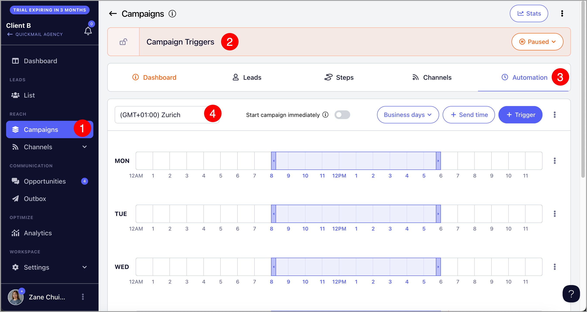

# Automate Starting Leads with Triggers

**In this article:**

- How does campaign automation works in QuickMail?

- What are triggers for?

- How do Triggers work?

- How to setup Triggers?

- How many leads should I add to the Triggers?

## How does campaign automation works in QuickMail?

In QuickMail, when leads are added to a campaign, they will be on a 'Not Started' status. The campaign will only send emails to the leads once they start the campaign.

To start new leads, it can be done either manually or by setting up Triggers.

## What are triggers for?

Triggers allows users to control when and how many new leads will start the campaign. If you'd like to setup the number of initial emails to send, you need to setup Triggers.

However, if the campaign has follow up emails, Triggers doesn't necessarily control the email volume of the campaign.

## How do Triggers work?

The number of leads in the Triggers is distributed evenly among the email accounts assigned to the campaign. For instance, if there are 100 leads in the Triggers and 5 email accounts assigned to the campaign, each email account will send to 20 new leads from the campaign.

There's no need to manually set up Triggers every day, as it will run automatically on a weekly basis. For instance, if you set up Triggers from Monday to Friday with 100 new leads, the campaign will start 100 new leads daily each week until there are no more available leads.

**Tip:** Triggers cannot set time delays between sending emails. For instructions on how to set this up, please refer to this guide: Throttling Emails to Avoid Getting Flagged

## How to setup Triggers?

First, go to your preferred campaign →  Automation tab → Make sure to select your preferred timezone.

After that, click '+Triggers' → Select your preferred days, time, and number of leads

**Important:** When adding triggers, there must be at least a 15-minute allowance between when the trigger is created and when it runs. For example, if you want the trigger to run at 8:00 AM, it must be created or updated by 7:45 AM. If not, the system will run the triggers for the next day.

## How many leads should I add to the Triggers?

The number of leads to add to the Triggers depends on your desired email volume, the assigned email accounts in the campaign, and the number of email steps.

To find the ideal number of leads, first determine the maximum daily number of emails an email account can send and the number of email steps in the campaign. Then, divide the maximum daily email limit by the number of email steps.

For example, if an email account has a daily limit of 100 emails and is running a campaign with 5 steps, you should add 20 leads each day. This way, when the emails from all 5 steps accumulate, the account can send the full 100 emails (5 steps × 20 leads = 100 emails).

If an email account is running 2 campaigns with 5 steps each, the 20 leads should be split between the two campaigns, meaning each should add 10 leads daily.

Keep in mind that the email volume will initially be lower and will reach the maximum limit only as follow-up emails stack up.

Managing email volume with Triggers can be tricky due to the follow-up emails, so it’s an experimental process until you achieve your desired email volume.

**Pro Tip:** You can also use this [calculator](https://docs.google.com/spreadsheets/d/1YmM0d3M6nlBLRcNcT_hCRf8Gatfnj8XTXYL9ZyZ5vUU/edit?gid=0#gid=0) to easily get the suggested number of leads based on the computation above.

## Why Can't I add more than 1,000 Leads in the Triggers?

Starting 1,000 leads at once may cause a spike in email volume, which can get the email accounts flagged for spamming. If you need to add more than 1,000 leads, it's best to create multiple triggers throughout the day. For example, create Triggers with 500 leads at 8 AM, 500 at 10 AM, another 500 at 12 PM, and so on

**Important:** If you're starting thousands of new leads, ensure you have multiple email accounts and sufficient send times. Otherwise, you may end up with a backlog of emails in the send queue

Tip: If you need help deciding how many leads to start on the campaign, please check out: Limit the number of leads that will start a campaign using triggers

## My campaign has leads, why does it say "no new leads left to start"?

When you have triggers set up, leads show as "not started" when you first add them to the campaign. Once the trigger conditions are met, they automatically move to "running" status.

**Why you're seeing this message:**

This is just a reminder that all your current leads have already started the campaign — there are no leads waiting in the "not started" status anymore.

**What to do:**

- **If you have more leads to contact** → Add them to the campaign and they'll start based on your trigger settings

- **If you don't have new leads right now** → You can safely ignore this message. It's not an error — it just means your campaign is running as expected with the leads you've already added.
