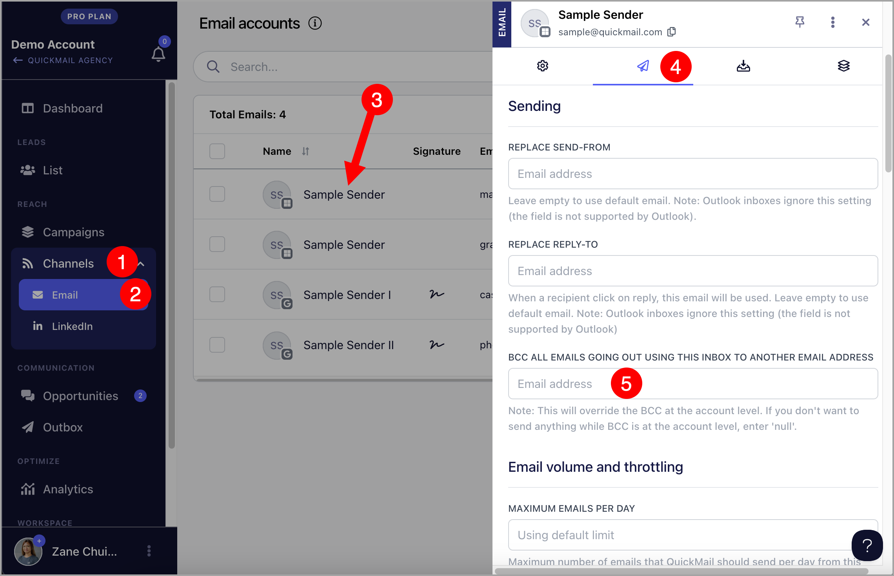

# How to BCC emails to Salesforce

**

Blind copying emails to Salesforce allows users to automatically log communication without needing an integration, ensuring that all interactions are tracked and easily accessible in the CRM.

**

## Step 1. Find your Salesforce BCC Email

Go to Salesforce → click on your thumbnail at the upper right hand corner → Settings

Select the Email tab → click on 'My Email to Salesforce' → Copy your email to Salesforce address (highlighted in yellow)

## Step 2. Add BCC email to QuickMail

Copy and paste the email to Salesforce address into your QuickMail Settings. There are two ways to do it.

### Option 1: Workspace-level

Adding a BCC email at the workspace level allows you to automatically BCC all emails sent from the workspace, regardless of the inbox. Workspace-level BCC is currently available only in the old interface.

To access the old interface, go to this URL and change it with your workspace ID.

https://next.quickmail.com/account/your-workspace-ID**/settings/inboxes

Here's where you can find your workspace ID:

### Option 2: Inbox-level

Adding a BCC email per inbox lets you BCC emails from a specific inbox only.

To add a BCC email per inbox, go to Channels → Emails → Click on an email account → Sending tab → 'BCC All emails going out using this inbox'

