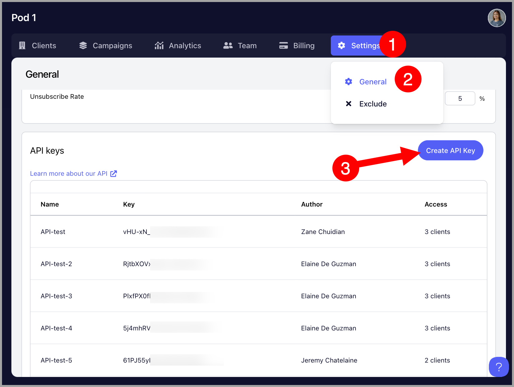

# Creating an API Key

**

## For Agency Accounts

Go to the Agency Dashboard by clicking the Organization name at the upper left corner of the screen → Settings → General → Scroll to the bottom and click "Create API key"

Above the button for creating an API key, there's a link that allows users to access our API documentation.

## For Team Accounts

Go to the Settings → Integrations → Under API keys, Create API Key

Above the list of API keys, there's a link that allows users to access our API documentation.

