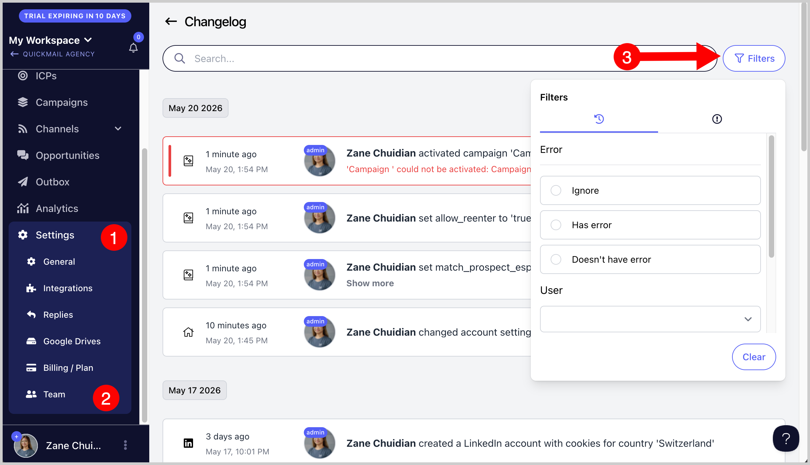

# Using the Changelog and Filters to Find Activity History

**
**

The Changelog section in QuickMail is a powerful tool that helps you track and review activity across your account. It’s especially useful for monitoring changes, reviewing team member actions, and troubleshooting issues.

Accessing the Changelog **

To access the Changelog: Go to Settings → Team → Options button → Changelog

This will open a detailed activity log containing changes made to campaigns, settings, inboxes, team members, and more.

**

Using Filters**

Within the Changelog screen, you can filter activities using different criteria, such as:

- Errors

- User

- Date

- Action taken

These filters make it easier to quickly find specific events or investigate account activity.

