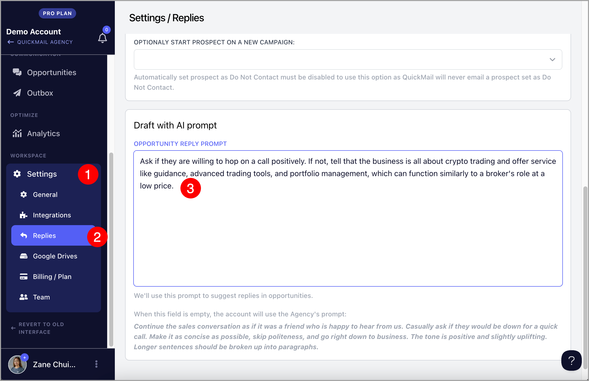
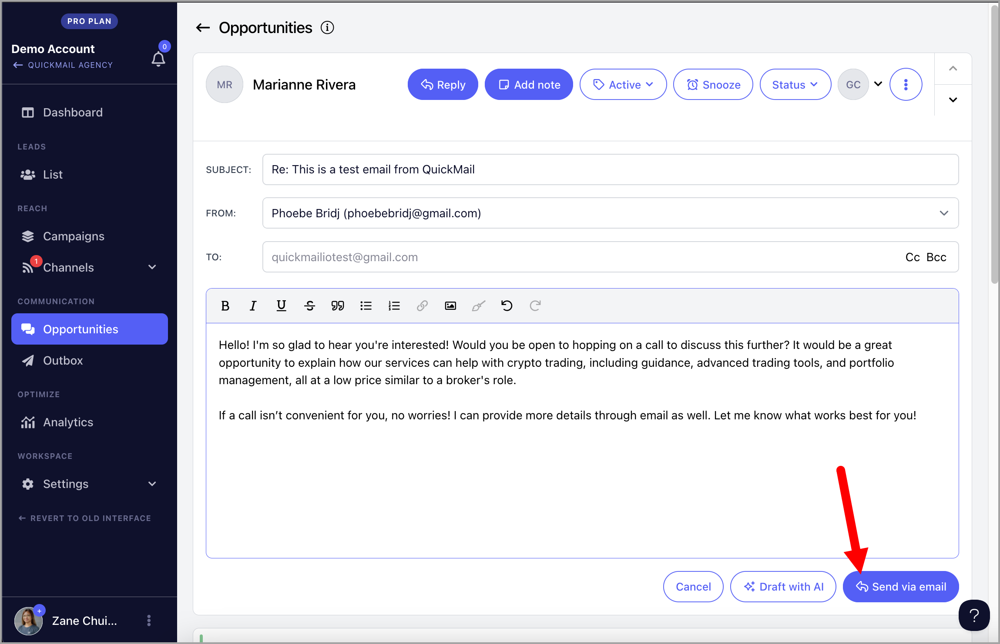

# Drafting Replies with AI ✨

**

QuickMail's Draft with AI allows you to effortlessly create replies that match the tone you want when engaging with leads via Opportunities. By leveraging AI, you can quickly draft professional and personalized responses, saving time while ensuring your communication aligns with your brand's voice.

**

## Why use Draft with AI?

Draft with AI helps you communicate more effectively by automatically reading through the entire email thread before suggesting a response. This means it understands the full context and tone of the conversation, allowing it to craft a reply that feels natural and fits with what's already been discussed. You don't have to worry about missing any important details or struggling to recall previous points. It saves you time and mental energy, especially when you're dealing with long email chains or unsure about how to phrase something. Plus, it allows you to handle more conversations without compromising on the quality of your responses, ensuring everything stays professional and error-free. In short, Draft with AI helps you work smarter, saves you time, ensuring your communication stays clear, efficient, and consistent, no matter how busy you get.

## How does it work?

Draft with AI generates a reply based on the prompt set for your specific workspace or agency, ensuring that each response maintains consistency and relevance.

If there's no prompt set, it will use the system's default prompt:**

*Continue the sales conversation as if it was a friend who is happy to hear from us. Casually ask if they would be down for a quick call. Make it as concise as possible, skip politeness, and go right down to business. The tone is positive and slightly uplifting. Longer sentences should be broken up into paragraphs.*

**

## How to use it?

Step 1. **Specify how you'd like the reply to sound by describing the tone and style. You can skip this step if you'd like to use the system's default prompt.

💡 You can set up an AI prompt at either the [Agency](#Agency-Level-VEa7t) or [Workspace level](#Workspace-Level-4yhLG). If both are set, the **system will prioritize the workspace AI prompt**. This allows for tailored communication, ensuring each client’s tone is consistently reflected.

### Agency Level

The AI prompt at the agency level automatically applies to all workspaces, streamlining communication, saving time on setup, and ensuring a consistent tone for all clients.

To set up the AI prompt at the agency level, go to Settings → General, and under the "Draft with AI" section, specify the tone and style you want for replies.

### Workspace Level

The AI prompt at the workspace level lets you create unique prompts for each client, ensuring personalized communication that aligns with their tone and needs.

To set it up, go to a specific Workspace → Settings → Replies. Under the "Draft with AI" section, describe the tone and style you'd like the replies to have.

**

Step 2. **Go to the lead's reply in the Opportunities page → click 'Reply' → click 'Draft with AI'.

You can hit the 'Draft with AI' button directly without typing anything, or write a few words, and the AI will generate a reply based on that input.

**Step 3. **It's possible to edit the draft if needed, and once you're happy with it, you can send the email.

**

## How much does it costs?

Every workspace, regardless of your plan, receives free Draft with AI credits each month. These credits reset automatically, providing you with a fresh set every month.

- Agencies in new pricing: 500 credits per month

- Agencies in old pricing: 100 credits per month per workspace

- Teams: 100 credits per month.

If you need to add more credits, it costs $10/mo per additional 1,000 credits monthly. Please contact [support@quickmail.io](mailto:support@quickmail.io) for us to configure your subscription.

Note:** For users who added an OpenAI key before January 6, 2025, your OpenAI credits will be automatically used when you use Draft with AI. If there are no OpenAI credits available, the system will automatically use your monthly credits instead.

You can view the remaining credits in your subscription by going to the Billing/Plan section of your workspace or agency.

