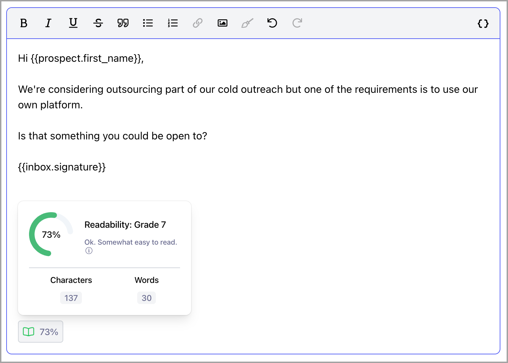

# Readability Scores

**

## Why consider readability scores when composing emails?

A readability score is a helpful way to make sure your email is easy to read and understand. It looks at things like sentence length and word choice, helping you write messages that are clear and to the point. By keeping your score high, you’re more likely to engage your readers and get your message across effectively.

## Where can I find readability scores?

Readability scores can be found when composing:

- Emails in the email step

- LinkedIn messages

- LinkedIn connection request messages

- Replies in opportunities

## How can I improve the readability scores of my emails?

Several factors can affect readability scores. To improve yours, here are a few simple tips:

- **Keep sentences short and to the point**: Avoid overly long or complicated sentences. Shorter sentences are easier to follow.

- **Use simple language**: Stick to common, everyday words that everyone can easily understand.

- **Break up big paragraphs**: Large blocks of text can be overwhelming. Keep paragraphs short and easy to skim.

- **Use bullet points or lists**: Lists are great for organizing information and making it easier for readers to digest.

- **Stick to active voice**: Active voice makes your writing more direct and engaging.

- **Cut out unnecessary words**: If something doesn’t add value, get rid of it. This keeps your message clear and concise.

- **Have a clear structure**: Start with a strong opening, present your main points, and wrap it up with a clear conclusion or call to action.
