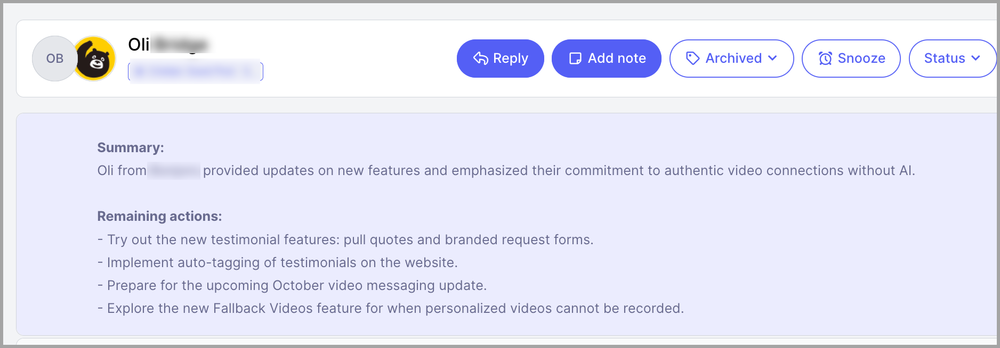

# AI Summaries on Opportunities (Agencies only)

# Why use AI summary?

- **Saves Time** – Quickly extracts key points from opportunities, especially those with a long conversation history.

- **Improves Decision-Making** – Provides concise insights that help users quickly understand and address remaining action points in the conversation

# How to turn it on?

AI summaries are on by default but it's only available on Agency accounts that are on the Expert Plan.

# Where can I find them?

They are added at the top of each opportunity with contents divided into Summary and Remaining Action points.

Here's an example:

