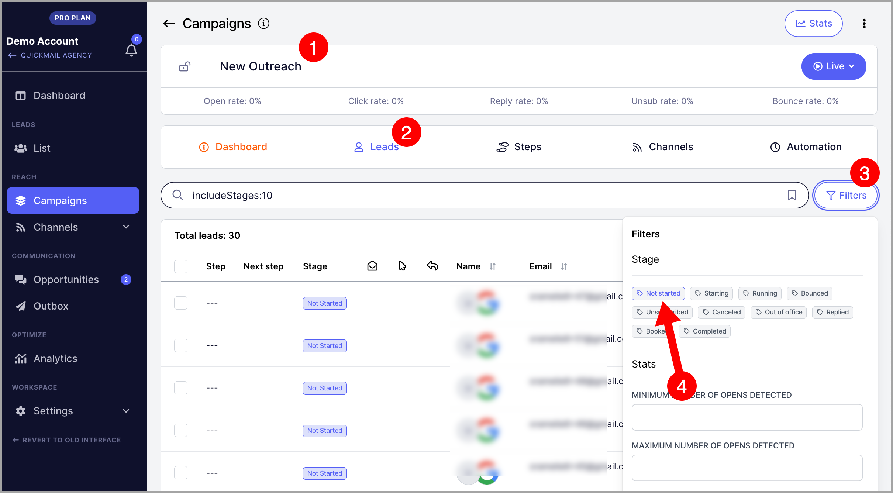

# Starting Campaigns Immediately

**

### In this article:

- [Why set a campaign to start immediately?](#Why-use-Instant-Start-eZTJs)

- [How does it work?](#How-does-it-work-oNMTr)

- [How to enable it?](#How-to-enable-it-JLUKk)

- [Troubleshooting](#Troubleshooting-PuRl2)

- [I set up my campaign to start immediately but leads are not starting, why?](#I-set-up-my-campaign-but-leads-are-not-starting-why-IJWeJ)

- [Where did my triggers go?](#Where-did-my-triggers-go-Mx70i)

# Why set a campaign to start immediately?

- **Immediate Execution** – Your emails start sending right away, great for urgent outreach.

- **Faster Testing** – Quickly test new email copies, subject lines, or lead lists without waiting for automation triggers.

- **Better Control** – You decide exactly when the campaign starts and can make adjustments in real-time.

# How does it work?

When leads are added to the campaign, they will be on a Not Started status. So leads must be started either manually or by using Triggers.

Instant start allows you to automatically start the leads as soon as they are added to the campaign.

# How to enable it?

To enable Instant Start, go to the Campaign → Automation → Toggle on 'Start campaign immediately'

# Troubleshooting

## I set up my campaign but leads are not starting, why?

Note that this setting only applies to leads that will be added to the campaign once the settings are turned on.

This means that leads that are already in "Not Started" status will not automatically start.

To make sure they start, please resume them.

To get started, filter them first.

Then, select all -> resume -> resume immediately.

Important: Resuming a lot of leads can lead to a sudden spike in the email volume. To make sure your emails will not send mass volume, please set up daily email limit. Here's a detailed guide on that: https://help.quickmail.com/article/591-new-ui-setting-daily-email-limit

## Where did my triggers go?

Turning this setting on will hide all your triggers.

Basically, there's no need for them if leads are starting immediately.

However, if you decide not to start leads immediately, you can toggle it off.

Then, all your triggers will show up again.
