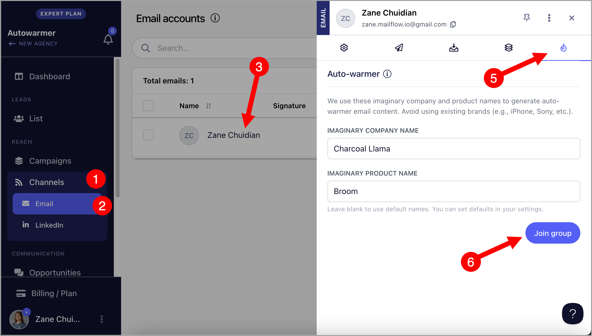
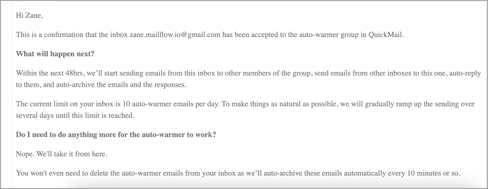
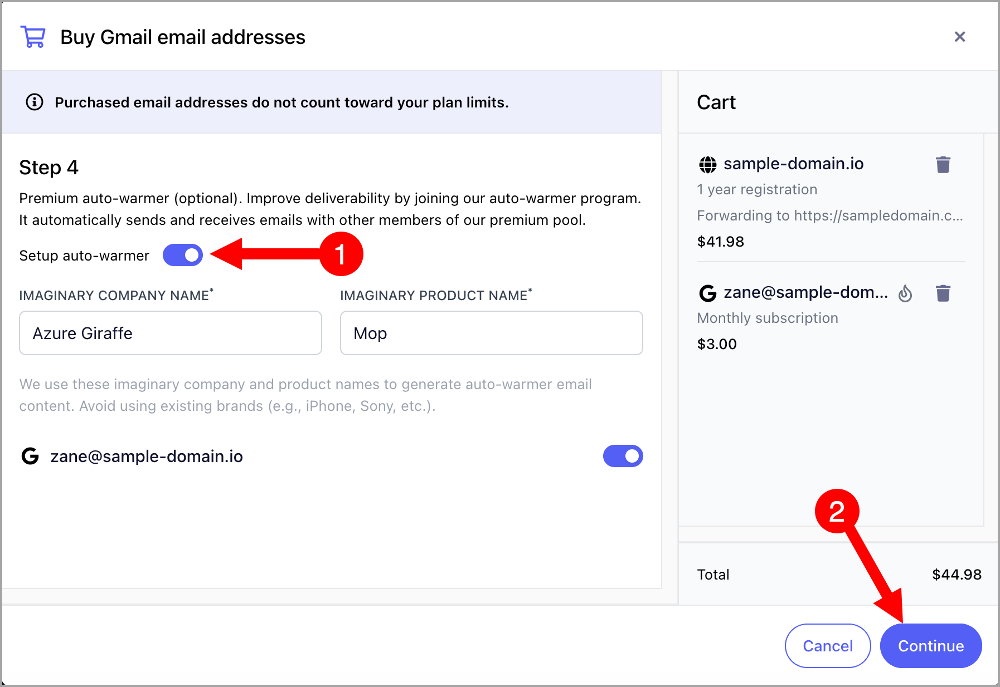
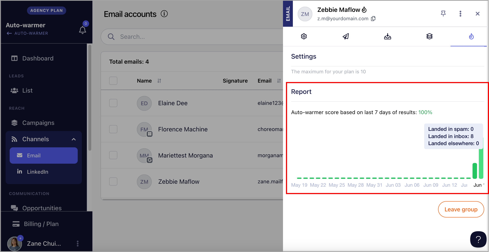
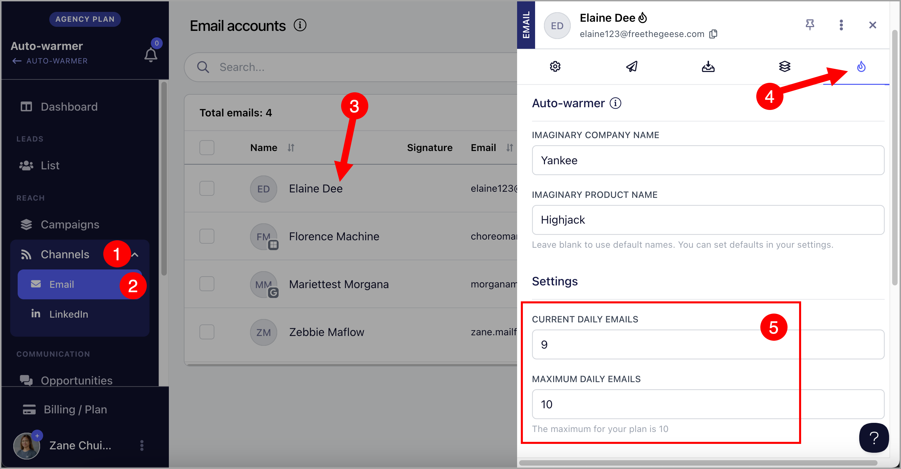
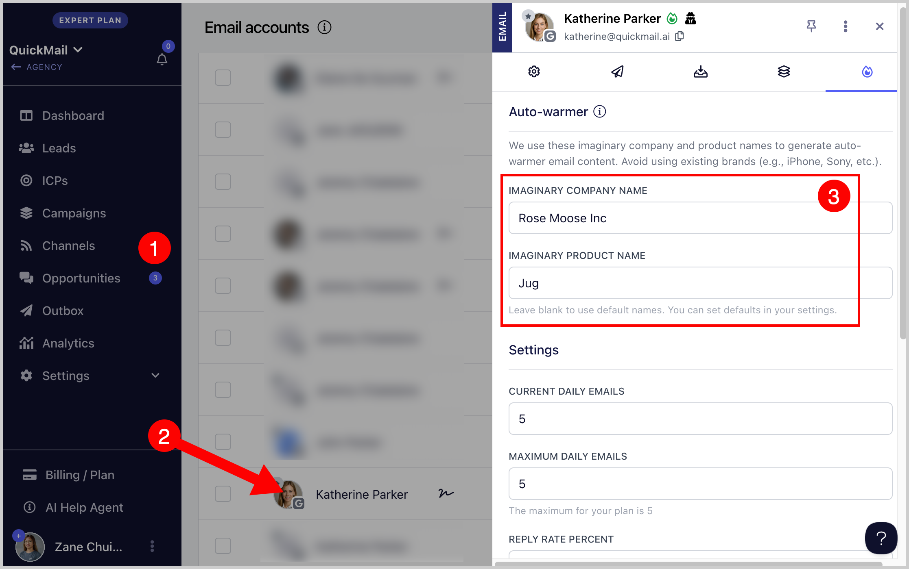

# Auto-Warmer for QuickMail Inboxes 🔥

QuickMail’s built-in Auto-Warmer is currently only available for Google inboxes purchased directly through QuickMail.
If you're using external inboxes or custom email accounts, you can still warm them up using [Mailflow.io](https://www.mailflow.io/) at no additional cost as part of your QuickMail subscription.

Check out **Auto-Warmer for Non-QuickMail Inboxes 🔥** for more info.

## In this article:

- Why use the Auto-Warmer feature?

- How does the Auto-Warmer feature work?

- How to set up the Auto-Warmer feature?

- Through Email Account Settings

- When Purchasing Domains

- How do I check for the Auto-Warmer Report?

- How many Auto-Warmer emails can I send?

- How can I increase or decrease the Auto-Warmer limit?

- Can I warm up an IP or SMTP?

- How long should I warm up the inbox?

- Should I turn off auto-warmer once I start sending outreach?

- How to stop autowarmer emails from cluttering your inbox?

## Why use Auto-Warmer?

The Auto-Warmer helps build and maintain a strong sender reputation for both new and existing inboxes. By gradually increasing email activity and simulating real engagement (opens, replies, etc.), it improves email deliverability and lowers the risk of your messages being marked as spam by email providers.

## How does it work?

- Gradual Ramp-Up 📈

The number of auto-warmer emails sent will gradually increase by 3 per day until it reaches the default maximum daily limit of 5. (We plan to increase this as our premium auto-warmer group grows)

- Inbox Management 📩
Auto-warmer emails are automatically archived to prevent clutter.

- **Spam Handling **🚫

If an auto-warmer email lands in the spam folder, it will automatically be moved out of spam to help improve deliverability.

- **Sent Within the Day 🏎️**

Once an email account is added to the Auto-Warmer Group, it may only take up to 5 hours before the first auto-warmer email is sent.

- **AI-Generated Content ✨**

Auto-warmer emails are generated by AI to mimic natural, human-like conversations, just like your real outreach, to improve engagement and deliverability.

- **Autowarmer Replies✨**

Replies to auto-warmer emails make the interactions look natural, which builds authenticity and improves deliverability. You can also adjust the percentage of replies to keep it realistic.

## How can I setup Auto-Warmer?

There are two ways** to set up auto-warmer:

- Through Email Account Settings

- When purchasing email domains in QuickMail.

### Option 1. Through Email Account Settings

Go to your workspace Channels → Click on an email account to open quick view →  Go to the tab with a Fire icon →  Join the auto-warmer group

How it works: **The system will test the email account’s sending and receiving settings, as well as check the MX, SPF and DKIM records. This helps prevent bounces that could negatively affect other email accounts in the auto-warmer group.

You’ll receive an email confirming that the email account has been added to the auto-warmer group.

Once accepted to the auto-warmer group, the inbox will start sending auto-warmer emails within 5 hours.

**Note:** To see if the domain has the correct MX, SPF, and DKIM records setup, visit[MxToolbox](https://mxtoolbox.com/). If the domain don't have these records setup, check this guide: How to setup SPF, DKIM, and DMARC records

Here's what the email confirmation looks like:

**Note:** QuickMail will first send some auto-warmer emails to your email account before it begins sending regular emails, to help improve deliverability.

### Option 2: When Purchasing Domains

When Buying Domains in QuickMail, users have an option to enable auto-warmer on Step 4.

How it works: **When the email account is added to the workspace, auto-warmer will be enabled by default. It will start sending auto-warmer emails within 24 hours

## How do I check for the Auto-Warmer Report?

The auto-warmer report allows you to see how many emails were sent and how many landed in spam.

To check the auto-warmer report, go to your workspace Channels → Click on an email account to open quick view → Go to the tab with a Fire icon → Scroll to the bottom and check the auto-warmer report.

## How many auto-warmer emails can I send?

The maximum number of auto-warmer emails an inbox can send per day is currently 5. *(We plan to increase this limit as our premium Auto-Warmer Group grows.)*

## How do I change the daily auto-warmer limit?

To change the daily auto-warmer limit, go to your workspace Channels → Click on an email account to open quick view →  Go to the tab with a Fire icon →  Maximum Daily Emails

## Can I warm up an IP or SMTP?

QuickMail's Auto-Warmer feature might not be suitable for warming up new IPs. It will require a massive volume of emails to warm up a specific IP.

## How long should I warm up the inbox?

Cold email experts generally recommend warming up new inboxes for at least 2 weeks. However, there's no strict rule, it really depends on your team's needs and sending goals. You can warm up longer for better deliverability or start sooner if you're operating on a tighter schedule.

## Should I turn off auto-warmer once I start sending outreach?

It depends, but in most cases, we recommend keeping the auto-warmer on even after you begin sending outreach emails. Here's why:

- **Maintains your sending reputation**
Outreach emails can trigger spam filters, especially if volume increases suddenly or engagement drops. The auto-warmer helps stabilize your reputation by generating consistent positive signals (opens, replies, inbox placement).

- **Simulates natural email traffic**
A mix of warm-up and outreach emails makes your sending behavior appear more organic to email providers.

- **Covers slow outreach days**
If your campaigns aren't sending much on certain days, the auto-warmer fills in the gap to keep your domain active.

### Note: Be mindful of your total daily email volume per inbox. Sending too many emails (outreach plus auto-warmer), especially if you're hitting hundreds per day, can increase the risk of your messages being flagged as spam or sent to the junk folder.

##

## How to stop autowarmer emails from cluttering your inbox?

Autowarmer emails are automatically archived by default. However, if they’re being forwarded to another email address we don't have access to, you can instead set up a filter to automatically archive incoming Autowarmer emails in that email address.

You can use the “imaginary company” and “product name” fields in your inbox settings in QuickMail to create rules that automatically archive emails when those identifiers are detected.

Technically, all Autowarmer emails sent to your inboxes already include the configured “imaginary company” and “product name” values.

If needed, you can update these values in QuickMail to make the filters more unique.

