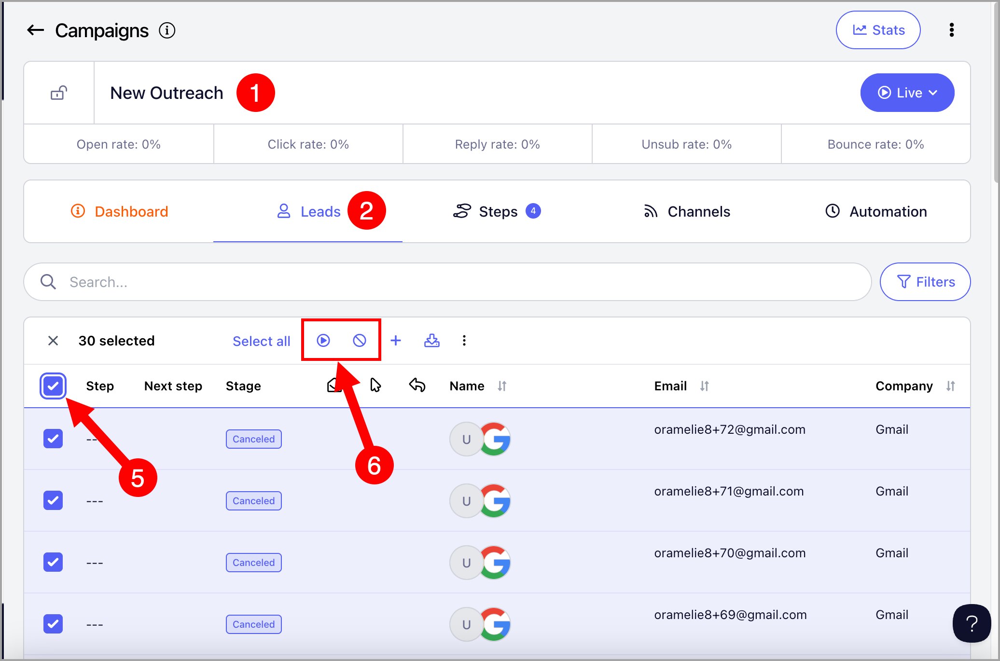
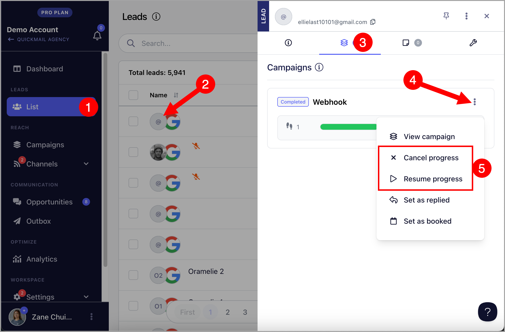

# Resuming and Cancelling Leads

**

## Why Cancel Leads?

Canceling leads allows you to stop sending them emails from the campaign.

**

## Why Resume Leads?

Resuming leads on the other hand, allows you to resume sending emails to leads who have a 'Canceled', 'Replied', 'Completed' status.

Note: **Resuming leads will change their stage to 'Running' while Canceling leads will change their stage to 'Canceled'

## How to Resume or Cancel Leads?

### From the campaign

Resuming or canceling leads from the campaign allows you to do actions in bulk.

To resume or cancel leads from the campaign, go to the Campaigns page → Open a campaign → Leads page → Select leads → Click the Play (to start or resume) or Pause icon (to cancel)

### From the lead's quickview

Resuming or canceling leads from the lead's quickview allows you to resume or cancel leads on the Leads page, Campaign's Leads page, or Opportunities.

To open quickview, click on the lead's thumbnail → second tab → Cancel progress or Resume progress

