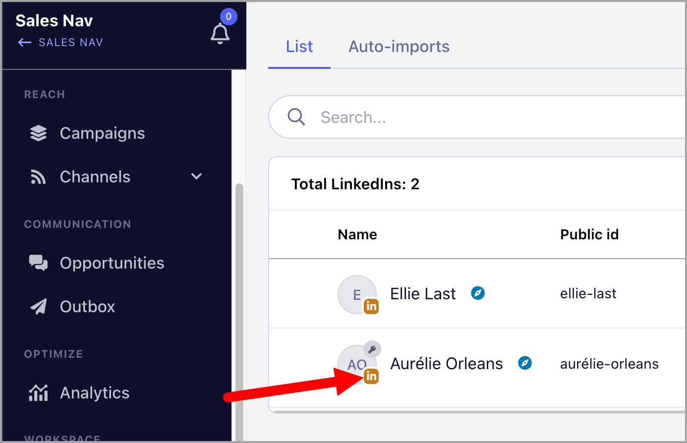
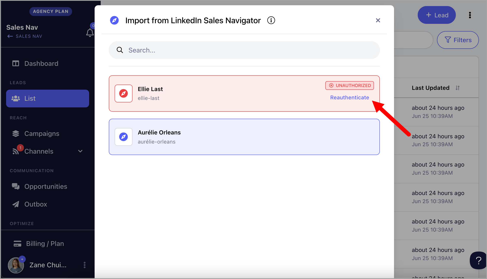
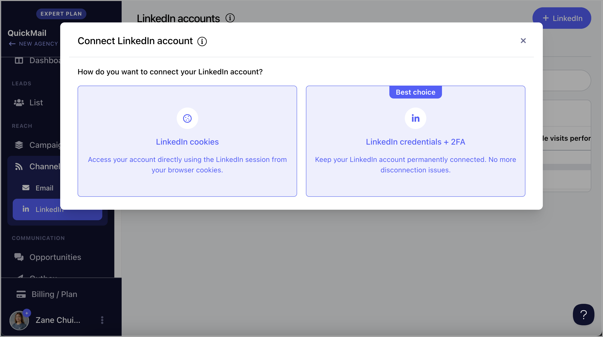
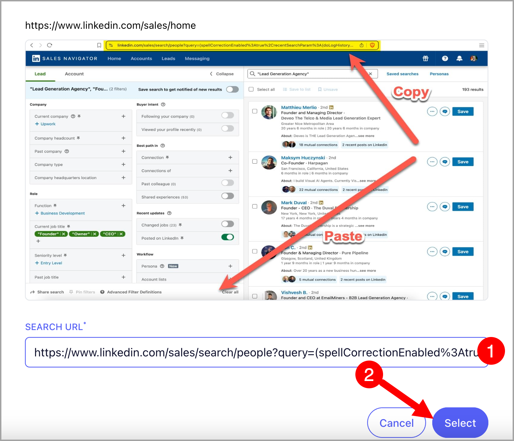

# Importing from LinkedIn Sales Navigator 🧭

**

Our integration with LinkedIn Sales Navigator allows you to easily import selected leads into QuickMail. This is especially useful for running LinkedIn outreach.

**Note:** While LinkedIn profile URLs and other lead details are imported, email addresses are not included.

# How to import from Sales Navigator?

## Option 1: Manual Import

**Step 1.** Add a LinkedIn account that has Sales Navigator subscription. Go to Channels → LinkedIn → + LinkedIn. This guide about Adding LinkedIn accounts might come in handy.

**Note: **LinkedIn accounts showing a brown icon are supported for Sales Navigator. If the icon is blue, the account isn’t compatible.

**Step 2.** Go to [Sales Navigator](https://www.linkedin.com/sales/home) > Search for the leads you'd like to import → Use filters to narrow down your search if needed → Copy the URL

**Note: **Recent Search links are not yet support. The URL Should start with [https://www.linkedin.com/sales/search/people?query=](https://www.linkedin.com/sales/search/people?query=) from fresh search.

**Step 3. **Go to Leads → + Add Leads → Import from Sales Navigator

**Step 4. **Paste the URL copied from Sales Navigator → Follow the on screen instructions to setup import

**

## What happens when I lose permission to my LinkedIn account?

When we lose permission to access your LinkedIn account, it will be highlighted in red, and it will no longer be possible to import from Sales Navigator.

Click re-authenticate to continue using the LinkedIn account.

## Option 2: Auto-import

Auto-Import continuously monitors your saved Sales Navigator search. When a new lead appears, it’s automatically pulled into your list or campaign so you can engage without lifting a finger.

Step 1. **To setup auto-import with Sales Navigator, first, addd a LinkedIn account that has Sales Navigator subscription. Go to Channels → LinkedIn → + LinkedIn. This guide about Adding LinkedIn accounts might come in handy.

**Note: **LinkedIn accounts showing a brown icon are supported for Sales Navigator. If the icon is blue, the account isn’t compatible.

**Step 2.** Go to [Sales Navigator](https://www.linkedin.com/sales/home) > Search for the leads you'd like to import → Use filters to narrow down your search if needed → Copy the URL

**Note: **Recent Search links are not yet support. The URL Should start with [https://www.linkedin.com/sales/search/people?query=](https://www.linkedin.com/sales/search/people?query=) from fresh search.

**Step 3. **Go to Leads → + Add Leads → Import from Sales Navigator

**Step 4. **Paste the URL copied from Sales Navigator → Follow the on screen instructions to setup import

**Step 5. **Setup the auto-import and under Options, check the box 'Re-run this import at regular intervals' → Then select preferred interval

**Tip:** You can select a campaign in the **“Add to campaign”** dropdown to automatically add new leads from Auto-Import to that campaign.

When a new lead appears, it’s automatically added to your list or campaign, so you can engage them right away without having to search again.
