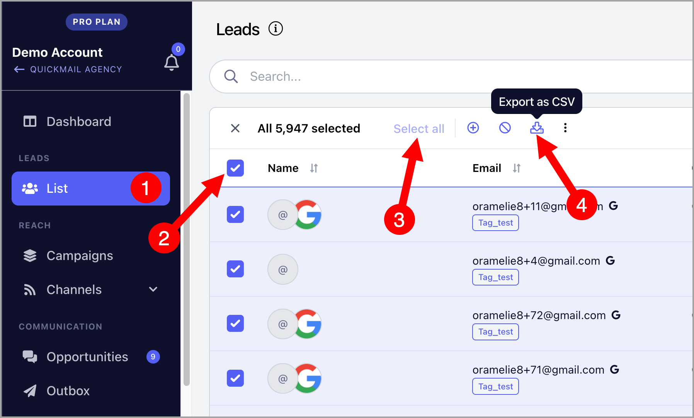

# Exporting Leads

If you need a backup of your leads or want to use them elsewhere, you can easily export your leads from QuickMail in just a few steps.

## How to Export Leads?

Simply go to Campaign List → select the leads → click Export to download a copy.

After every import, an email containing the CSV will be sent to the email address you're using to login.

**Note:** You can use filters to narrow down the list you'd like to export

## What do I do if I didn't receive the email?

If you didn’t receive the email containing the CSV export, it’s possible your email was added to our suppression list. This can happen if QuickMail notification emails to your address bounced more than once. Please contact [support@quickmail.com](mailto:support@quickmail.com) for assistance
