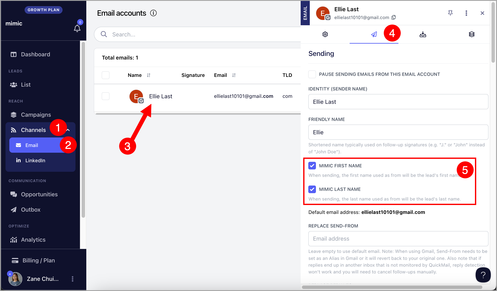

# Getting More Engagement with Mimic 🪞

**Mimic** allows users to automatically adjust the sender name to closely match or mirror the recipient’s name.

This technique helps build familiarity and boost engagement, especially in cold outreach, because the message feels more personal and less automated.

## How does it work?

Once enabled, Mimic automatically references the recipient’s name and adjusts the sender name accordingly for each email sent.

You can choose to mimic either the first name or last name. This is configured per email account and applies at the time of sending, so the sender name dynamically updates to match each recipient in real time.

For example, if the recipient is John Smith, the sender name could appear as:

- John Smith – if Mimic is enabled for both first and last name

- John Pineda – if Mimic is enabled only for the first name

- Michael Smith – if Mimic is enabled only for the last name

**Note:** If a lead doesn't have a first or last name and Mimic is enabled, it will not make any changes to the sender name.

## How to use it?

To setup Mimic, go to Channels > Click on an email account > Sending tab > Check the box Mimic First or Mimic Last Name

Once enable, every emails sent wil match tgereciouents name and changeyour sender name to it automatically.
