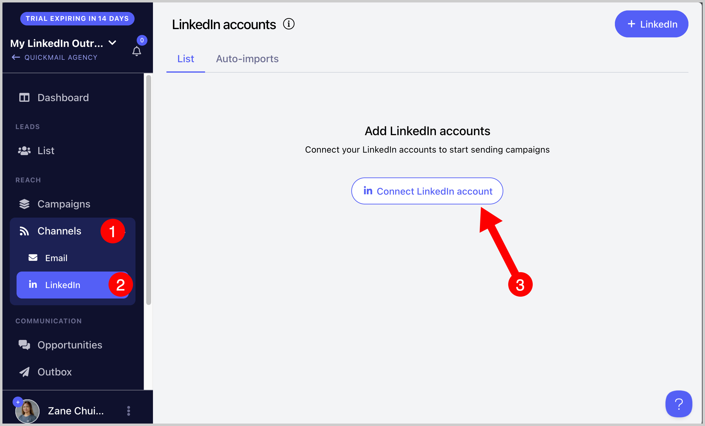
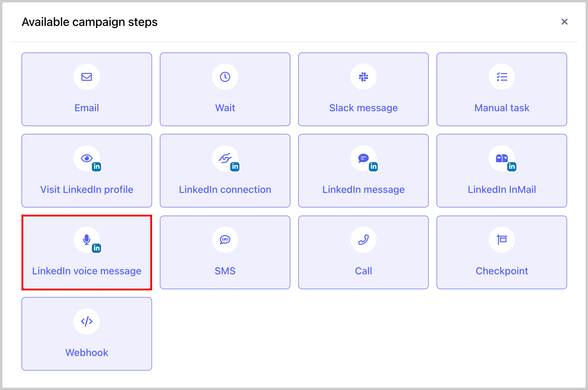
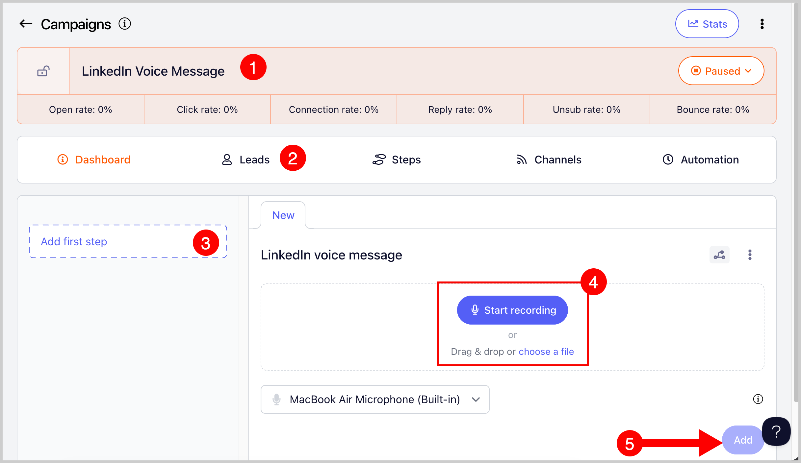

# Sending LinkedIn Voice Messages 🔊

It’s now possible to send LinkedIn voice messages directly through your campaigns in QuickMail!

## Why use it?

Voice messages help your LinkedIn campaigns stand out by adding a human touch that text just can’t capture. It helps you stand out and get more replies because because it feels more personal, grabs attention faster, and builds trust more easily than a text message.

## How does it work?

When you record a LinkedIn voice message to your campaign, QuickMail sends it directly to your recipient’s LinkedIn inbox. Your message plays as an audio clip, letting your tone and personality come through instantly.

## How to use it?

**Step 1** . Connect your LinkedIn account.

**Step 2.** Make sure you're connected with the lead. You must be connected to a lead before sending a LinkedIn voice message. If you try to send one without being connected, the lead’s progress will run into an error.

To avoid this, you can add a LinkedIn connection request step before your LinkedIn voice message step in the campaign.

**Step 3.** Go to a campaign →  Steps →  Add Step →  Add LinkedIn Voice Message Step

**Step 4.** Record or upload your voice message and save step.

**Important:** - The maximum recording length is **1 minute**

- The maximum file size for uploads is **20 mb**

- Currently supported file type: **.m4a**

**Step 5:** Make sure to set the campaign live. Once a lead reaches the LinkedIn Voice Message step, they will receive the voice message in their LinkedIn inbox.

To know more about QuickMail's LinkedIn Automation, check out this guide: LinkedIn Automation
