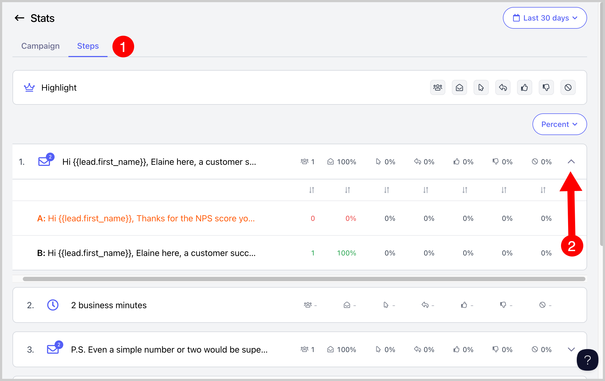

# Viewing Stats per Email Step & Variation

**
**

Users can see the stats per email step or per email variation. This allows users to identify which specific step or variation is performing well and which is not.

You can view stats per email step or variation for:

- Total leads who went through that step

- Opens

- Clicks

- Replies

- Unsubscribes

- Positive replies

- Negative replies

- LinkedIn connection acceptances

## How to see stats per email variation?

Step 1.** Go to a specific campaign →  Stats

**Step 2.** Go to the Steps tab → To view variations, click on the dropdown button next to the step

