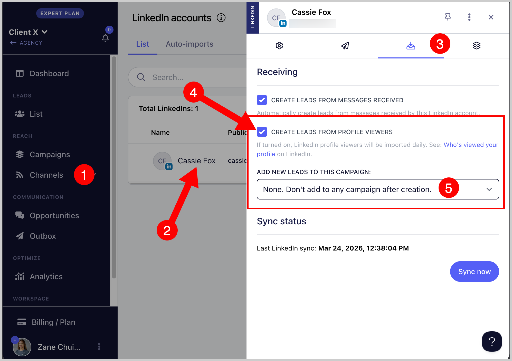

# Importing from LinkedIn Profile Views 👀

**

You can automatically import leads who viewed your profile to QuickMail. This helps you quickly follow up with interested prospects and increase your chances of conversion.

To enabled this option, go to Channels → LinkedIn → Click on the LinkedIn account → Receiving tab → Check the box 'Create leads from profile viewers' → Choose campaign where you'd like to add the leads (Optional)

