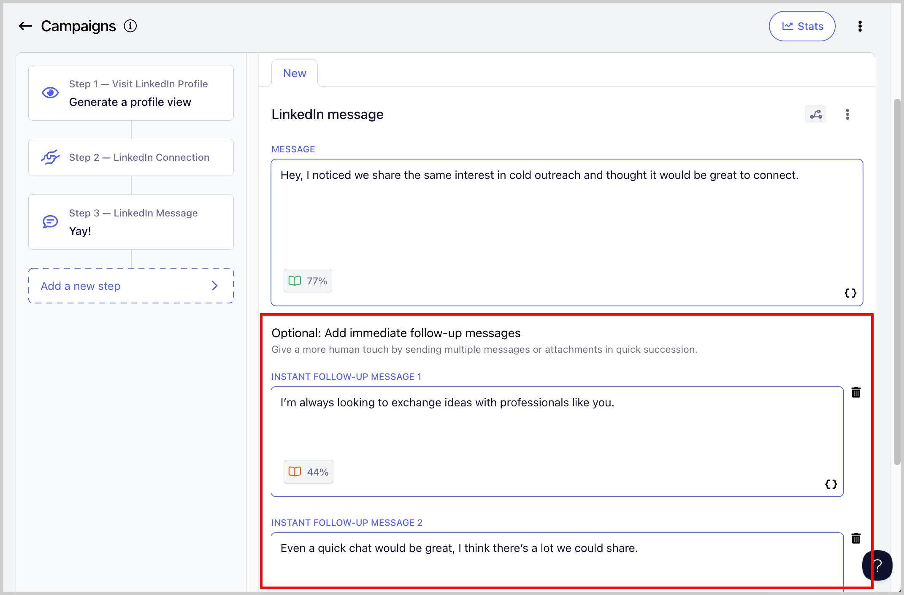
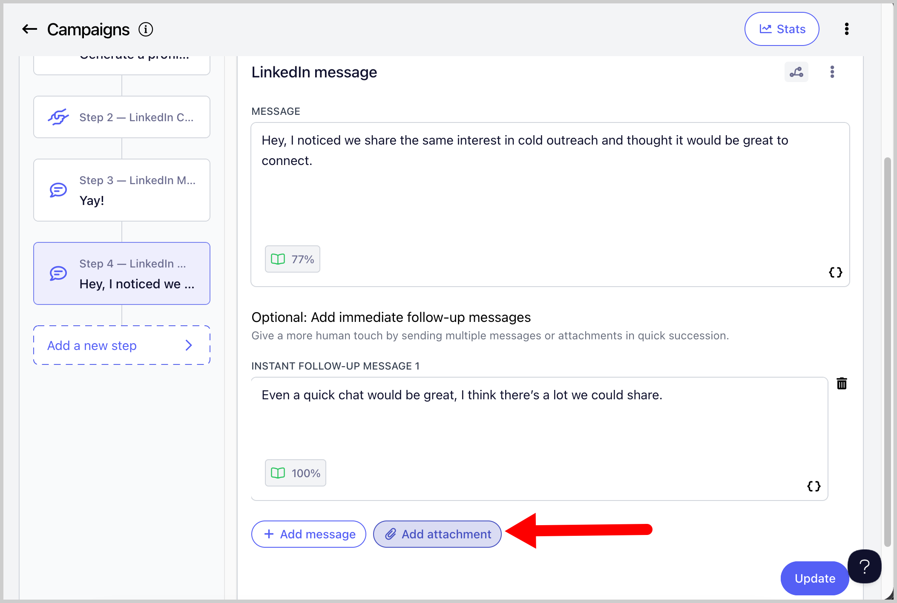
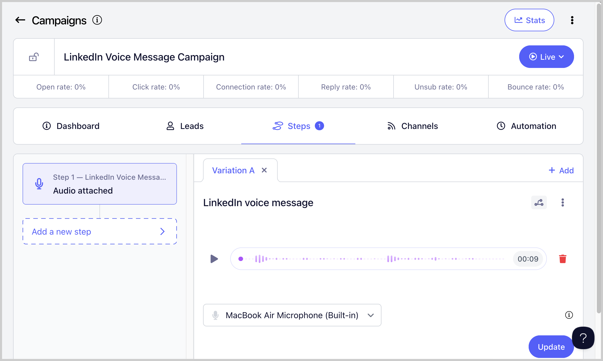

# FAQ: What can I do with QuickMail’s LInkedIn automation?

We have 9 features available in our Linkedin Automation:

## Generate profile views

Helps create familiarity and boost connection and reply rates by making your approach feel more natural.

##

## Send LinkedIn connection requests

Allows you to connect to the leads, without having to do it manually

**IMPORTANT NOTES:**

- LinkedIn Connection Requests are automatically withdrawn after 90 days and when that happens, the lead status will change from 'Running' to 'Canceled'.

- You can resend the Connection Requests again after 3 weeks.

- LinkedIn doesn't allow sending messages to leads you're yet connected with

- Therefore, the setting 'Wait Until Connection Request' on a LinkedIn Connection Request Step is enabled by default. This means that the lead won't proceed to the next step, until the connection request is accepted. You can disable this setting here:

## Send LinkedIn messages

Allows you to send LinkedIn Messages (the lead must be connected in order to send a LinkedIn message)

## Send instant follow up LinkedIn message

You can also send multiple messages or attachments in quick succession, which helps your outreach feel more natural, like a real conversation.

## Send attachments

You can now add attachment to your LinkedIn messages which helps make your outreach more engaging, shows proof of your work, and gives prospects something tangible to review, like a case study, one-pager, or portfolio.

## Send LinkedIn InMails

Allows you to send LinkedIn InMail messages without needing to be connected to the lead.

## Send LinkedIn voice message

Helps you stand out and get more replies because because it feels more personal, grabs attention faster, and builds trust more easily than a text message.

## Import Leads Who Viewed Your Profile to a Campaign

You can automatically import leads who viewed your profile to QuickMail.

To enabled this option, go to Channels → LinkedIn → Click on the LinkedIn account → Receiving tab → Check the box 'Create leads from profile viewers' → Choose campaign where you'd like to add the leads (Optional)

## Import Leads From LinkedIn Post

**Tip:** You can also import leads from a different person's LinkedIn post

Users can now import leads from LinkedIn posts. This makes it easier to capture engaged prospects directly and streamline your outreach efforts.

To use this feature, go to List  → Import from LinkedIn post  → Copy the LinkedIn post link and paste it into QuickMail →  Continue with the onscreen prompts.

