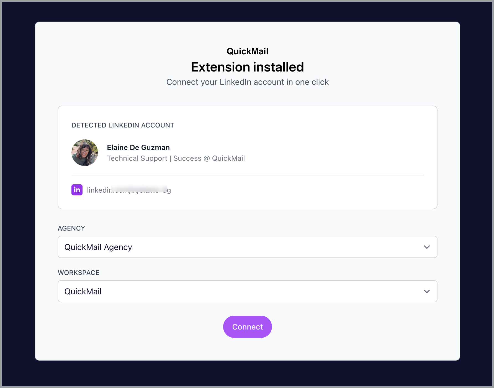
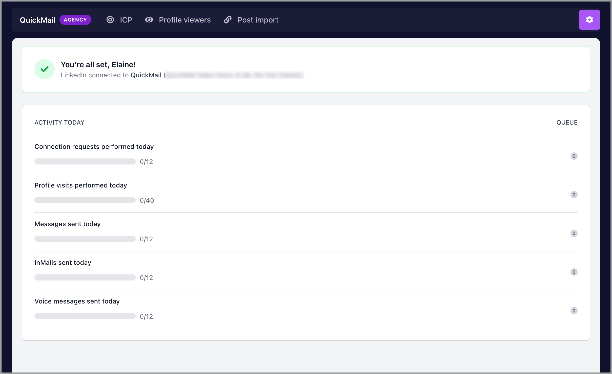
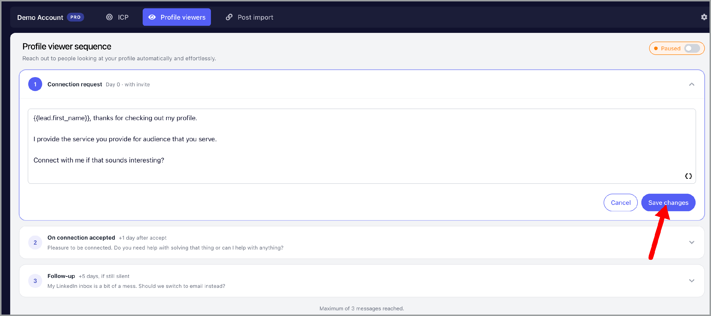
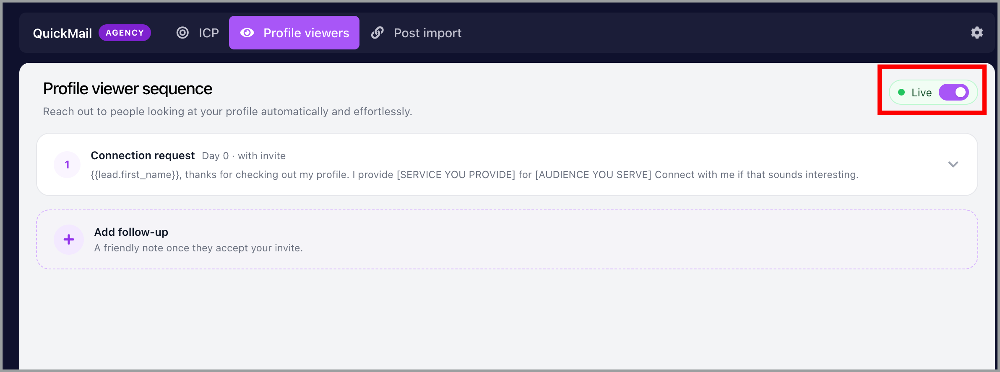
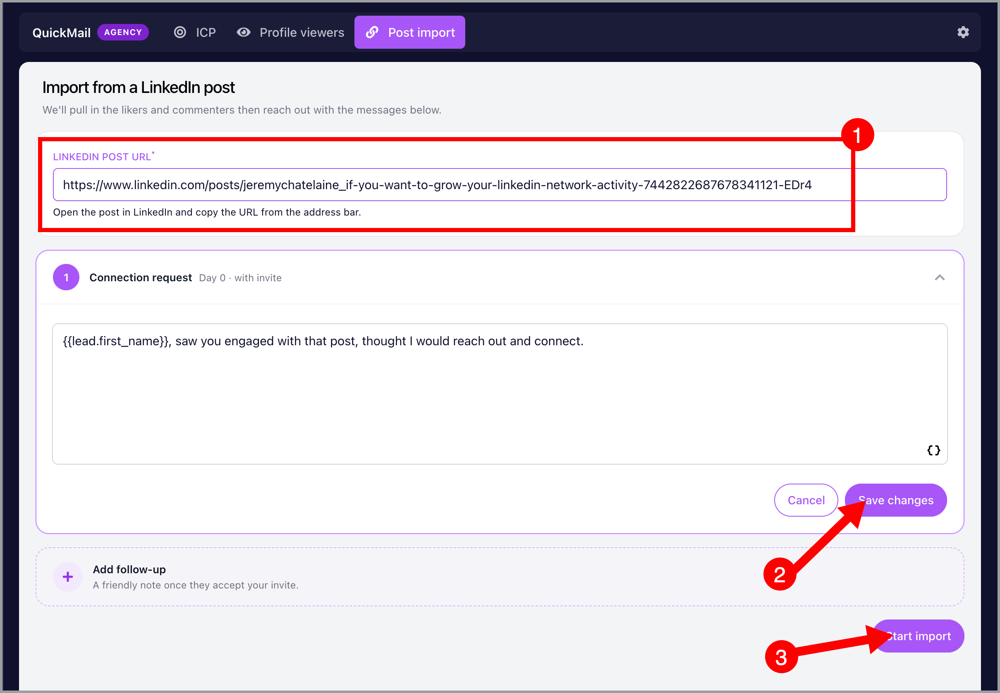

# QuickMail's LinkedIn Browser Extension

In this article:

- What is the QuickMail LinkedIn extension

- How to install the extension

- How to connect your LinkedIn account

- How to create a Profile viewers campaign

- How to create a Post import campaign

- FAQs

## What is the QuickMail LinkedIn extension

The QuickMail LinkedIn extension lets you create LinkedIn campaigns directly from your browser. You can automatically reach out to people who view your LinkedIn profile, or quickly import people who engage with specific posts.

The extension supports two campaign types:

- Profile viewers – Automatically reach out to people who view your LinkedIn profile

- Post import – Import people who like or comment on your LinkedIn posts

The extension also includes ICP filters, which let you control which profiles get imported based on job titles, industries, locations, and excluded companies. ICP filters apply to both Profile viewers and Post import campaigns.

Here's how to use the ICP filters

## How to install the extension

- Go to the [QuickMail Chrome extension page](https://chromewebstore.google.com/detail/quickmail/dbcnemlmenmcgfcbchpbamgfgaefncjd)

- Click "Add to Chrome"

- Click "Add extension" when prompted

## How to connect your LinkedIn account

Before you start: Make sure you're logged in to both your LinkedIn account and your QuickMail account.

- Click the QuickMail extension icon in your browser toolbar

- The extension will detect your LinkedIn and QuickMail accounts automatically.

- If your managing multiple accounts, select the dropdown for Agency and Workspace.

- Click "Connect"

You'll see a confirmation message that says "You're all set!" with your connected workspace name.

The extension will show your activity dashboard with:

- Connection requests performed today

- Profile visits performed today

- Messages sent today

- InMails sent today

- Voice messages sent today

## How to create a Profile viewers campaign

Profile viewers campaigns automatically reach out to people who view your LinkedIn profile.

- Click the QuickMail extension icon in your toolbar

- Click the "Profile viewers" tab

- Edit the connection request message

- Click "Add follow-up" if you want to send a message after they accept your connection request

- Click "Save changes"

Your Profile viewers campaign is now live.

You can see it in your QuickMail campaign list as well and it's named "Profile viewers outreach"

The extension will automatically import people who view your profile and send them your connection request.

## How to create a Post import campaign

Post import campaigns let you reach out to people who engage with your LinkedIn posts.

- Click the QuickMail extension icon in your toolbar

- Click the "Post import" tab

- Go to your LinkedIn -> find the post -> copy link to post

- Paste that link on the post URL box

- Keep or edit the connection request message in the text box

- Click "Add follow-up" if you want to send a message after they accept your connection request

- Click "Save changes"

- Click "Start import"

The extension will import people who liked or commented on your post and add them to your campaign.

## FAQs

Can I connect multiple LinkedIn accounts?

Yes. Each LinkedIn account you connect will be assigned to the owner who connected it.

You can create multiple campaigns using different LinkedIn accounts through the extension.

What happens if I try to connect a LinkedIn account that's already added to QuickMail?

The extension will auto-detect your existing QuickMail account, so you won't need to connect it again.

Do I need to keep the extension open for campaigns to run?

No. Once your campaigns are set up, they'll run automatically even if you close your browser.

The extension just makes it easier to create the campaigns.

Can I edit my campaigns after I create them?

Yes. Go to your QuickMail account and look for "profile viewer outreach" or "post import outreach." You can edit them directly there.

Will ICP filters apply to campaigns I create through the extension?

Yes. Any ICP filters you've set up will automatically apply to Profile viewers and Post import campaigns created through the extension.

Can I create multiple profile viewers outreach for each LinkedIn?
Each LinkedIn account can only have 1 profile viewers outreach.

**Can I create multiple post import outreach?**

Yes, you can have a separate campaign for each LinkedIn post.

**Do I need to select which campaign to import my leads into?**

No. The extension automatically creates a complete campaign for you. Profile viewers campaigns are created as "Profile viewers outreach" and post import campaigns are created as "Post import outreach." You don't need to choose an existing campaign - the extension builds everything from scratch.
