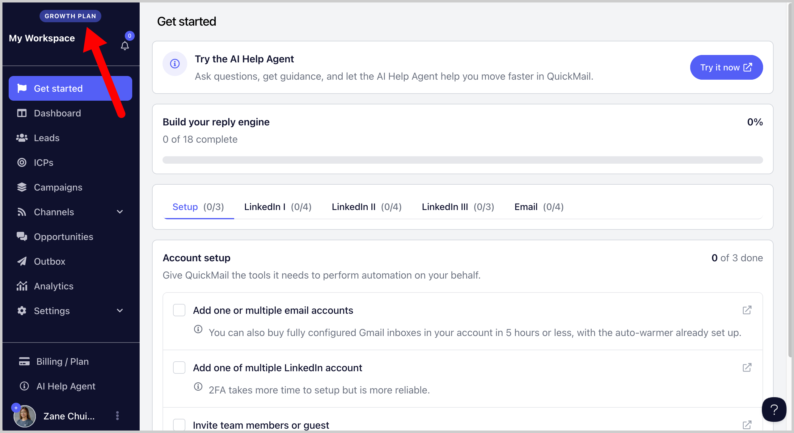
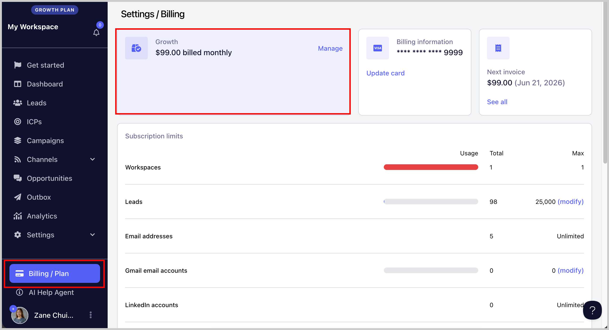
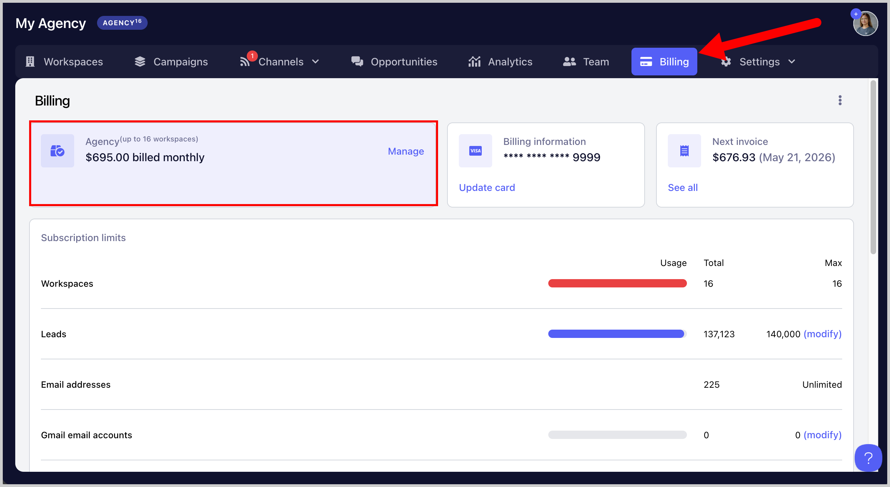
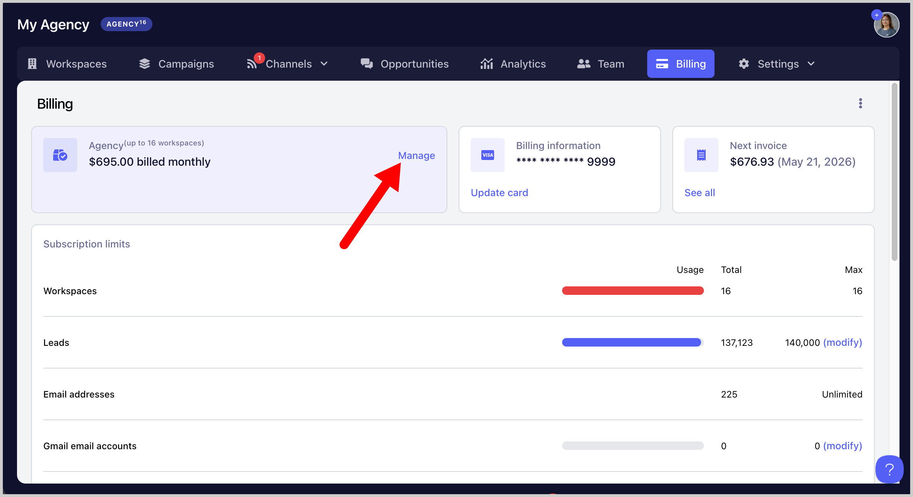
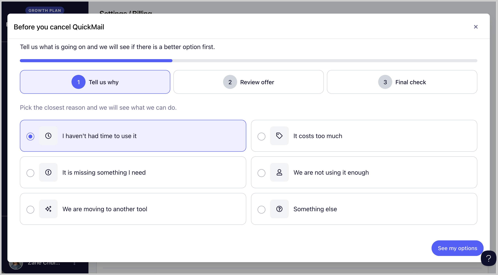

# Managing Your QuickMail Subscription

**
**

In this article:**

- [What's included in the 14-day trial?](#Whats-Included-in-the-14-Day-Trial-oUSfv)

- [What happens after the 14-day trial?](#What-Happens-After-the-14-Day-Trial-3C1pt)

- [What’s Included in Each QuickMail Plan?](#Whats-Included-in-Each-Plan-Np8Cw)

- [How to View Your Current Subscription?](#How-to-View-Your-Current-Subscription-hASe1)

- [How to Upgrade or Downgrade Your Plan?](#How-to-Upgrade-or-Downgrade-Your-Plan-qFshn)

- [How to Cancel Your Subscription?](#How-to-Upgrade-or-Downgrade-Your-Plan-IK_u9)

## What’s Included in the 14-Day Trial?

When creating a new account, your workspace is placed on a **14-day free trial by default**.

### Trial includes:

- Up to **100 leads** (does not replenish daily)

- **Unlimited inboxes**

- Up to **100 emails per day**

- Applies generally across all plans (not tied to a specific plan)

## What Happens After the 14-Day Trial?

- You will **not be charged automatically**

- Your account will exit trial mode

- To continue using QuickMail, you must **manually subscribe to a plan**

- If you do nothing, your account will remain **inactive for sending**

- No payment will be taken unless you choose to subscribe

You can upgrade at any time or simply leave the account inactive.

## What’s Included in Each QuickMail Plan?

QuickMail offers three plans designed for different stages of outreach, whether you're just getting started, growing your business, or managing outreach for multiple clients.

Feature
Starter Plan
Growth Plan
Agency Plan

**Price**
$49/month
$99/month
$299/month

**Email Senders**
Unlimited
Unlimited
Unlimited

**LinkedIn Accounts**
Unlimited
Unlimited
Unlimited

**LinkedIn Automation**
✅
✅
✅

**Sales Navigator Import**
—
✅
✅

**Import from LinkedIn Posts**
—
✅
✅

**Send LinkedIn Voice Messages**
—
✅
✅

**Send InMail Messages**
—
✅
✅

**Users**
Unlimited
Unlimited
Unlimited

**Workspaces**
1 Workspace
1 Workspace
2 Workspaces included (+$49 per extra workspace)

**Uploaded Contacts**
1,000
25,000
100,000

**Emails Sent per Month**
5,000
100,000
500,000

**Free AutoWarmer with MailFlow**
✅
✅
✅

**Zapier Integration**
✅
✅
✅

**API Access**
—
✅
✅

**Webhook Access**
—
—
✅

**Support**
Expert Support
Priority Expert Support
Priority Expert Support

**Free Trial**
14-Day Free Trial
14-Day Free Trial
—

## How to View Your Current Subscription?

You can view your subscription by going to the **Billing/Plan** page, or simply check the banner in the **upper left-hand corner** of your workspace to see which plan you’re on or how many days are left in your trial.

- **For Team Accounts (Users on Starter and Growth):** To manage your subscription, go to the **Billing/Plan** page in your workspace.

- **For Agency Accounts (Users on the Agency plan):** Agency subscriptions are managed from the **Billing/Plan** page in the Agency Dashboard.

## How to Upgrade or Downgrade Your Subscription?

To upgrade or downgrade your plan, go to the **Billing/Plan** page → click the **Manage** button → select your preferred plan → click **Update Subscription** to apply the changes.

**Tip:** If you’re on an old/legacy pricing plan and would like **unlimited email accounts**, **higher lead storage**, or an **increased email sending limit**, we can move you to our new pricing structure (Starter, Growth, Agency). Email us at **support@quickmail.io** to request the switch.

## How to Cancel Your Subscription?

To cancel your plan, go to the **Billing/Plan** page → click the **Manage** button → click **Cancel Subscription** → follow the on-screen instructions to confirm the cancellation.

