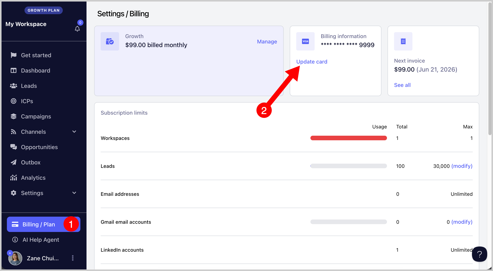

# Updating Your Payment Method

**

Currently, our payment channel only supports debit and credit card payments. At the moment, there is no option to subscribe or make payments using other payment methods.

If you would like to change the card on file, please note that you must have admin access to the account.

To update the card on file:

- **For agencies:** Go to the agency dashboard → Billing/Plan

- **For teams:** Go to the workspace' Billing/Plan page

Then click '**Update card' **and save your changes.

