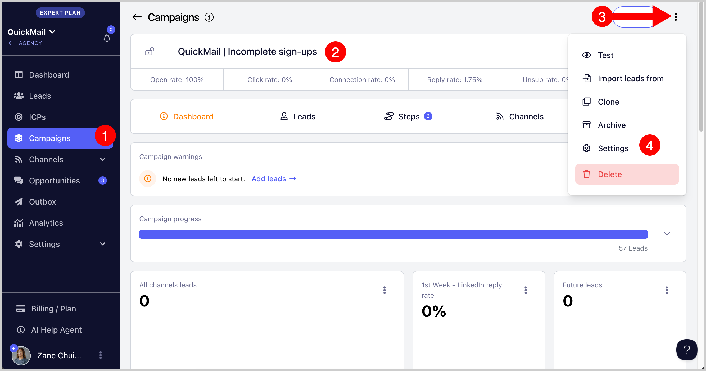
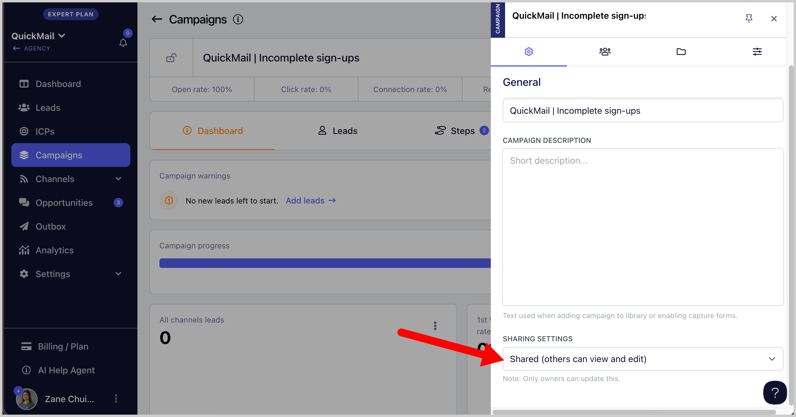
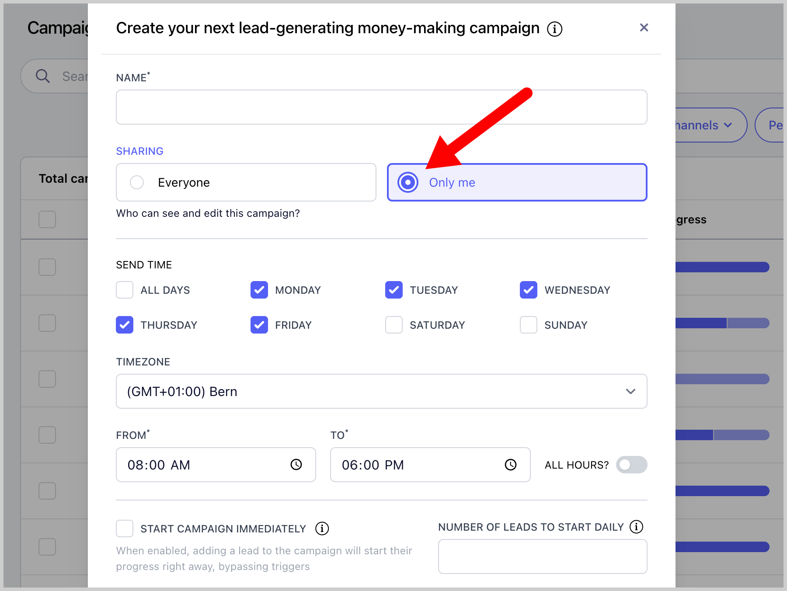

# Setting a Campaign Private

**

Setting a campaign private allows you to restrict access so that only the campaign owner can view and manage it. This is useful when you want to prevent other team members from editing or managing your campaigns.

**Note: **By default, the campaign owner is the user who created the campaign

## How to Set a Campaign to Private

### Option 1: From Campaign Settings

Open the campaign you want to edit → Click **Settings**

Locate Sharing Settings → Set from Shared to Private

**

### Option 2. Initial campaign Setup

You can set the campaign as private during the initial campaign setup. Simply select Only me.

Note:** Users who are not set as campaign owner cannot make changes to the campaign or view it, even if they are an admin.
