# Buying Gmail Accounts & Domains Through QuickMail

**In this article:**

- Why buy Google email accounts in QuickMail?

- How much does it cost?

- How to buy Google email accounts in QuickMail?

- Where can I see pending domain orders?

- Where can I get the password and 2FA?

- How to cancel Google email accounts purchased from QuickMail?

- How to add or remove email forwarding?

- How to add or remove domain forwarding?

- How to renew domains?

## Why buy Google Email Accounts in QuickMail?

- Create new Google inboxes in just a few clicks ✨
No need for manual setup, each email account is automatically added to your QuickMail workspace.

- Skip the technical headaches 🤖
QuickMail automatically configures DNS records (SPF, DKIM, DMARC) and custom tracking domains for optimal deliverability, no need to touch complicated settings.

- Built-in Stealth Mode 🥷
Email accounts purchased from QuickMail use their own Gmail API, so Gmail sees emails as sent directly from the user, not a third party. This means less chance of being flagged and better inbox deliverability. This also means that you can use the inbox from day 1, as long as you keep the volume low. No more waiting for 2 weeks.

- Premium Auto-Warmer 🔥
QuickMail’s Auto-Warmer is currently only available for inboxes purchased through QuickMail.
It generates realistic email exchanges within a trusted group of high-deliverability accounts, helping your emails land in the inbox more consistently.

- Lower monthly cost 💰
Gmail email accounts through QuickMail cost only $4/mo per email account, significantly less than buying directly from Google Workspace and other providers.

**IMPORTANT:** Domains purchased through QuickMail are valid for one year. Please note that they are** non-refundable **and **non-transferable.**

## How much does it cost?

- For users on new pricing (Starter, Growth, Agency Plans):

*To purchase new email accounts, you’ll first need to buy a Google email package.*

- Each package includes 10 email accounts.

For accounts created before December 2025, it costs $30 per package

- For accounts created on or after December 2025, the cost is $40 per package.

- You can purchase as many packages as needed.

Bringing your own domain is not supported. A new domain must be purchased through QuickMail. Pricing depends on availability.

It’s currently not possible to add more inboxes under a domain you’ve already purchased. For example, if you’ve bought a domain and added two inboxes, you won’t be able to add a third later

## How to buy Google Email Accounts in QuickMail?

**Important:** This feature is currently only available to accounts on a paid subscription

**Step 1.** Accounts on the new pricing must purchase a Gmail package to be able to buy new email accounts from QuickMail.

Each package costs **$40** and allows you to add up to **10 email accounts**. You can purchase as many packages as needed.

**Note:** Users on old pricing - Basic, Pro, and Expert Plans can skip Step 1.

To Buy Google Email Package go to the Billing/Plan → Manage Plan

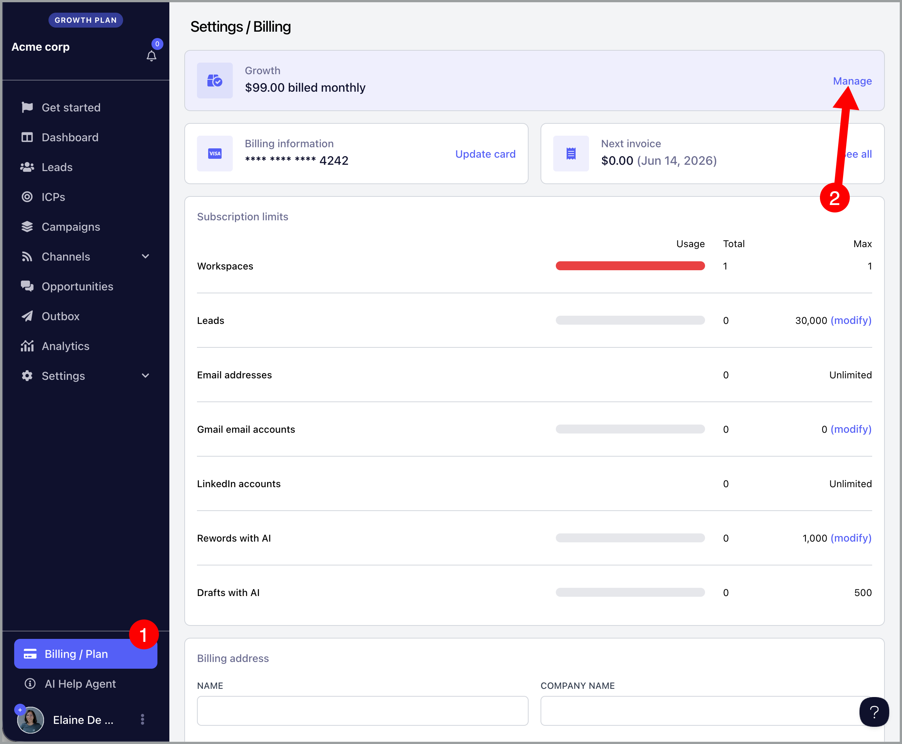

Add Gmail package → Update subscription

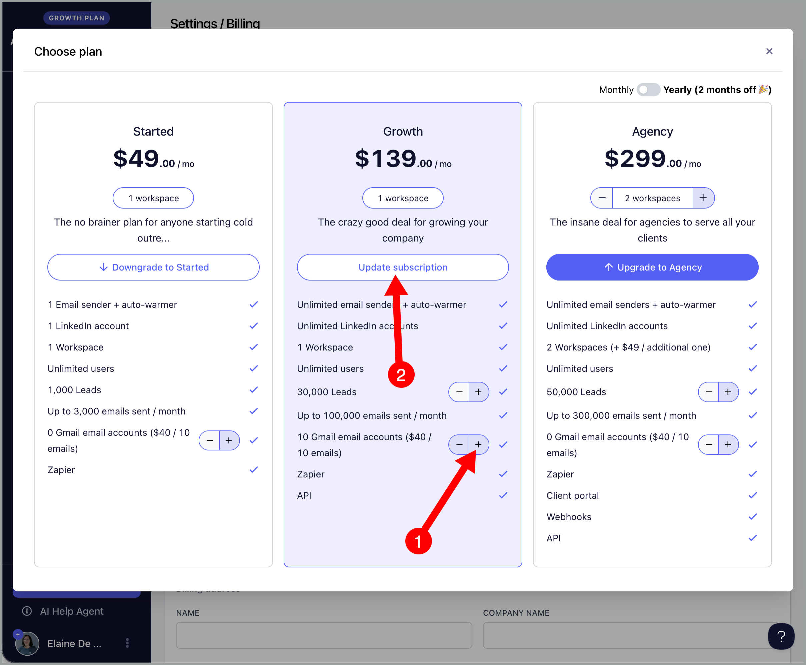

**Step 2.** Go to Channels → Email → Buy Gmail email accounts

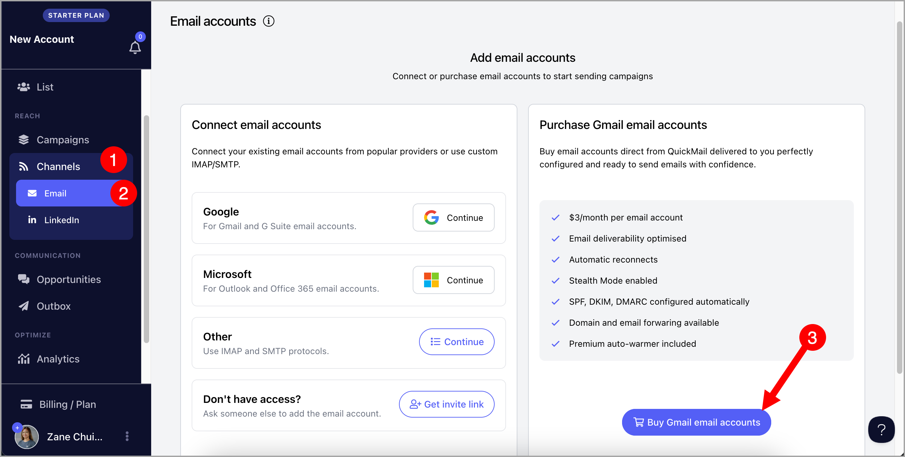

**Step 3.** Search for the domain you'd like to buy → Check availability → Add the website where you would like to redirect the domain → Add to cart

**Important**: Adding a redirect helps prevent new domains from being blacklisted.

Additionally, if recipients visit the domain in your emails, they will be automatically redirected to your main website.

**Step 4.** Fill in the First Name and Last Name → Add username → Upload Avatar (optional)

If you'd like to add more email accounts, click "+Email", otherwise click "Continue"

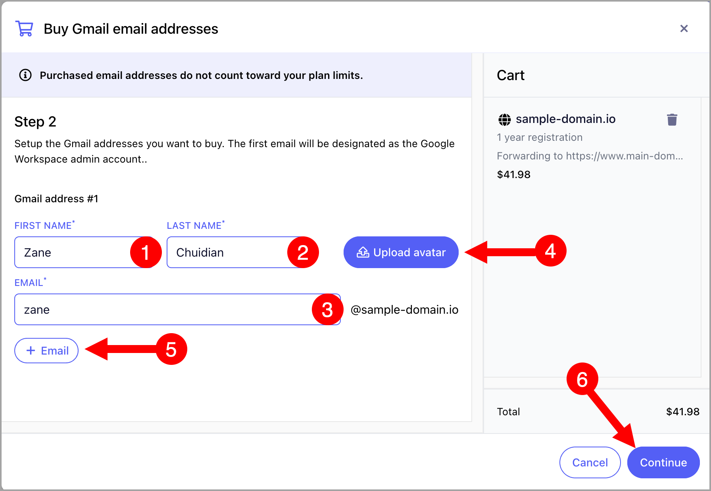

**Step 5. (Optional) **If you'd like to setup email forwarding, toggle on 'Setup email forwarding' → Add the email address where you'd like to forward emails to → Hit continue. Otherwise, you can skip it.

**Note:** If you wish to set up email forwarding in the future, you will need to configure it manually in your Gmail settings.

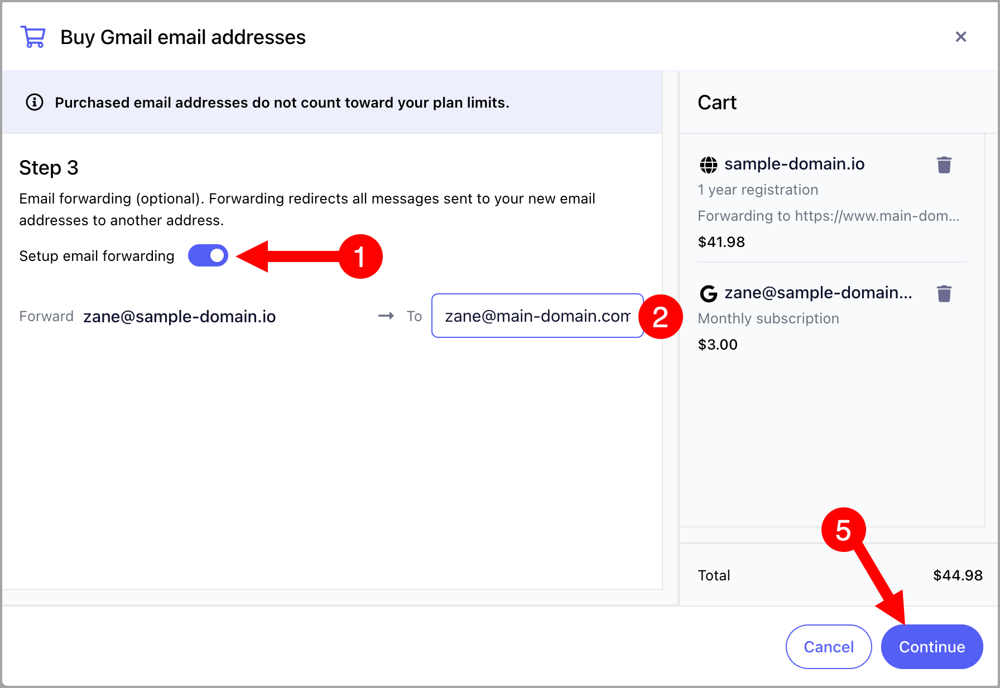

**Step 6. (Optional) **If you'd like to warm up the email account, toggle on 'Setup auto-warmer' → Change the imaginary company and product name if you'd like → Hit continue

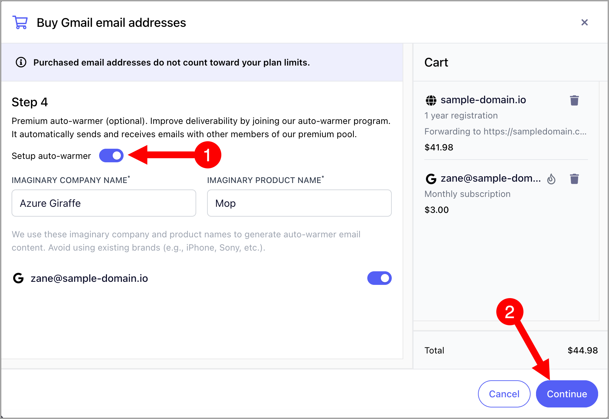

**Tip:** If you'd like to know more about auto-warmer, check out this guide: QuickMail Auto-Warmer

**Step 7.** Check the total cost of the order and check the 'I Accept' box → Pay Now

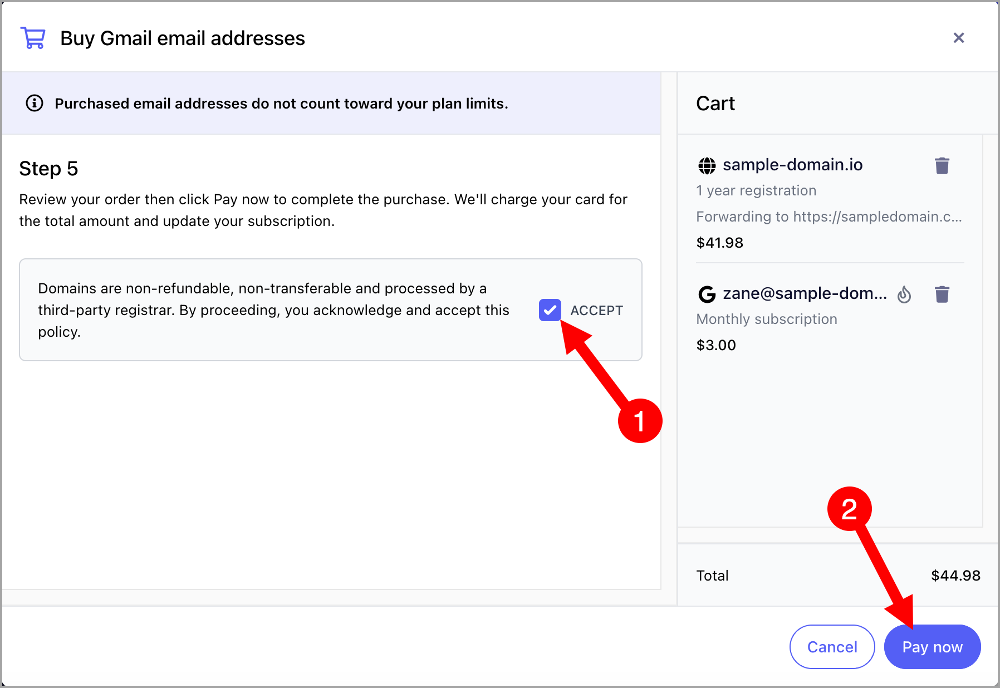

**Step 8.** After making a payment, the email accounts will automatically appear in the Channels page after some time (within 48 hours), and are ready for use.

**Note:** Domains purchased through QuickMail have a ★ icon on their thumbnail. Those in stealth mode display a detective icon next to "Google."

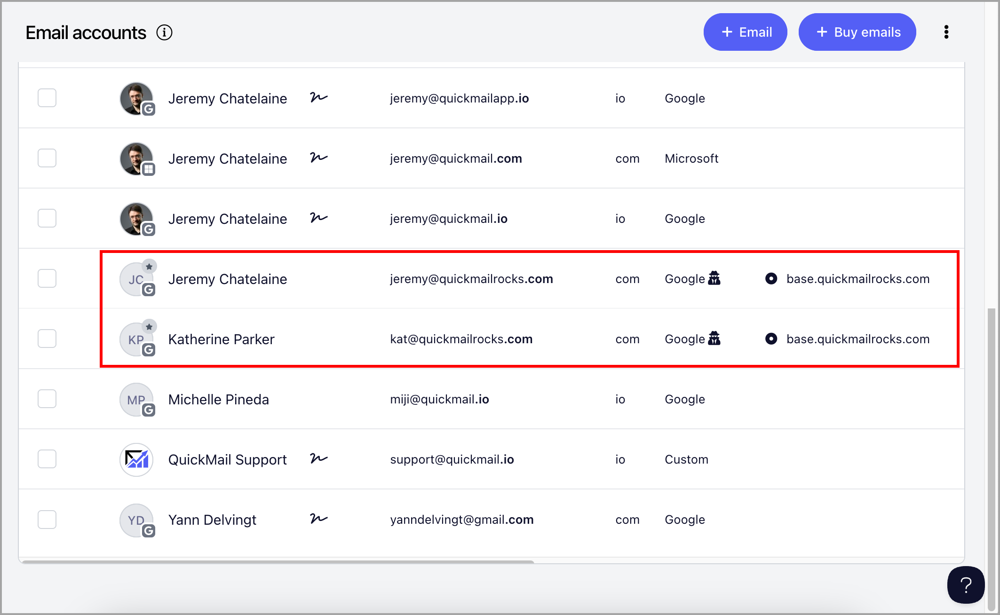

## Where can I see pending domain orders?

You can see pending domain orders by clicking the hourglass icon here:

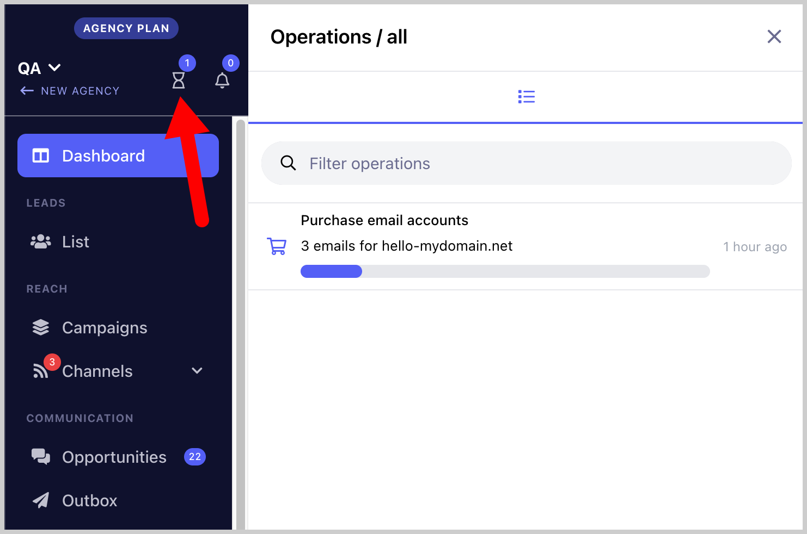

## Where can I get the account password and 2FA of the purchased email accounts?

You can get the account details of the purchased email accounts by going to Channels → Click on an email account to open quick view → Password / 2FA One-time password

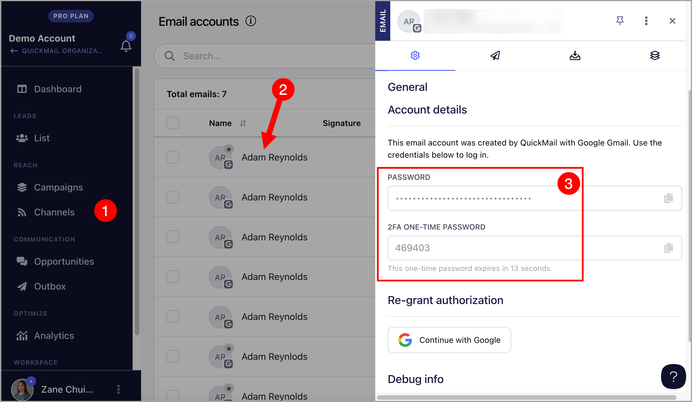

##

## How to cancel purchased email accounts from QuickMail?

Please reach out to [support@quickmail.io](mailto:support@quickmail.io) or click on the widget at the bottom right of the page so we can process the cancellation for you.

Once the emails are canceled, you can remove your Gmail package by going to Billing -> manage subscription -> downgrade Gmail package to 0.

## How to add or remove email forwarding?

It's only possible to add email forwarding upon domain order in the interface. However, if you'd like to add, remove, or update the email forwarding, please reach out to support@quickmail.io

## How to add or remove domain forwarding?

It's only possible to add domain forwarding upon domain order in the interface. However, if you'd like to add, remove, or update the domain forwarding, please reach out to support@quickmail.io

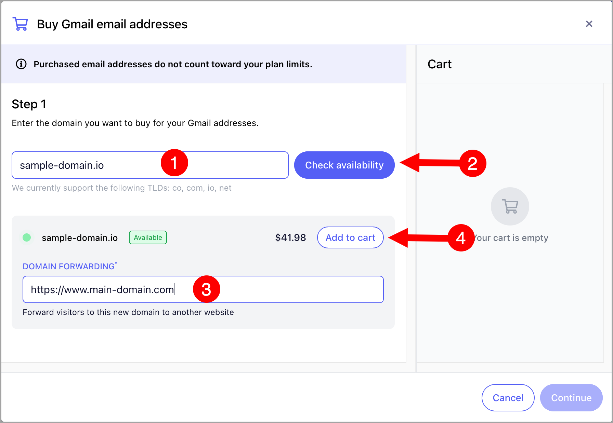

## How to renew domains?

When your domains are approaching their expiration date, you will be notified both in the interface and via email.

The interface notification will include a **“Renew”** button, which allows you to easily extend your domain before it expires.

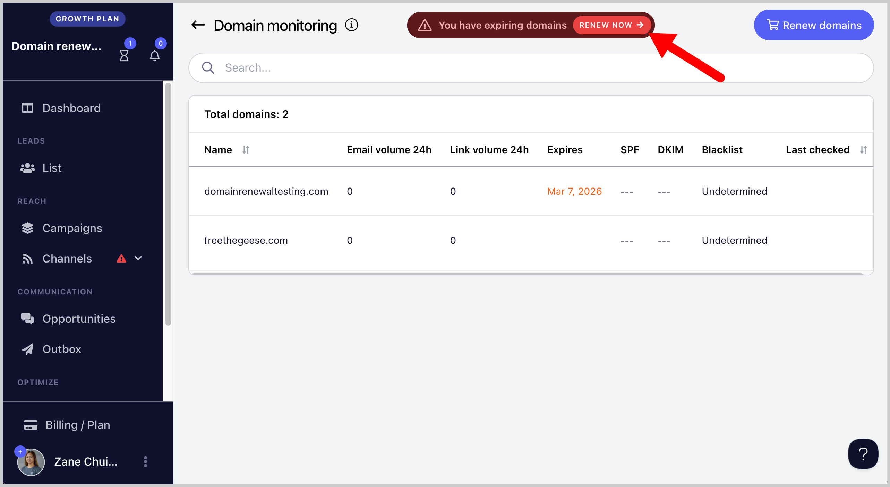
