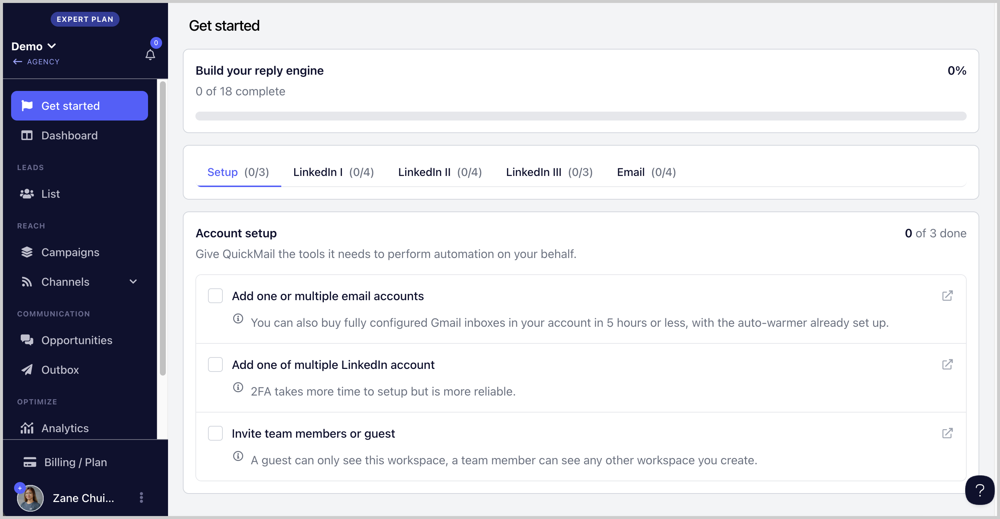

# Getting Started

The **Getting Started** page provides a simple checklist of essential tasks to help you smoothly complete your onboarding and set up your campaigns with ease. It guides you step by step, ensuring you don’t miss anything important as you begin.

## Setup

This section gives you a checklist of all the accounts you need to connect in order to run automation successfully.

## LinkedIn I

Provides a checklist of foundational tasks required to start sending LinkedIn messages, ensuring your account is properly prepared for engagement.

## LinkedIn II

Helps you build and launch an outreach campaign designed to connect with high-quality, relevant leads from your LinkedIn posts and generate replies efficiently.

## LinkedIn III

Enables you to generate new leads on autopilot using automatic imports from Sales Navigator links, helping you continuously feed your pipeline.

## Email

Provides a checklist of key steps to ensure your email account is properly configured and fully ready for email outreach campaigns.
