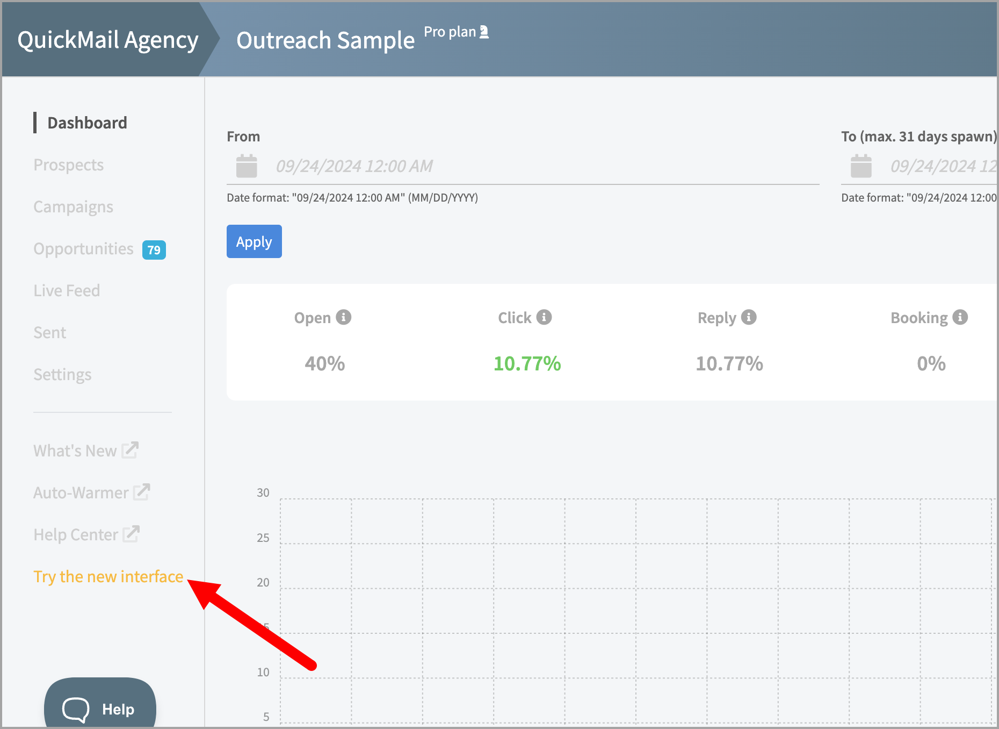
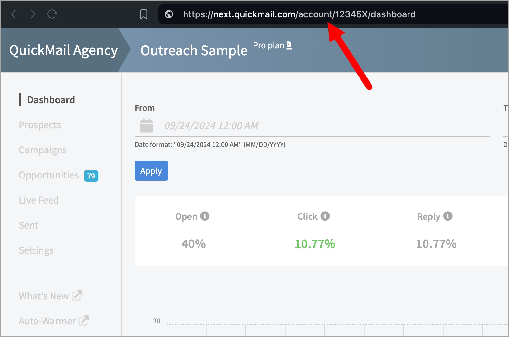
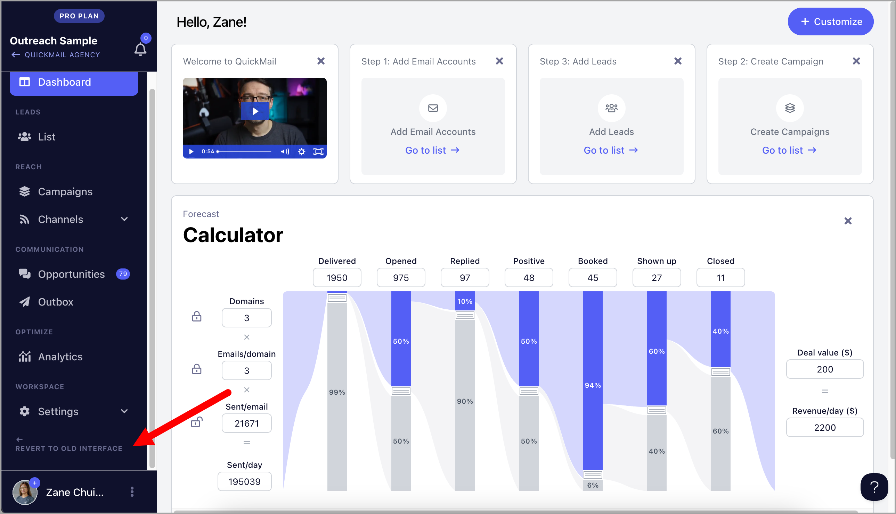

# Switching from the Old UI to the New UI

To switch between the old UI to the new UI, simply click the ‘**Try New Interface**’ link in the left-side navigation of your workspace.

If you don't see this option, change the word 'account' to 'workspace' in the URL of your workspace dashboard instead.

For example:

Old UI - *https://next.quickmail.com/account/12345X/dashboard*

New UI - *https://next.quickmail.com/workspace/12345X/dashboard*

**Note:** The new interface works differently and no longer uses “buckets” in its automation system.

Also, clicking the '**Try New Interface'** link will switch your workspace to the new version, but it will not update or migrate your automation system.

If you want a full migration to the new interface (removing buckets in the automation system), please contact us at **support@quickmail.io** so we can complete the switch for you.

To go back to the old UI, simply click '**Revert to old interface**' link

