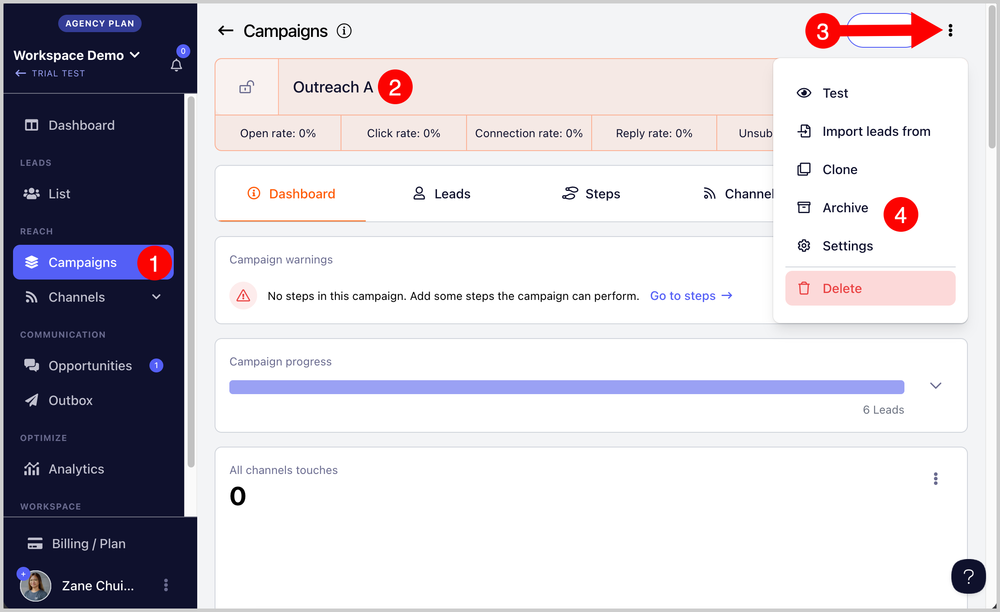
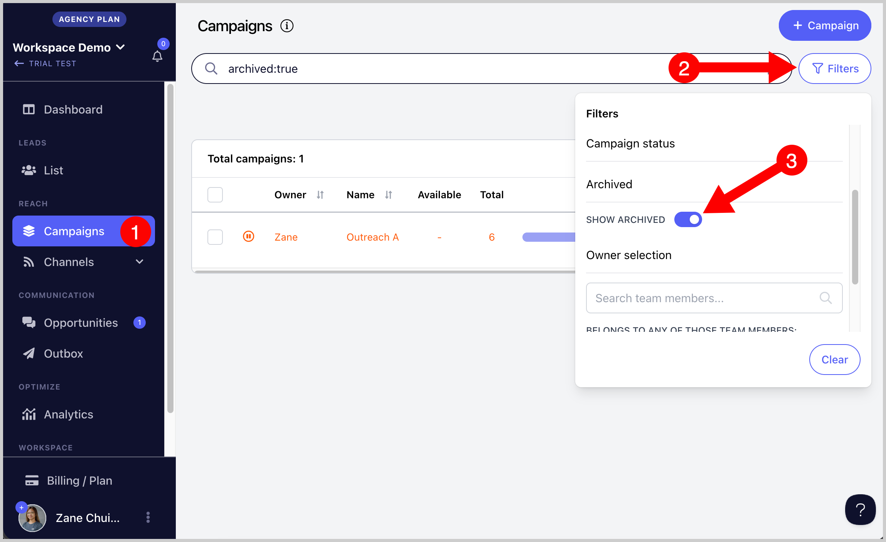
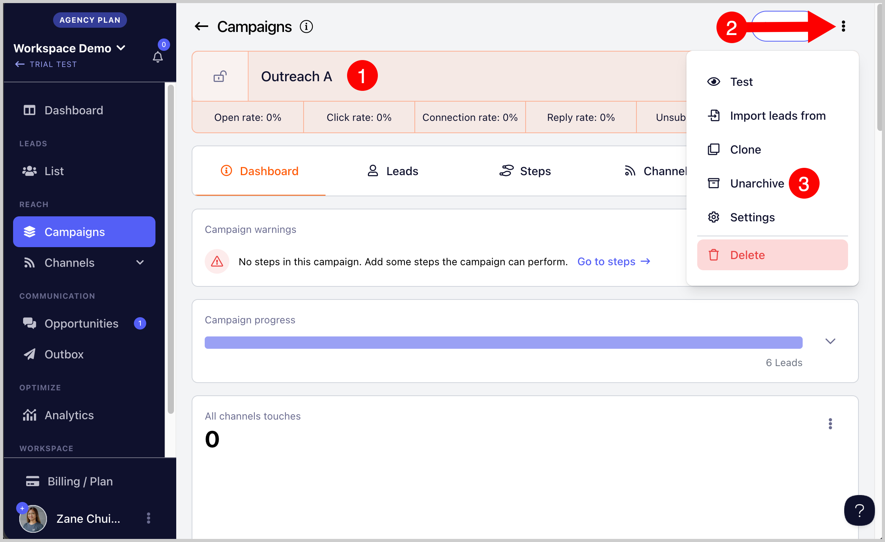

# Archiving Campaigns

Archiving campaigns lets you hide them without permanently deleting anything. This is useful if you want to keep your workspace organized while still being able to access those campaigns again in the future.

## How to Archive Campaigns?

Go to the campaign you'd like to archive → click menu (three vertical dots) → Archive → Confirm

Once the campaign is archived, it will no longer be visible in the campaign list.

**Note:** There's no option yet to bulk archive campaigns, it needs to be done manually.

## How to See Archived Campaigns?

Go to the Campaigns page → Filters → Toggle on show archived

## How to Unarchive Campaigns?

Go to the archived campaign by using the filters above → click menu (three vertical dots) → Unarchive → Confirm

