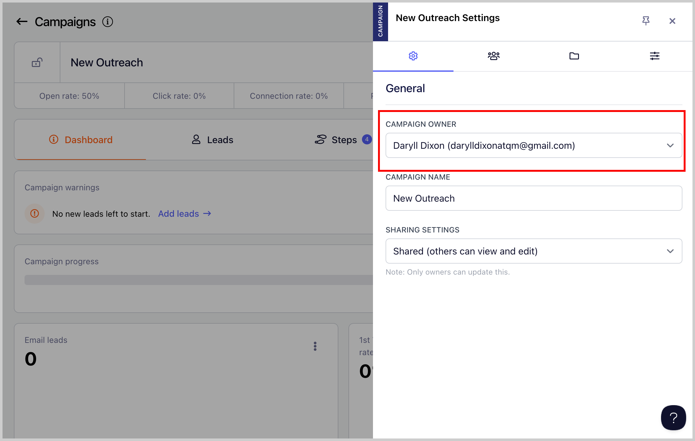

# Changing the Campaign Owner

Changing campaign owners makes it easy to quickly reassign responsibility when team members change roles or go on leave.

In a real-life situation, this helps prevent delays or missed updates because the right person always has control and visibility over campaign performance.

## How to change a campaign's owner?

To change a campaign's owner, go to the Campaign → Menu (three vertical dots) → Settings → Select Campaign Owners

**Note:** Only team members and guests can be assigned as campaign owners.

**Tip:** If you'd like to know more about adding guests or team members, here's a guide: Adding Team Members
