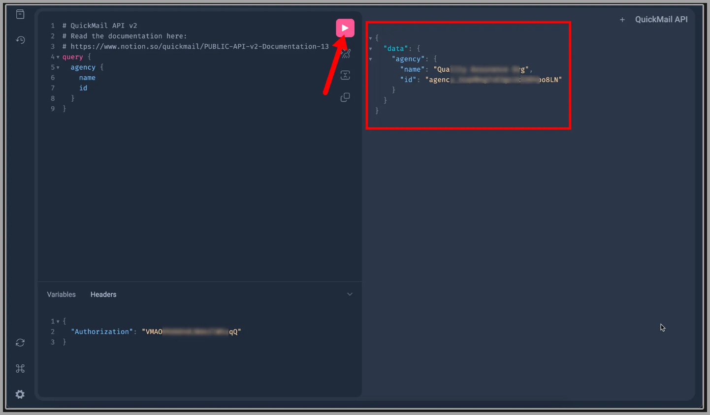
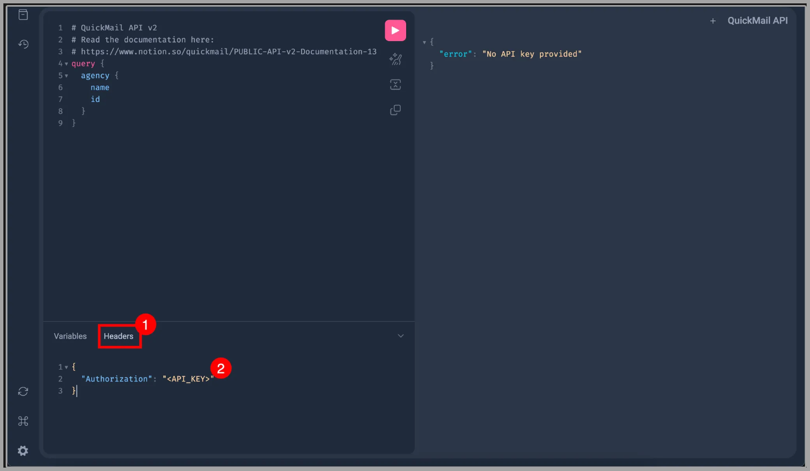
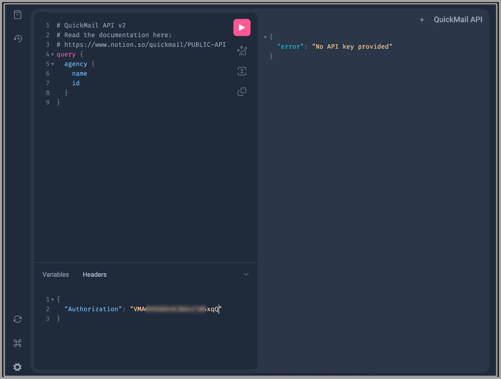
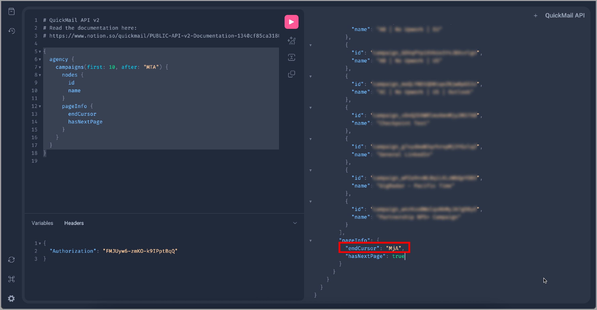

# Setting up API V2

These are mostly just JSON samples for API calls.

**Here's the complete API documentation to use: **[**https://api.quickmail.com/help**](https://api.quickmail.com/help)

For convenience, we have a web app that you can use to test your integrations with your live data in QuickMail. Here’s where you can access it:[https://api.quickmail.com/v2/graphiql](https://api.quickmail.com/v2/graphiql)

API rate limit is 10 requests per 10 seconds

**In this article:**

- Creating an API Key

- API Authorization

- API Documentation

- API Endpoint

- JSON samples for API calls:

- Getting Agency information including name, ID, and URL

- Getting workspaces IDs, names, and URLs

- Getting campaign IDs, names, and URLs

- Getting campaign stats based on a specific campaign

- Getting email account IDs

- Creating campaigns

- Creating email steps

- Creating email variation

- Creating Wait step

- Updating send times

- Assigning/unassigning email accounts to/from campaigns

- Creating custom properties

- Setting custom properties

- Creating Tags

- Setting Tags

- Getting the number of available, active, and completed leads in a campaign

- Getting the number of leads that ran into an error

- Getting leads

- Deleting Leads

- Moving to the next page

- Filtering: Exclude/Include workspace IDs

- Ruby samples

- Creating a lead

- Retrieving a lead's information

# Creating an API key

To create an API key, please refer to this guide: Creating an API key in QuickMail

# Authorization

To get started, paste this on the headers:

{
"Authorization": "<API_KEY>"
}

Then, generate your API in QuickMail and replace the word *<API_KEY>* with it.

Here’s an **article** to help you generate an API key.

Next, click the play button. If the API key is valid, it should show the name of your agency, as well as the ID. Like this:

**Common error/s when setting up authorization**

If it shows an error, please double-check that the API key pasted is correct and that it’s still on the agency dashboard. (It can be deleted by other team members)

Once the API key has been corrected or a new one added, just replace the old one on the headers and press the play button again.

# Documentation

Here's the full documentation: [https://api.quickmail.com/help](https://api.quickmail.com/help)

# Endpoint

To use the API directly, send POST requests directly to: https://api.quickmail.com/v2/graphql

This URL is different from the GraphiQL page URL: https://api.quickmail.com/v2/graph**i**ql

## JSON samples

### Getting Agency information including name, ID, and URL

{
agency {
id
name
appUrl
}
}

### Getting workspaces IDs, names, and URLs

{
agency {
id
name
appUrl
workspaces {
nodes {
id
name
appUrl
}
}
}
}

### Getting campaign IDs, names, and URLs

{
agency {
id
name
appUrl
campaigns {
nodes {
id
name
appUrl
}
}
}
}

### Getting campaign stats based on a specific campaign

{
agency {
id
name
appUrl
campaign(id: "add-the-campaign-id-here") {
id
name
appUrl
stats {
clicks
opens
replies
repliesPositive
repliesNegative
}
}
}
}

### Getting email account IDs

{
agency {
id
name
appUrl
workspaces {
nodes {
id
name
appUrl
}
}
emailAccounts {
nodes {
id
}
}
}
}

This only pulls up the list of inboxes/email sender in the account. It doesn't pull up the stats related to the inboxes such as open, clicks, replies, sent emails, etc.

### Creating campaigns

mutation createCampaign {
createCampaign(
input: {
workspaceId: "add-workspace-id-here",
name: "Campaign 2",
}
) {
campaign {
id
name
}
}
}

### Creating email steps

mutation createEmailStep {
createEmailStep(
input: {
campaignId: "add-campaign-id-here",
subject: "insert subject here",
body: "insert body here",
continueThread: Boolean,
openTracking: Boolean,
clickTracking: Boolean,
draft: Boolean,
plainText: Boolean,
cced: "insert cc email here",
bcced: "bcc here"
preview: "The preview text snippet shown before opening the email in the user mail client.",
paused: Boolean,
clientMutationId: "A unique identifier for the client performing the mutation."
}
) {
step {
id
}
}
}

### Creating email variation

mutation addEmailVariation {
addEmailVariation(
input: {
stepId: "campaign step ID here",
subject: "insert subject here",
body: "insert body here",
continueThread: Boolean,
openTracking: Boolean,
clickTracking: Boolean,
draft: Boolean,
plainText: Boolean,
cced: "insert cc email here",
bcced: "bcc here"
preview: "The preview text snippet shown before opening the email in the user mail client.",
paused: Boolean,
clientMutationId: "A unique identifier for the client performing the mutation."
}
) {
variation {
id
}
}
}

### Creating Wait step

mutation createWaitStep {
createWaitStep(
input: {
campaignId: "insert campaign ID here",
unit: "days",
value: 3
}
) {
step {
id
}
}
}

### Updating send times

mutation updateCampaignAutomation {
updateCampaignAutomation(
input: {
campaignId: "insert campaign ID here",
timeZone: "UTC",
businessDays: {
sunday: boolean,
monday: boolean,
tuesday: boolean,
wednesday: boolean,
thursday: boolean,
friday: boolean,
saturday: boolean
},
timeRanges: [
{
day: monday, startTime: "00:00", endTime: "00:00",
day: tuesday, startTime: "00:00", endTime: "00:00"
}
]
}
) {
campaign {
id
}
}
}

### Assigning/unassigning email accounts to/from campaigns

mutation setCampaignEmailAccounts {
setCampaignEmailAccounts(
input: {
campaignId: "insert campaign ID here",
emailAccountIds: ["email ID", "email ID"],
assign: boolean
}
) {
emailAccounts {
id
}
campaign {
id
}
}
}

### Creating custom properties

mutation createCustomProperty {
createCustomProperty(
input: {
workspaceId: "workspace_5Mk2rvQpagb0aTLVXGDKRN4E",
name: "name of property",
value: "default value"
}
) {
customProperty {
id
name
}
}
}

### Setting Custom Properties

mutation setCustomProperty {
setCustomProperty(
input: {
workspaceId: "workspace_xxxx",
customPropertyId: "custom_property_xxx",
leadIds: [
"lead_xxx",
"lead_xxx"
],
value: "set via v2 API"
}
) {
leads {
id
customProperties {
nodes {
id
name
value
}
}
}
}
}

### Creating Tags

mutation createTag {
createTag(input: { workspaceId: "workspace_xxxxx", name: "newtag"} ) {
tag {
id
name
}
}
}

### Setting Tags

mutation setTags {
setTags(
input: {
workspaceId: "workspace_xxx",
leadIds: [
"lead_xxx",
"lead_xxx"
]
tagIds: [
"tag_xxx",
"tag_xxx",
],
assign: true # or false to untag
}
) {
leads {
id
tags {
nodes {
id
name
}
}
}
}
}

### Getting number of available, active, and completed leads in a campaign

{
campaigns {
nodes {
id
name
leadStatus {
total
active
available
completed
}
}
}
}

### Getting number of leads that ran into an error

{
campaigns {
nodes {
id
name
leadStatus {
failed
}
}
}
}

### Getting leads

query getLeads {
leads {
edges {
node {
id
email
firstName
lastName
fullName
title
role
phone
linkedinId
language
score
appUrl
}
}
}
}

### Deleting leads

# {
#   leads {
#     nodes {
#       id
#       firstName
#     }
#   }
# }

mutation {
deleteLeads(input: { workspaceId: "workspace_a3ZyeOmKbzDXAiLzMXDY5APE", leadIds: ["lead_r6zQLkOd0pnQiGVERvwaj14g", "lead_KQdYzj8W7OnJiY90AbaBeL6p"], permanent: false }) {
clientMutationId
}
}

### Moving to the next page

We only show the 1st 10 items on the 1st page.

So you need to use this JSON to move to the next page.

{
agency {
campaigns(first: 10, after: "MTA") {
nodes {
id
name
}
pageInfo {
endCursor
hasNextPage
}
}
}
}

To move to the next pages, use the endCursor code and insert it into

campaigns(first: 10, after: "endCursor")

### Filtering: Exclude/Include Workspace IDs

{
agency {
campaigns(first: 10, after: "MTA") {
nodes {
id
name
}
pageInfo {
endCursor
hasNextPage
}
}
}
}

## Ruby Samples

### Creating a lead

quickmail_key = 'your api key'
workspace_id = 'workspace_yourworkspace_id'

email = 'john@ibm.com'

mutation = <<~TEMPLATE
mutation CreateLeads($input: CreateLeadsInput!) {
createLeads(input: $input) {
leads {
id
email
}
}
}
TEMPLATE

variables = { input: { workspaceId: workspace_id, leads: [{firstName: 'John', email: 'john@ibm.com'}] } }

query = { query: mutation, variables: }

options = {
url: '<https://api.quickmail.com/api/v2/graphql>',
headers: {
authorization: "#{quickmail_key}",
accept: 'application/json',
content_type: 'application/json'
},
method: :post,
payload: query.to_json
}

response = RestClient::Request.execute(options)

body = JSON.parse(response.body)

errors = body.dig('errors')

### Retrieving a lead’s information

quickmail_key = 'your api key'

workspace_id = 'workspace_yourworkspace_id'

email = 'john@ibm.com'

payload = <<~TEMPLATE
{
workspace(id: "#{workspace_id}") {
id
name
leads(text: "#{email}") {
nodes {
id
email
}
}
}
}
TEMPLATE

query = { query: payload }

options = {
url: 'https://api.quickmail.com/api/v2/graphql',
headers: {
authorization: "#{quickmail_key}",
accept: 'application/json',
content_type: 'application/json'
},
method: :post,
payload: query.to_json
}

response = RestClient::Request.execute(options)

body = JSON.parse(response.body)

errors = body.dig('errors')These are mostly just JSON samples for API calls.

Here’s an **article** to help you generate an API key.

Next, click the play button. If the API key is valid, it should show the name of your agency, as well as the ID. Like this:

**Common error/s when setting up authorization**

If it shows an error, please double-check that the API key pasted is correct and that it’s still on the agency dashboard. (It can be deleted by other team members)

Once the API key has been corrected or a new one added, just replace the old one on the headers and press the play button again.

# Documentation

Here's the full documentation: https://api.quickmail.com/help

# Endpoint

To use the API directly, send POST requests directly to: https://api.quickmail.com/v2/graphql

This URL is different from the GraphiQL page URL: https://api.quickmail.com/v2/graph**i**ql

## JSON samples

### Getting Agency information including name, ID, and URL

{
agency {
id
name
appUrl
}
}

### Getting workspaces IDs, names, and URLs

{
agency {
id
name
appUrl
workspaces {
nodes {
id
name
appUrl
}
}
}
}

### Getting campaign IDs, names, and URLs

{
agency {
id
name
appUrl
campaigns {
nodes {
id
name
appUrl
}
}
}
}

### Getting campaign stats based on a specific campaign

{
agency {
id
name
appUrl
campaign(id: "add-the-campaign-id-here") {
id
name
appUrl
stats {
clicks
opens
replies
repliesPositive
repliesNegative
}
}
}
}

### Getting email account IDs

{
agency {
id
name
appUrl
workspaces {
nodes {
id
name
appUrl
}
}
emailAccounts {
nodes {
id
}
}
}
}

### Creating campaigns

mutation createCampaign {
createCampaign(
input: {
workspaceId: "add-workspace-id-here",
name: "Campaign 2",
}
) {
campaign {
id
name
}
}
}

### Creating email steps

mutation createEmailStep {
createEmailStep(
input: {
campaignId: "add-campaign-id-here",
subject: "insert subject here",
body: "insert body here",
continueThread: Boolean,
openTracking: Boolean,
clickTracking: Boolean,
draft: Boolean,
plainText: Boolean,
cced: "insert cc email here",
bcced: "bcc here"
preview: "The preview text snippet shown before opening the email in the user mail client.",
paused: Boolean,
clientMutationId: "A unique identifier for the client performing the mutation."
}
) {
step {
id
}
}
}

### Creating email variation

mutation addEmailVariation {
addEmailVariation(
input: {
stepId: "campaign step ID here",
subject: "insert subject here",
body: "insert body here",
continueThread: Boolean,
openTracking: Boolean,
clickTracking: Boolean,
draft: Boolean,
plainText: Boolean,
cced: "insert cc email here",
bcced: "bcc here"
preview: "The preview text snippet shown before opening the email in the user mail client.",
paused: Boolean,
clientMutationId: "A unique identifier for the client performing the mutation."
}
) {
variation {
id
}
}
}

### Creating Wait step

mutation createWaitStep {
createWaitStep(
input: {
campaignId: "insert campaign ID here",
unit: "days",
value: 3
}
) {
step {
id
}
}
}

### Updating send times

mutation updateCampaignAutomation {
updateCampaignAutomation(
input: {
campaignId: "insert campaign ID here",
timeZone: "UTC",
businessDays: {
sunday: boolean,
monday: boolean,
tuesday: boolean,
wednesday: boolean,
thursday: boolean,
friday: boolean,
saturday: boolean
},
timeRanges: [
{
day: monday, startTime: "00:00", endTime: "00:00",
day: tuesday, startTime: "00:00", endTime: "00:00"
}
]
}
) {
campaign {
id
}
}
}

### Assigning/unassigning email accounts to/from campaigns

mutation setCampaignEmailAccounts {
setCampaignEmailAccounts(
input: {
campaignId: "insert campaign ID here",
emailAccountIds: ["email ID", "email ID"],
assign: boolean
}
) {
emailAccounts {
id
}
campaign {
id
}
}
}

### Creating custom properties

mutation createCustomProperty {
createCustomProperty(
input: {
workspaceId: "workspace_5Mk2rvQpagb0aTLVXGDKRN4E",
name: "name of property",
value: "default value"
}
) {
customProperty {
id
name
}
}
}

### Setting Custom Properties

mutation setCustomProperty {
setCustomProperty(
input: {
workspaceId: "workspace_xxxx",
customPropertyId: "custom_property_xxx",
leadIds: [
"lead_xxx",
"lead_xxx"
],
value: "set via v2 API"
}
) {
leads {
id
customProperties {
nodes {
id
name
value
}
}
}
}
}

### Creating Tags

mutation createTag {
createTag(input: { workspaceId: "workspace_xxxxx", name: "newtag"} ) {
tag {
id
name
}
}
}

### Setting Tags

mutation setTags {
setTags(
input: {
workspaceId: "workspace_xxx",
leadIds: [
"lead_xxx",
"lead_xxx"
]
tagIds: [
"tag_xxx",
"tag_xxx",
],
assign: true # or false to untag
}
) {
leads {
id
tags {
nodes {
id
name
}
}
}
}
}

### Getting number of available, active, and completed leads in a campaign

{
campaigns {
nodes {
id
name
leadStatus {
total
active
available
completed
}
}
}
}

### Getting number of leads that ran into an error

{
campaigns {
nodes {
id
name
leadStatus {
failed
}
}
}
}

### Getting leads

query getLeads {
leads {
edges {
node {
id
email
firstName
lastName
fullName
title
role
phone
linkedinId
language
score
appUrl
}
}
}
}

### Moving to the next page

We only show the 1st 10 items on the 1st page.

So you need to use this JSON to move to the next page.

{
agency {
campaigns(first: 10, after: "MTA") {
nodes {
id
name
}
pageInfo {
endCursor
hasNextPage
}
}
}
}

To move to the next pages, use the endCursor code and insert it into

campaigns(first: 10, after: "endCursor")

### Filtering: Exclude Workspace IDs

query {
campaigns(
excludeWorkspaceIds: [
"workspace_ID1",
"workspace_ID2",
"workspace_ID3"
]
) {
nodes {
name
appUrl
id
}
}
}

### Filtering: Include Workspace IDs

query {
campaigns(
includeWorkspaceIds: [
"workspace_ID1",
"workspace_ID2",
"workspace_ID3"
]
) {
nodes {
name
appUrl
id
}
}
}

## Ruby Samples

### Creating a lead

quickmail_key = 'your api key'
workspace_id = 'workspace_yourworkspace_id'

email = 'john@ibm.com'

mutation = <<~TEMPLATE
mutation CreateLeads($input: CreateLeadsInput!) {
createLeads(input: $input) {
leads {
id
email
}
}
}
TEMPLATE

variables = { input: { workspaceId: workspace_id, leads: [{firstName: 'John', email: 'john@ibm.com'}] } }

query = { query: mutation, variables: }

options = {
url: '<https://api.quickmail.com/api/v2/graphql>',
headers: {
authorization: "#{quickmail_key}",
accept: 'application/json',
content_type: 'application/json'
},
method: :post,
payload: query.to_json
}

response = RestClient::Request.execute(options)

body = JSON.parse(response.body)

errors = body.dig('errors')

### Retrieving a lead’s information

quickmail_key = 'your api key'

workspace_id = 'workspace_yourworkspace_id'

email = 'john@ibm.com'

payload = <<~TEMPLATE
{
workspace(id: "#{workspace_id}") {
id
name
leads(text: "#{email}") {
nodes {
id
email
}
}
}
}
TEMPLATE

query = { query: payload }

options = {
url: 'https://api.quickmail.com/api/v2/graphql',
headers: {
authorization: "#{quickmail_key}",
accept: 'application/json',
content_type: 'application/json'
},
method: :post,
payload: query.to_json
}

response = RestClient::Request.execute(options)

body = JSON.parse(response.body)

errors = body.dig('errors')
