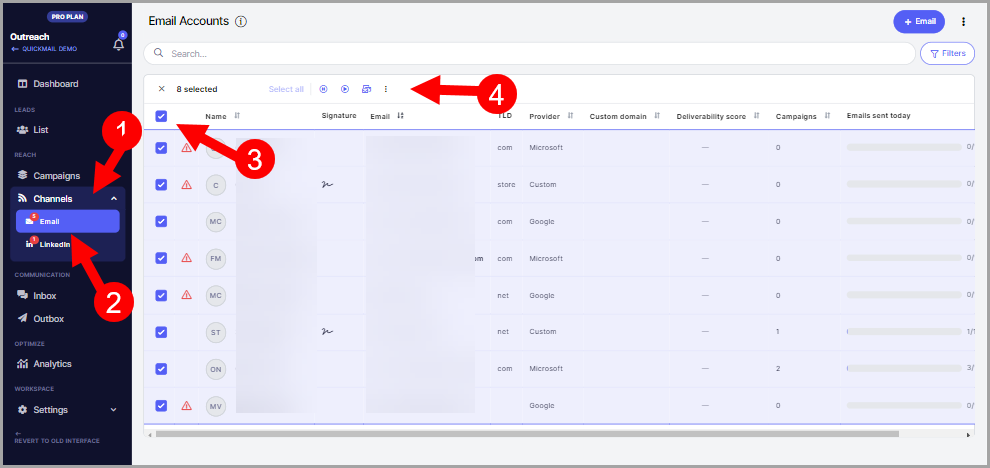

# Managing Channels with Bulk Actions

**In this article:**

- Why use bulk actions?

- How to take bulk actions?

- Which bulk actions are available?

## Why Use Bulk Actions?

Bulk actions allow you to manage multiple email and LinkedIn accounts at the same time, saving time by reducing the need to update each account individually.

## How to Take Bulk Actions?

Select multiple email or LinkedIn accounts → select the bulk action to take.

## Which Bulk Actions Are Available?

**Email**

- Pause sending

- Resume sending

- Set daily email limit

- Delay between emails

- Set email signature

- Set custom domain

- Delete

**LinkedIn**

Bulk actions coming soon.
