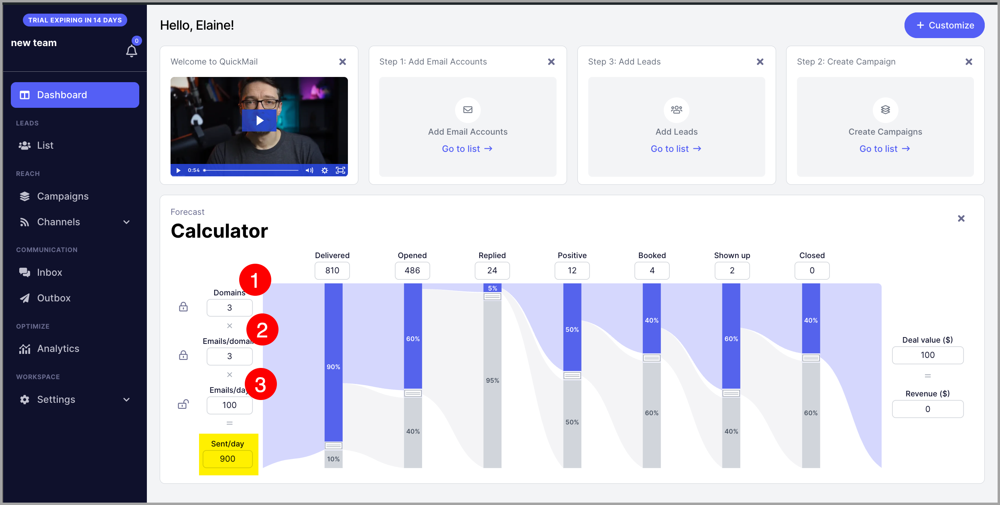
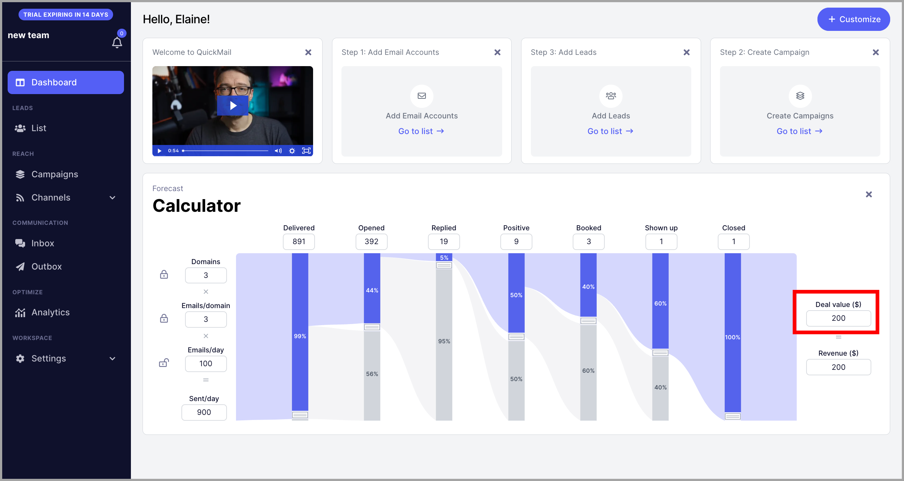
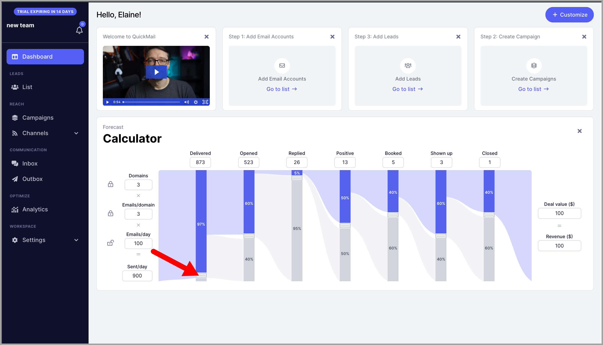
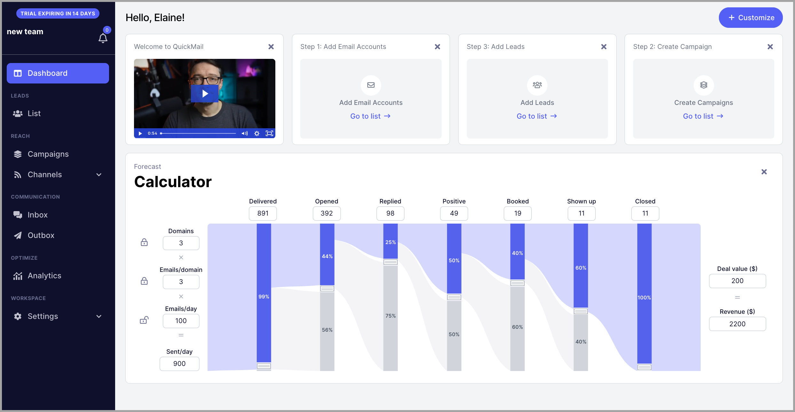
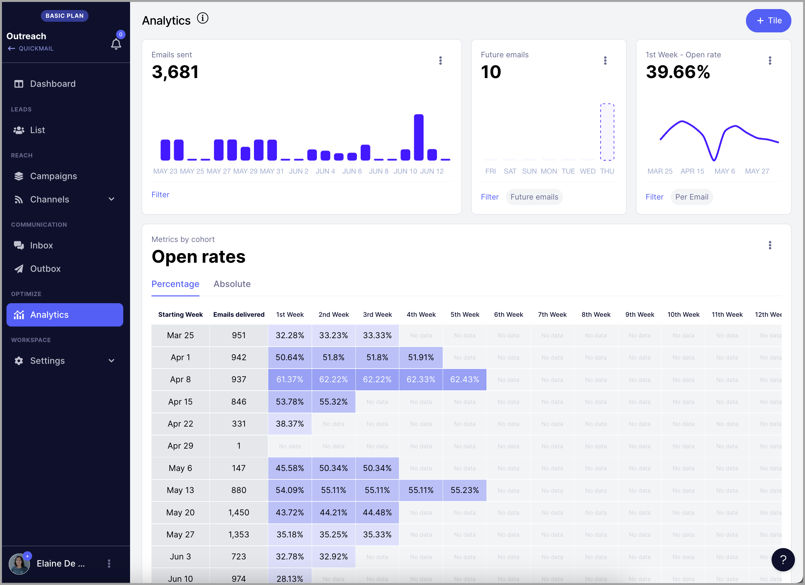
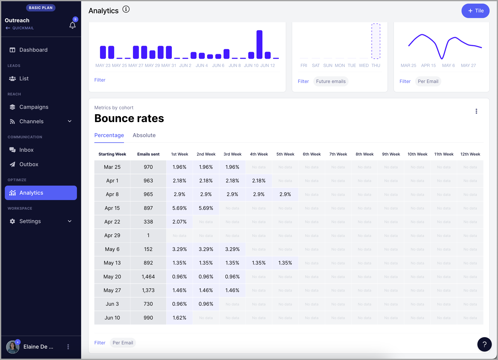
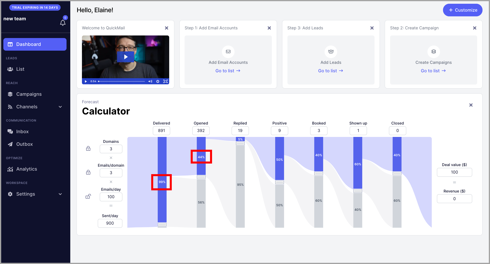

# Improving Account Revenues Using the Calculator

# Why use the revenue calculator?

Many users wonder how many emails they need to send daily from a certain number of email accounts and domains to achieve their goals.

Users are also usually confused about what stats threshold they should aim for.

The revenue calculator helps avoid that confusion by allowing users to visualize targets for delivered emails, opens, replies, positive replies, and bookings.

It also helps users easily track and optimize email outreach by showing how much revenue they're generating and what stats they need to improve to reach their revenue goals.

# How to use the revenue calculator?

To get started, you can input how many domains you have, how many inboxes you have in each domain, and how many emails each inbox sends daily.

The default value is 3 domains, 20 emails per domain, and 300 emails per emails per domain but you can change it by editing these fields based on your account set up.

Based on the fields you input, we will automatically calculate how many emails daily your whole account can send.

Here's an example:

Next to set is how much value each deal costs by editing this number:

Based on your total emails sent per day, you can adjust your delivered rates which refer to emails that didn't bounce.

The default is 90% but if you have a lower bounce rate, you can adjust the percentage by dragging this button on delivered emails.

You can adjust all variables to get the ratio of each.

Here's an example of an account that generated $2200.

It has 99% delivered emails; out of delivered emails 44% have opened; out of those opens, 25% replied; out of those replies 50% sent a positive reply; out of those positive replies, 40% have booked; out of those bookings, 60% has shown up; and all of those who showed up turned to be closed deals.

Pro tip: To get an accurate number of open, reply, and positive reply rate, you can look at the **analytics** page.
For example, this account has an average open rate of ~44% this month.

And an average bounced rate of ~1%.

So I can set my delivered emails to 99% and the open rate to 44%. Like this:

