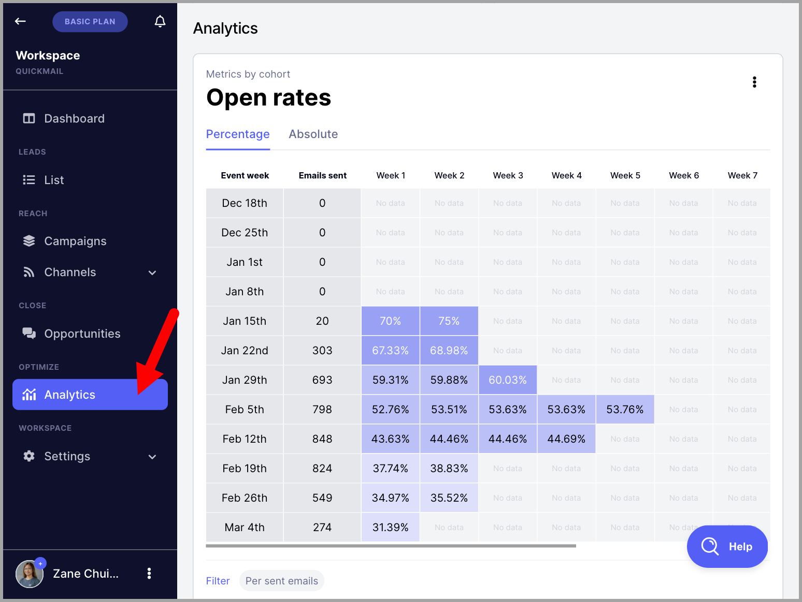
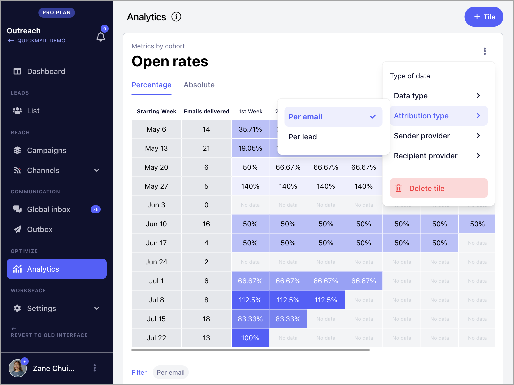
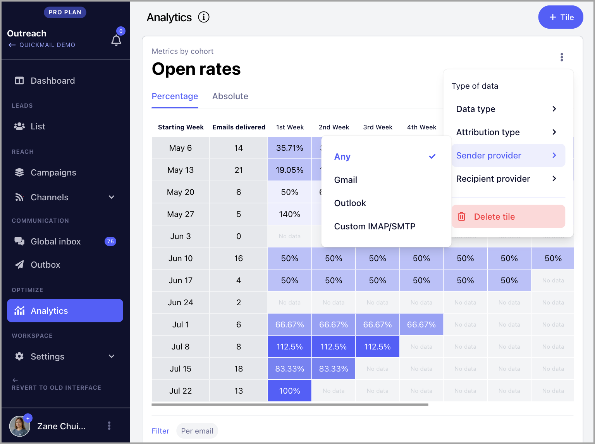
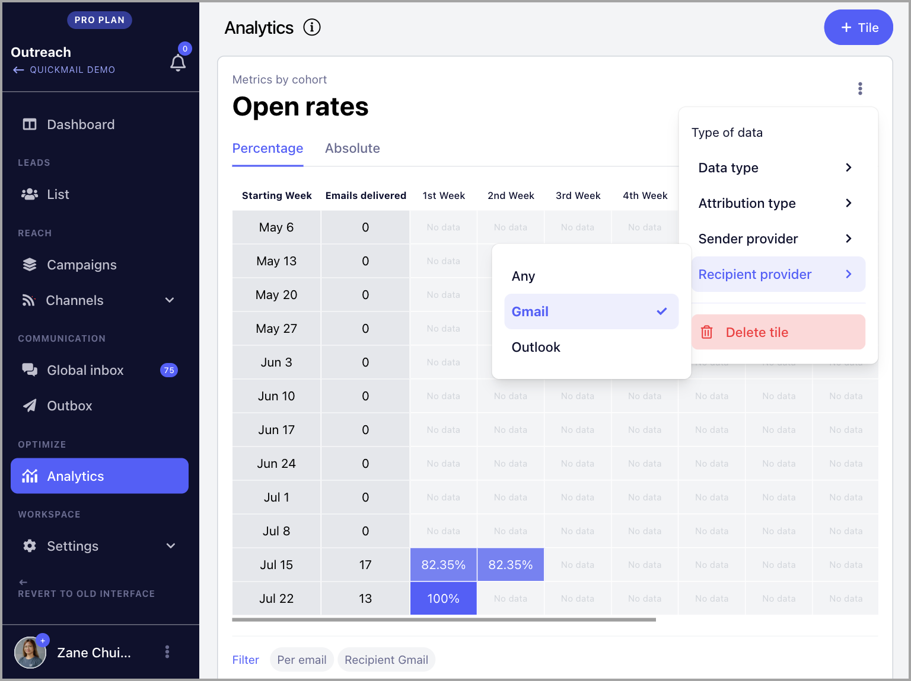
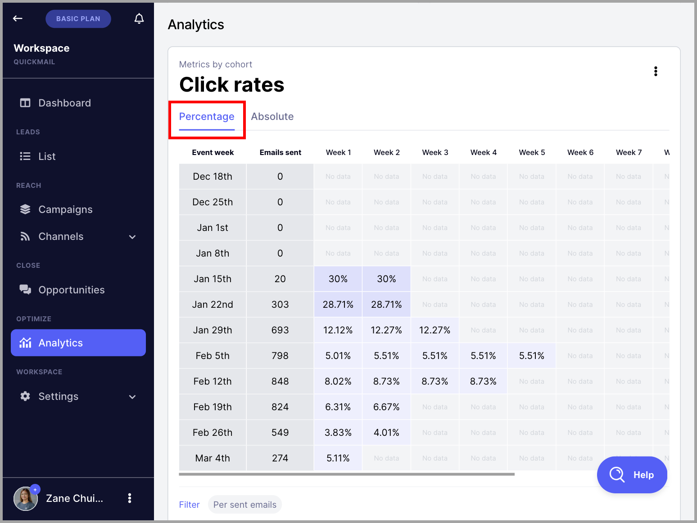
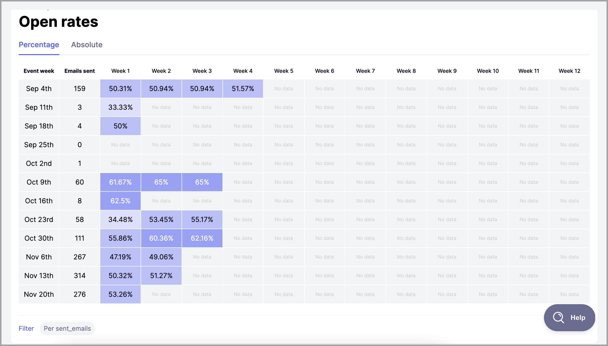
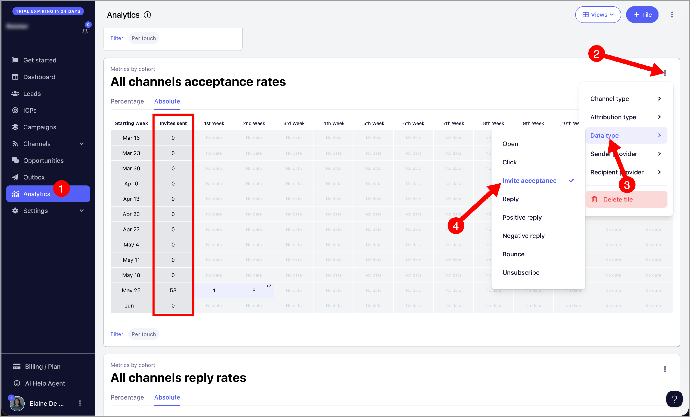

# Understanding Metrics by Cohort (Advanced Analytics)

**In this article:**

- Where can I find Metrics by cohort?

- What are the types of data in the analytics?

- Absolute vs. Percentage

- Understanding Metrics by cohort

- Why do my stats look off when I manually calculate it?

QuickMail's Advanced Analytics gives a deep dive into email effectiveness, offering insights into the actual deliverability of emails sent from your inbox or a campaign based on email stats.

If you want to see how revolutionary that is, here is an article from our founder explaining why our metrics are unique: [https://www.linkedin.com/pulse/why-were-all-wrong-open-rates-jeremy-chatelaine-/](https://www.linkedin.com/pulse/why-were-all-wrong-open-rates-jeremy-chatelaine-/)

## Where can I find Metrics by cohort?

There are two ways to see the metrics by cohort in QuickMail.

### Overall Metrics

The overall metrics by cohort can be found on the Analytics page

### Per Campaign

The metrics per campaign can be found on the dashboard of each campaign.

To view the campaign dashboard, go to the Campaigns page → Select a campaign → Scroll down to see the metrics by cohort

## What are the types of data in the analytics?

### Data type

At the moment, the available data in the metrics are as follows:

- Opens

- Clicks

- Replies

- Positive & Negative Replies (Based on Reply Categorization)

- Bounces

- Unsubscribes

### Attribution type

You can change the data in the analytics based on either the:

- number of emails sent

- number of leads started

### Sender Provider

The data can also be sorted based on the email provider of the email account used for sending. These email providers include:

- Gmail

- Outlook

- Custom IMAP/SMTP

- Any

### Recipient Provider

If you would like to check the stats per recipient email provider, this is also possible. Data can be sorted based on the following email providers:

- Gmail

- Outlook

- Any

## Absolute vs. Percentage

### Percentage

The default view in the metrics by cohort is in percentage, which expresses values as a proportion of the whole per statistic.

### Absolute

Absolute metrics represent the numerical values of the tracked statistics

## Understanding Metrics by cohort

Metrics for Opens, Replies, Positive Replies, Negative Replies, and Unsubscribes are attributed to the date the email was sent or when the journey started every week rather than only the date the event occurred.

Here's what each column means:

- **Event Week** - the week the journeys started or the emails were initially sent

- **Emails Sent / New Journeys** - the number of new journeys or emails sent on the event week

- **Week 1** - the open, click, reply, bounce, or unsubscribe rate on the event week

- **Week 2 and subsequent weeks** - the open, click, reply, bounce, or unsubscribe rate on the subsequent weeks. Still attributed to the journey that started or emails sent based on the event week

To better understand how analytics work, let's talk about the open rate based on the number of emails sent for the week of October 9th in the image above.

For the week of September 4th, the total number of emails sent was 19.
In the same week, the open rate was **50.31%**

The following week, the open rate increased to **50.94%**

There were no additional opens the week after, so the open rate remained at **50.94%** on week 3.

The last time an open was detected was on week 4 which increased the open rate to **51.57%**

In summary, the open rate of the emails sent on the week of September 4th increased from 50.31% **to** 51.57% **in 5 weeks.

Therefore, we can also conclude that more than 51.57%** of the emails were delivered.

## Why do my stats look off when I manually calculate it?

If you're adding up the numbers manually and they don't match what QuickMail is showing, the most common reason is deleted leads.

**How QuickMail handles deleted leads:**

When you delete a lead from a campaign or your account, QuickMail preserves the historical performance data from that lead.

This means:

- **The lead is removed** from your active lead list

- **But their stats remain** in the campaign's overall analytics (opens, clicks, replies, etc.)

**Why we do this:**

This prevents your campaign performance history from changing retroactively. If you sent 100 emails and got 25 opens, then deleted 20 leads, your open rate should still reflect the original 25 opens — not recalculate as if those 20 leads never existed.

**Example:**

Let's say your campaign shows:

- 50 opens

- 200 emails sent

- 25% open rate

But when you count your current leads manually:

- Only 40 leads in the campaign

- Each received 4 emails = 160 total emails

**The gap:** 200 - 160 = 40 emails were sent to leads that have since been deleted, but their stats are still counted in your campaign analytics.

# Can we have LinkedIn specific dashboard?

InMail, profile view, and messages all fall under LinkedIn touches.

There's currently no option for a specific view for them.

If the goal is to check how many InMail, profile view, or messages are sent, please look at the outbox and manually look for them. Just note that the outbox only shows the last 30 days.

For the connection requests, you can choose the data type acceptance rate.

## Can I see how many emails have been sent out per user since we started using QuickMail?

There's currently no option to filter the stats based on the sender.

You can look at the outbox and filter based on emails. However, the outbox only shows the last 30 days of emails sent.

## Why does my lead count doesn't reflect the total number of leads in the campaign stats?

This could be caused by bounces.
Since bounced emails didn't really reach the leads, we don't count them in the stats.

## Do my canceled leads count in the stats?

Yes, canceled leads still count in the stats.
