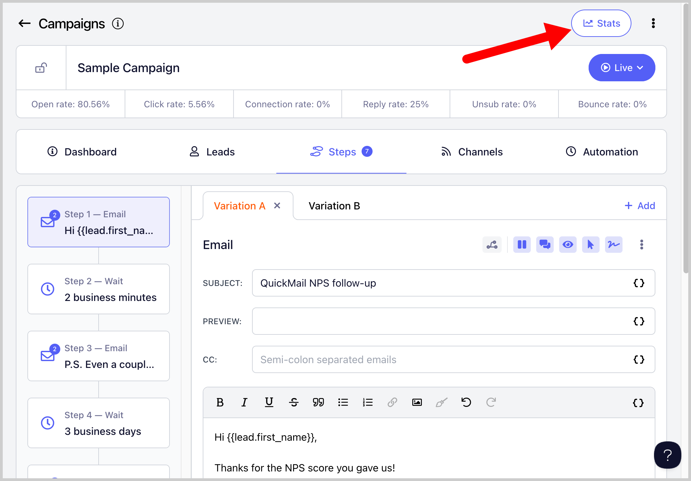

# Viewing Stats per Email Step and Variation

You can view stats per email step or email variation to identify which specific step or variation is performing well.

**In this article:**

- What stats are available per step or variation?

- How to see stats per email step or variation?

## What Stats Are Available per Step or Variation?

- Total leads who went through that step

- Opens

- Clicks

- Replies

- Unsubscribes

- Positive replies

- Negative replies

- LinkedIn connection acceptances

## How to See Stats per Email Step or Variation?

**Step 1.** Go to a specific campaign → **Stats**.

**Step 2.** Go to the **Steps** tab → click the dropdown button next to a step to view its variations.

