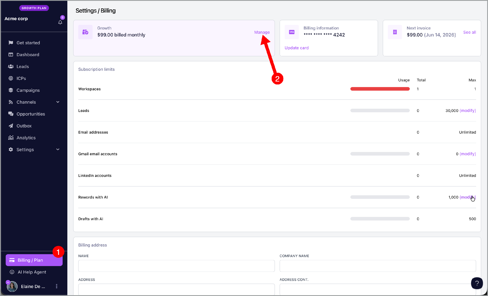
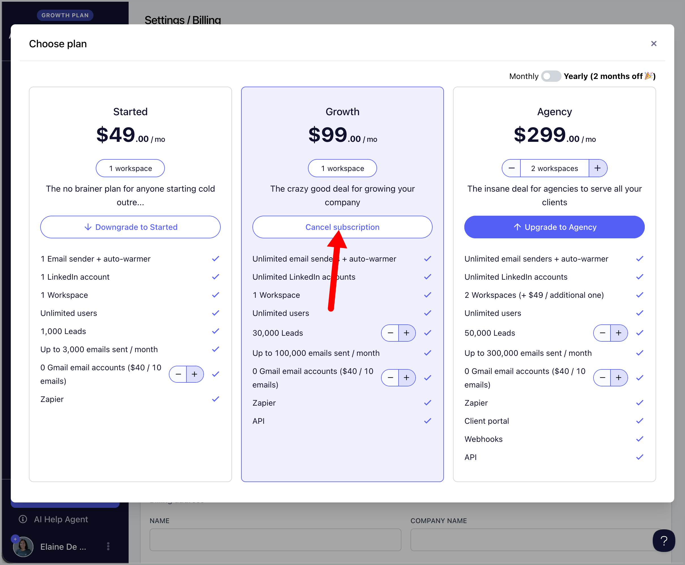
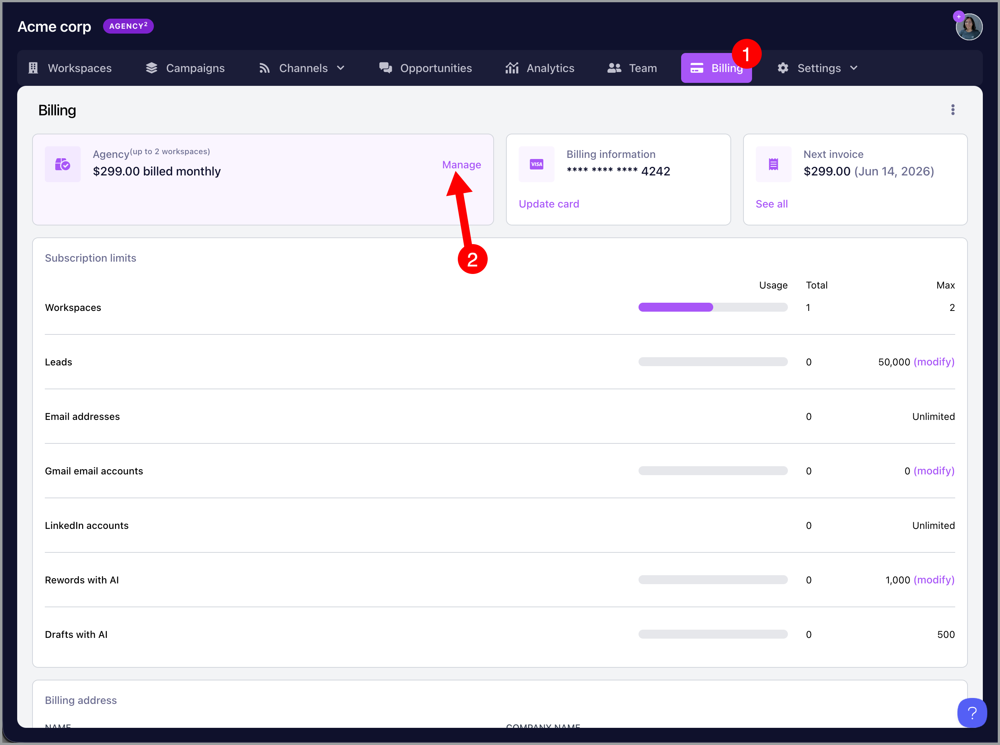
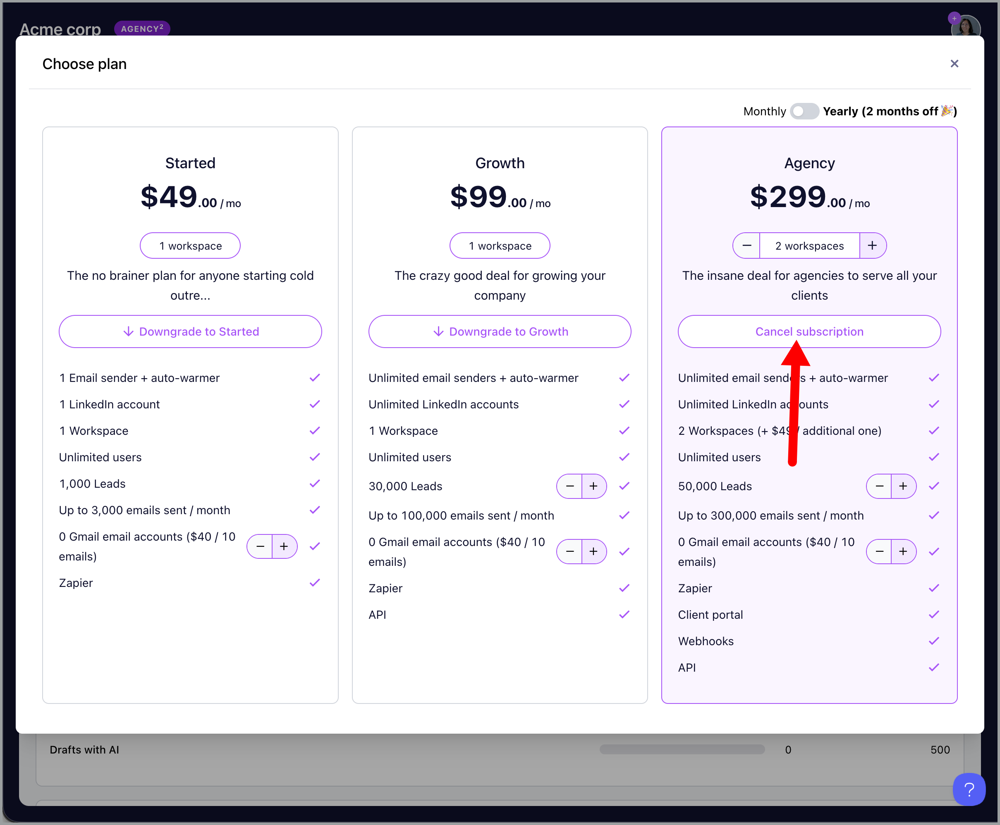

# Canceling your subscription

### In this article:

- Single workspace

- Agency account

- Trial account

- I'm having an error canceling my subscription

## Single workspace

To cancel your workspace subscription, go to your billing page and click manage.

Then, click cancel subscription.

## Agency account

To cancel your agency subscription, go to your agency dashboard by clicking your agency name in one of the workspaces.

Then, go to -> billing -> manage.

Click cancel subscription

## Trial account

No need to cancel the account.

Once the 14-day trial expires, the account will not be charged. Instead, it will simply expire and be automatically deleted, no further action is required.

## I'm having an error canceling my subscription

- If you have Google inboxes bought from QuickMail, only support can cancel them at the moment. To speak with a human agent, click on the chatbot, then select "Escalate to Human" to cancel your Google inboxes and subscription.

- Only email addresses admins can cancel the subscription. Please reach out to your account admin for help.
