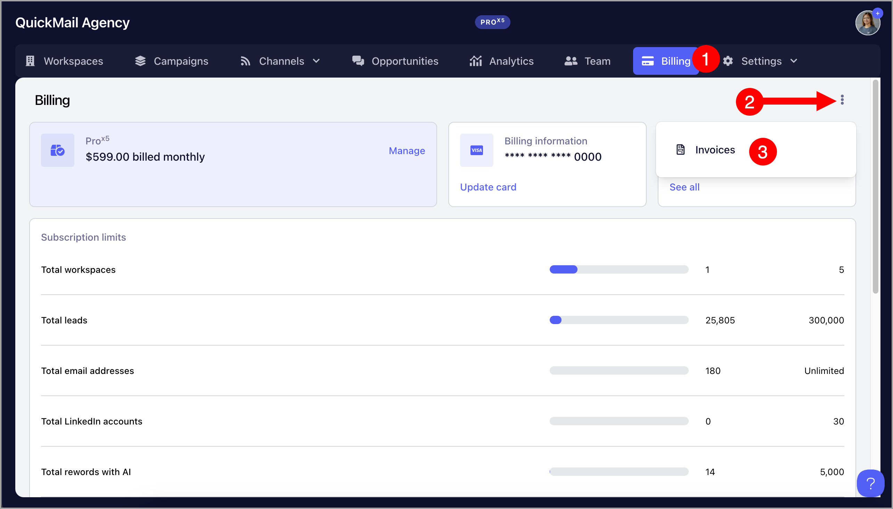
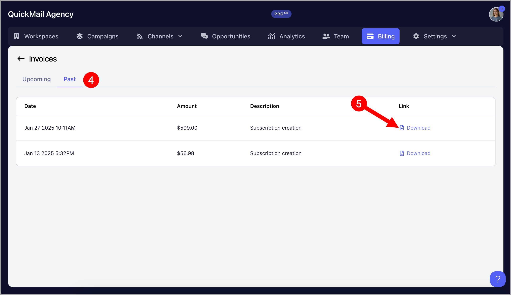
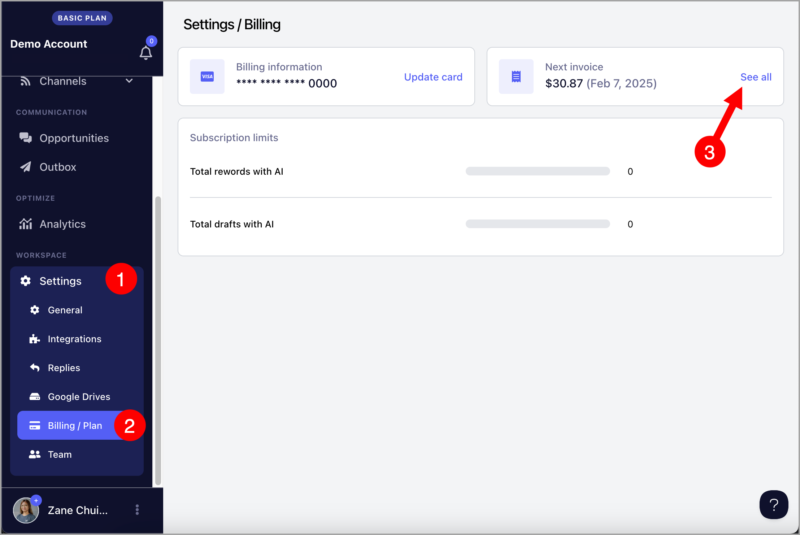
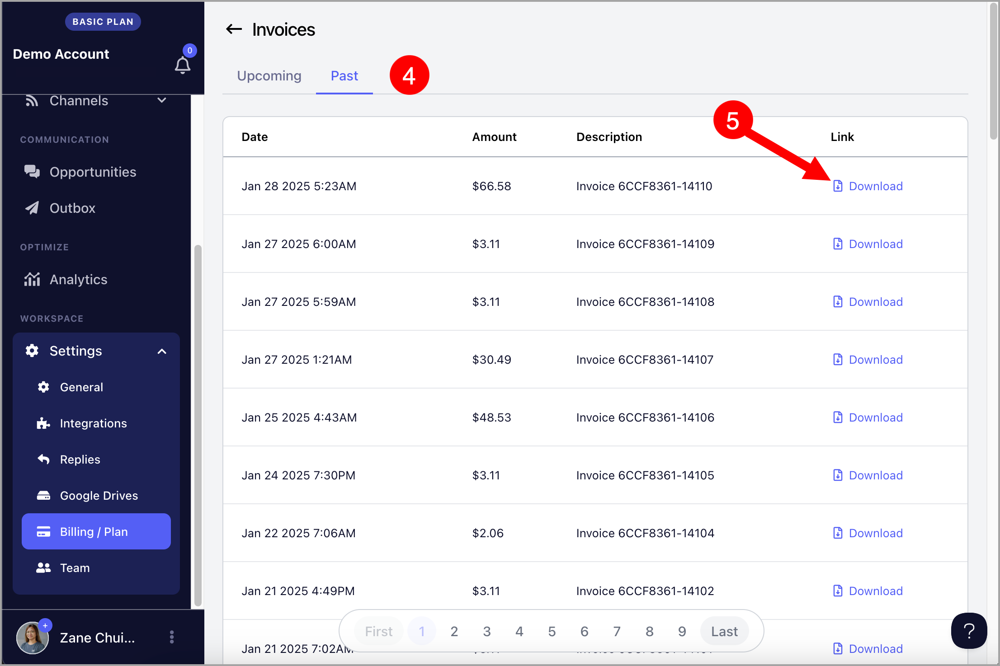

# Downloading Invoices

Users can download invoices after the monthly payment has been successfully processed.

**Important:**
- Only account admins can download invoices.
- Team members do not have permission to access or download invoices and will receive an error if they try.

## For Agencies (Accounts on the Agency Plan):

For accounts on the Agency Plan, invoices are available in the Agency Dashboard.

To download invoices, go to the agency dashboard →  Billing →  Click "See all" under Next Invoice

After that, go to "Past" tab → Download invoices

## For Teams (Accounts on Starter and Growth Plan):

For Starter and Growth plans, invoices are managed at the workspace level.

To do that, go to workspace Settings →  Billing/Plan →  Click "See all" under Next Invoice

After that, go to "Past" tab → Download invoices

## Troubleshooting

**I can't find this month's invoice**

- The invoice is generated only after the monthly payment has been successfully completed.
- If the payment is still processing, wait until it finishes and refresh the Billing page.

**I get an error when downloading an invoice**

- Verify that you're signed in as an account admin.
- Team members cannot download invoices.

**My account has been canceled and I can't access my invoices**

- For canceled accounts, invoices may no longer be visible in the Billing page.
- If you need a copy of an invoice, please contact our support team by clicking the AI chatbot in the lower-right corner of your QuickMail account, then selecting "Escalate to a Human".
