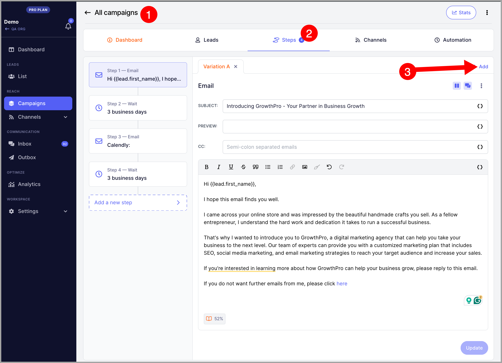
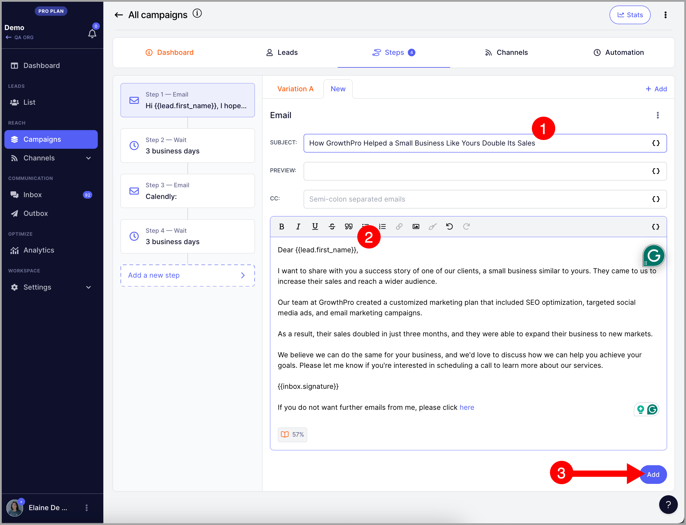
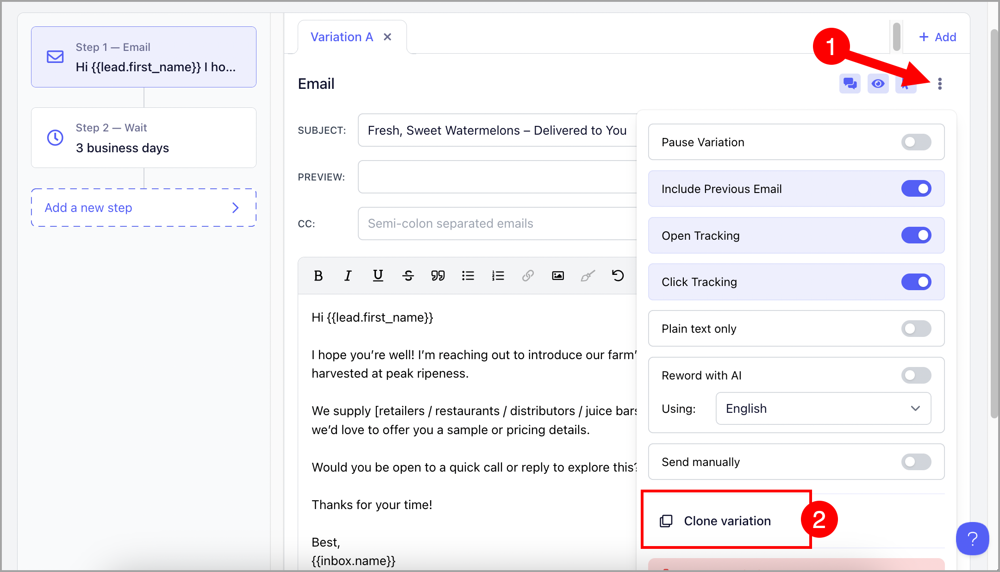
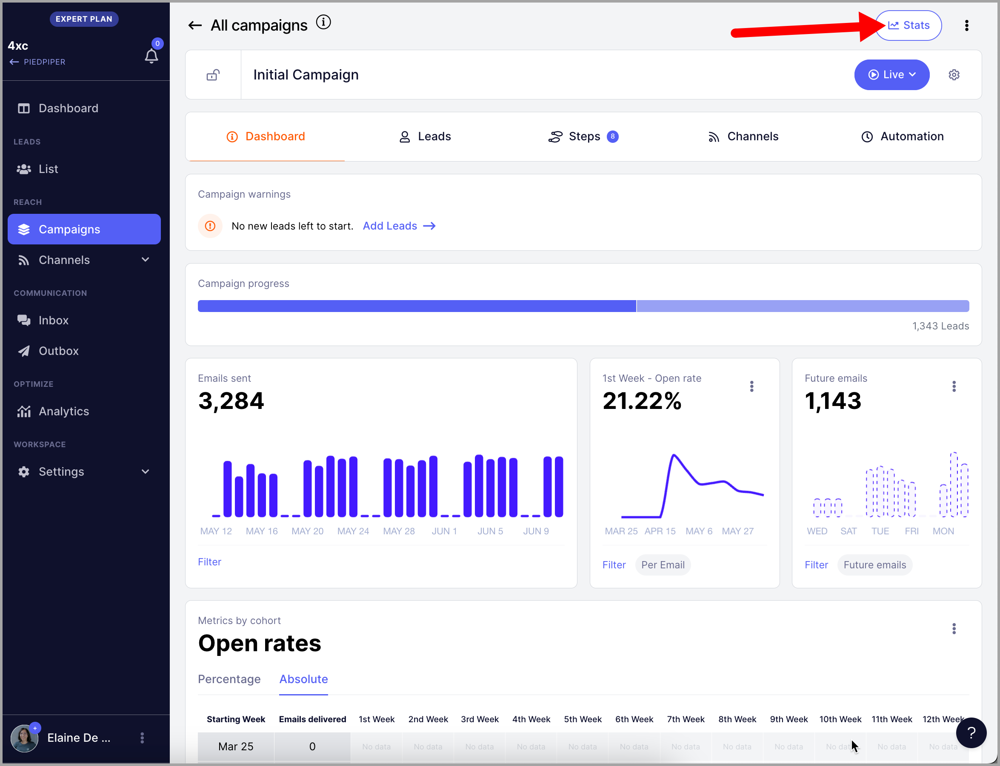
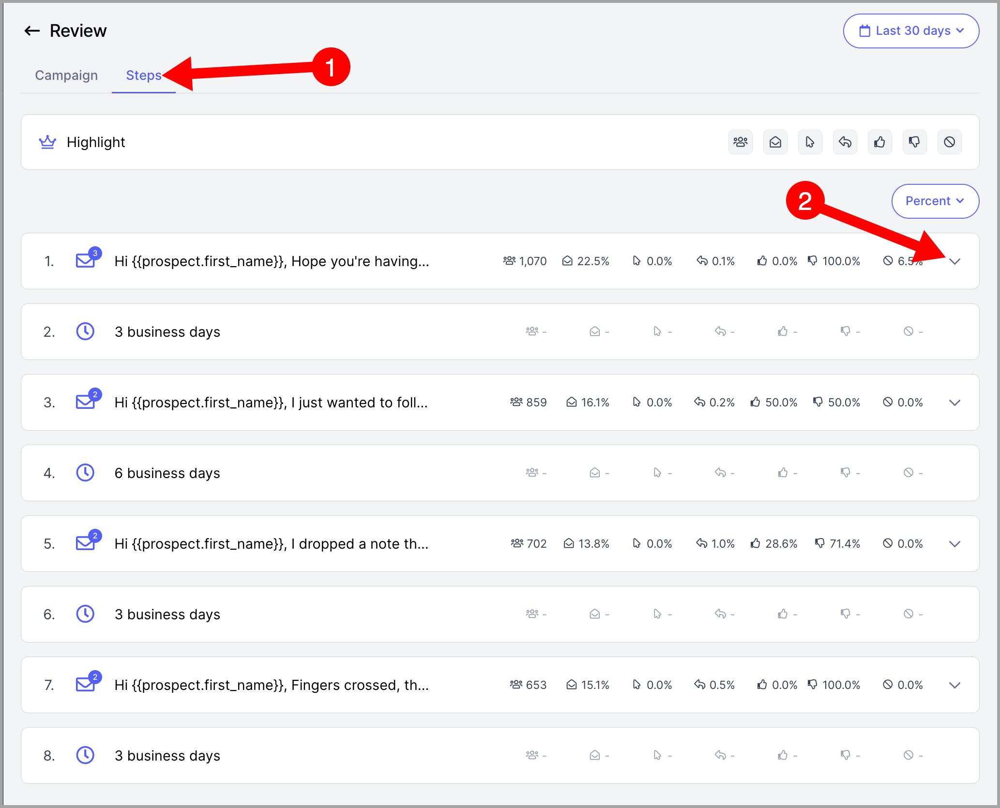
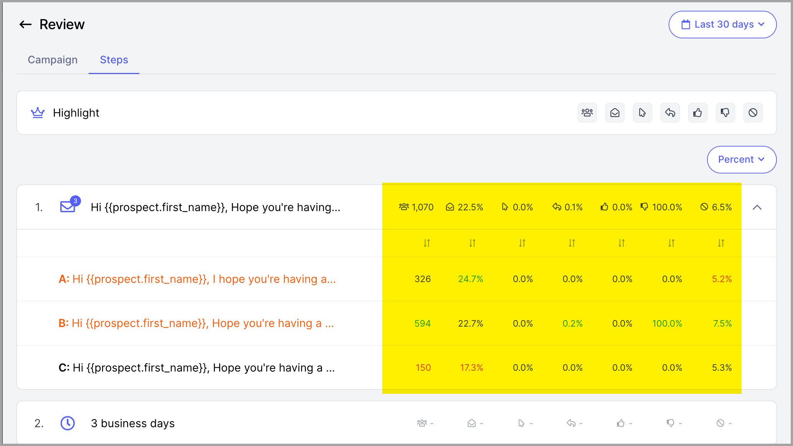
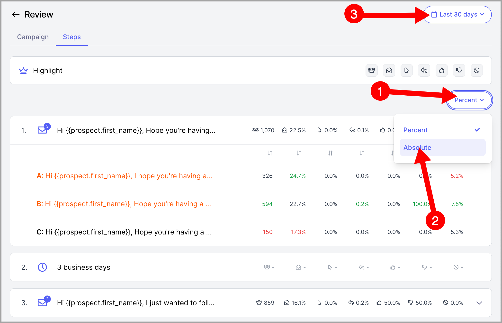
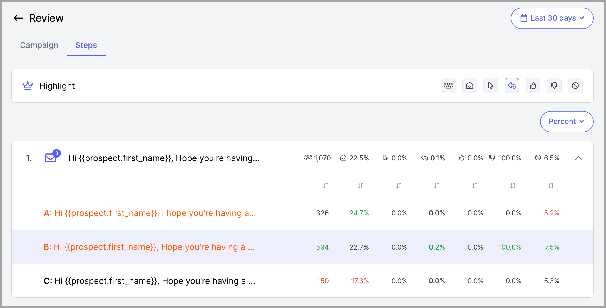
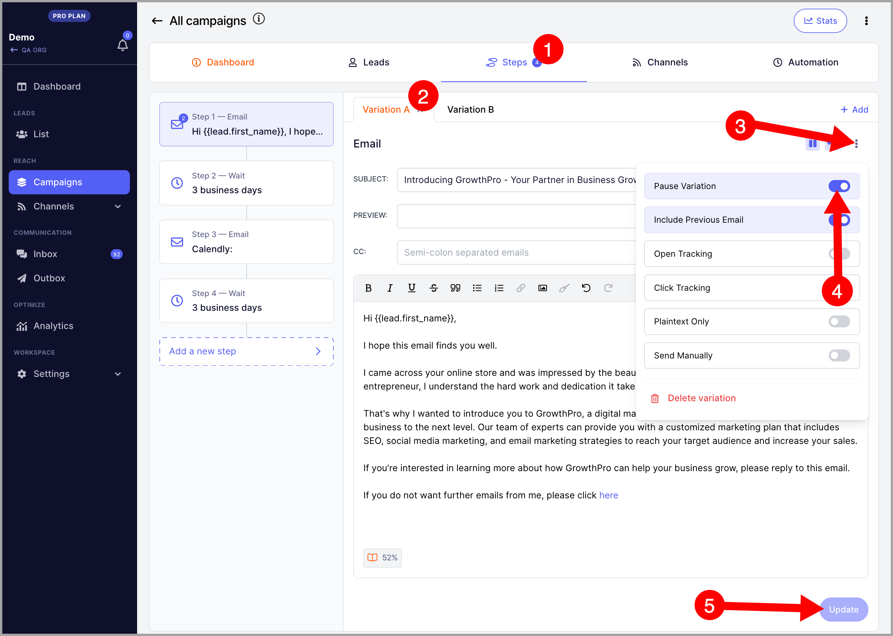

# Email Variations for AZ Testing

In this article:

- Why do AZ testing?

- How to do AZ testing?

- How to clone an email variation?

- Which email variation is working best?

- How to stop sending an email variation that is not performing well?

## Why do AZ testing?

AZ testing is done to test multiple email copies and see which of the copies is working best.  An email copy's performance is measured by its opens, (clicks) unsubscribe, and most importantly --replies.

Pro tip: Using email variations also improves your email deliverability. This is because sending emails with different variations will make it more difficult for spam filters to block you.

## How to do AZ testing?

AZ testing can be easily done by creating multiple variations to an email step.

**Step 1.** Go to the campaign step, and on the email step, click Add.

**Step 2.** Add email subject, body, and click Add.

**Note:** You can add as many variations as you need in an email step.

## How to clone an email variation?

Click on an email step → Menu (triple dots) → Clone variation

## Which email variation is working best?

Each email variation has its own stats. These stats will help you determine which email copy is the most effective.

**Step 1.** In the campaign, click Stats at the top-right corner of the screen.

**Step 2.** Go to the Steps tab and click the down arrow for each step to see all variations.

Here's an example of what it looks like:

You can change the data from Percent to Absolute (2) and also change the timeframe (3).

You can also highlight the steps based on which stats you're optimizing for more actionable data.

Here's an example that highlights the best performing step based on reply stats.

## How to stop sending an email variation that is not performing well?

The goal of A/Z testing is to rule out the best email copy. If an email copy is not helping you receive replies, then you can stop sending it by pausing the email variation.

To pause an email variation, go to the variation from the campaign steps page → click the triple-dot → toggle the pause variation setting → click Update.

**Warning:** Avoid deleting email variations as doing so might cause journeys to run into an error. When a journey runs into an error, the prospect won't be able to receive further follow-ups.
