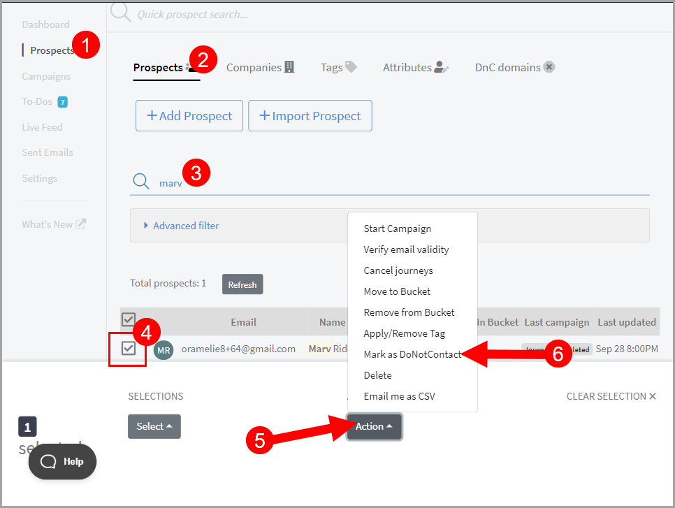
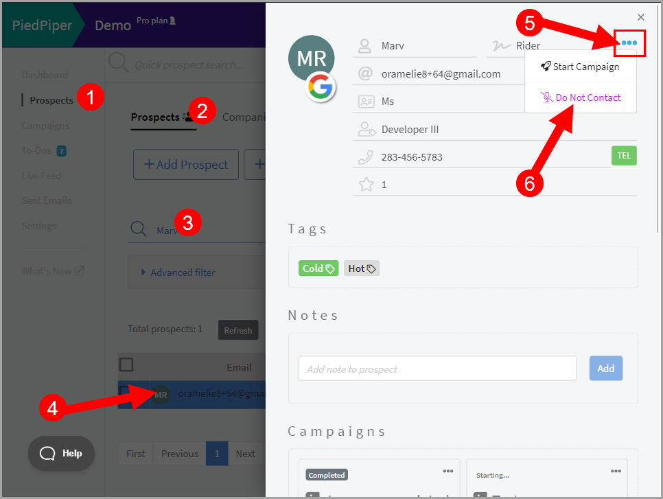
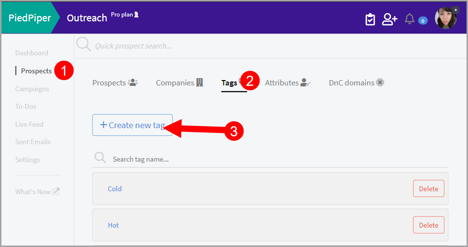
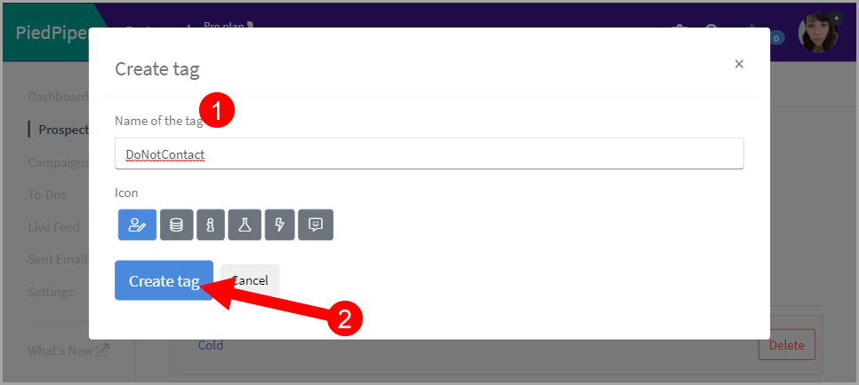
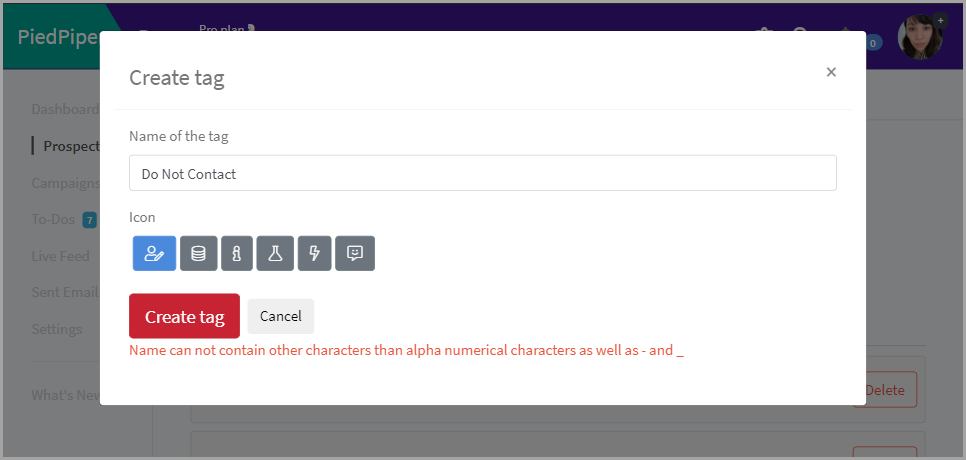
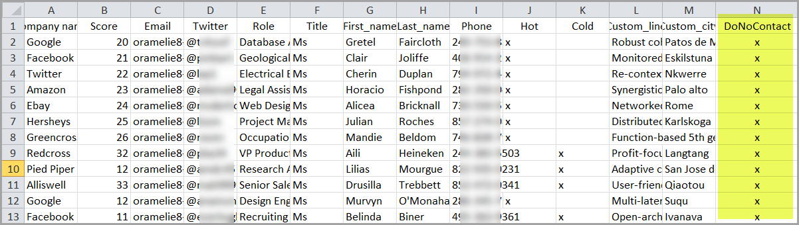
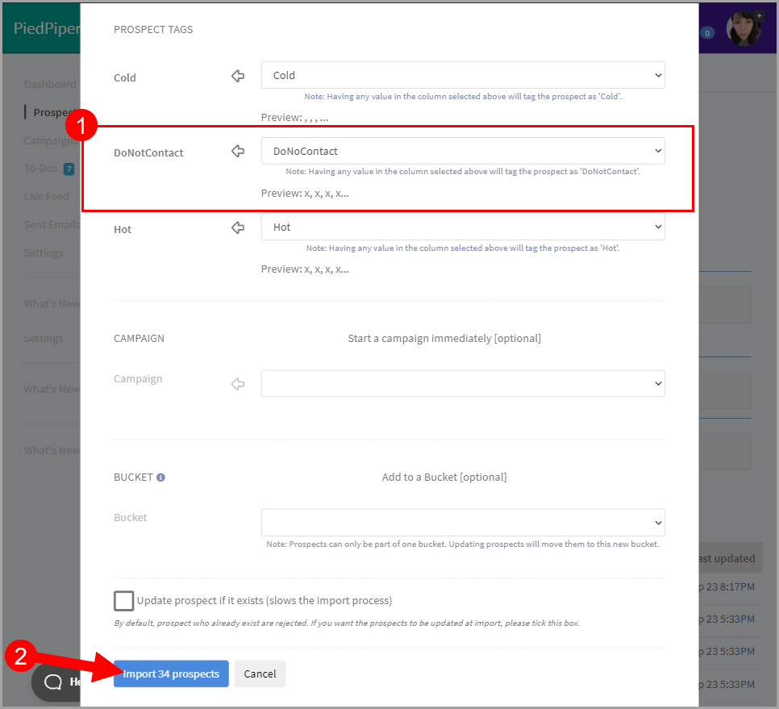
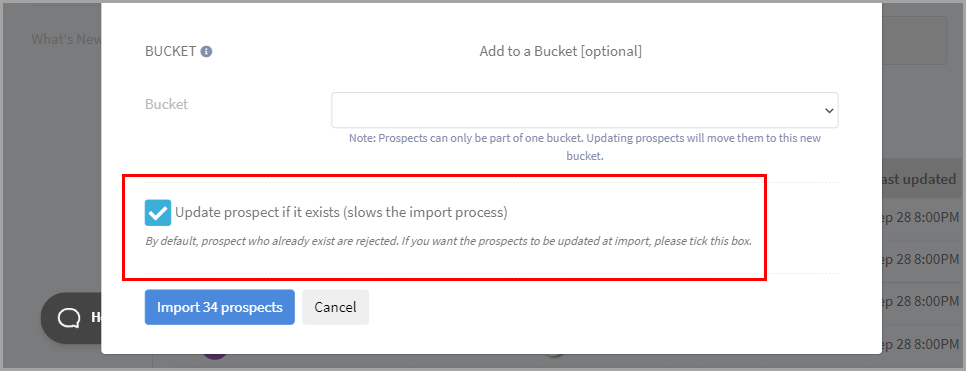
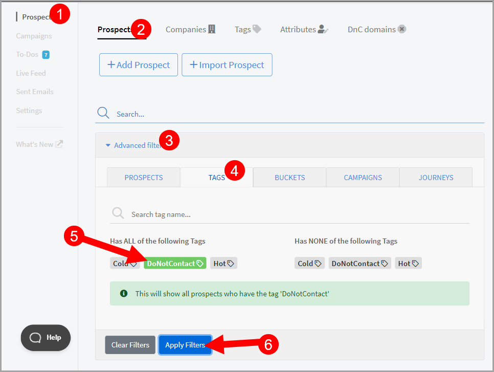
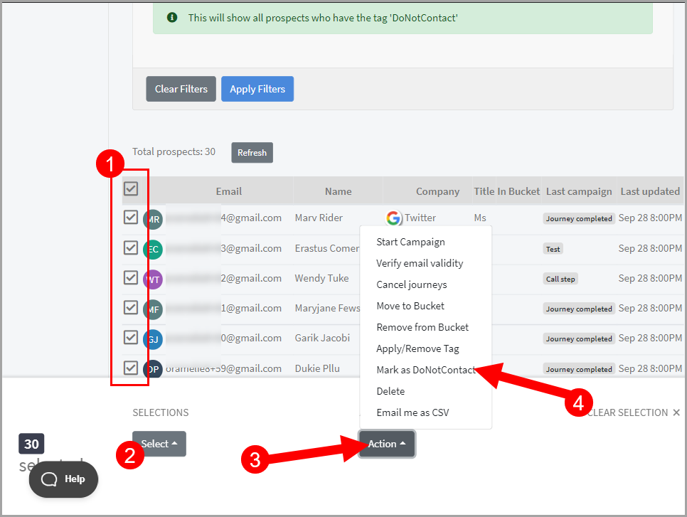

# Handling Unsubscribes

## Why manually mark a prospect as Do Not Contact?

If an unsubscribe link is added to your email and a prospect clicks it, we automatically mark the journey as unsubscribed.

Additionally, we also mark the prospect as Do Not Contact, and prospects marked as Do Not Contact can't be added to any campaign or bucket anymore.

**Pro tip:** To learn about how to add an unsubscribe link to your emails in QuickMail, check out this article.

Although it can be automated, there are some instances when you need to do it manually such as the following:

- Your emails don't have an unsubscribe link;

- Prospects replied with the word "unsubscribe" instead of clicking the link (we only support unsubscribe link clicks at the moment);

- You're using multiple software and they unsubscribed from a different platform;

- You have a master list of unsubscribed prospects and you want to add them to QuickMail.

## How to mark a prospect as Do Not Contact?

You can either mark prospects as Do Not Contact individually or in bulk.

### Individually

To mark a prospect individually, simply go to the prospect's page and search for the prospect.

Then, select the prospect -> action -> Mark as DoNotContact.

Prospects can also be manually marked as Do Not Contact from the Prospects preview profile.

To go there, simply click the preview button beside the prospect's email address.

Alternatively, you can also click the thumbnail of the prospect.

Then, from the prospect's preview profile, click the triple-dot icon on the top-right corner of the page.

Finally, click Do Not Contact.

**Pro tip:** You can go to the prospect's preview profile in all pages where prospects exist. This includes Prospects page, Campaign Journeys, Sent Emails, and To-dos.

### In bulk

To be able to bulk mark prospects as Do Not Contact, we have to tag them so we can easily filter them.

To get started, create a tag by going to Prospects -> Tags -> Create New Tag.

Then, name the tag and save it. DoNotContact is just an example, you can name it anything.

**Note:** When creating a tag, make sure to not put any spaces in the name. At the moment, we only support alphanumeric characters as well as - and _. Because of this, creating a tag with a name with spaces will lead to an error.

After creating the tag in QuickMail, go to your CSV and update it.

Simply add a column for Do Not Contact and put x for everyone that must be marked as Do Not Contact.

Then, save the changes.

After updating the CSV, import it to QuickMail.

Make sure to map the column DoNotContact with the tag in QuickMail before clicking import.

Check out this article for a more detailed guide on how to use tags.

**Note:** If prospects already exist, make sure to check the checkbox Update Prospect if Exists.

This is because, by default, we reject prospects that exist to prevent duplicates,

After the import is done, simply filter all prospects with the DoNotContact tag.

To do that, go to the Prospects page -> Advanced filter -> Tags -> Under Has ANY of the following tags, click DoNotContact -> Apply filter.

After filtering prospects with DoNotContact tag, simply select all -> Actions -> Mark as Do Not Contact.

Here's a detailed guide on how to filter prospects in QuickMail.

**Pro tip:** You can also mark a domain as Do Not Contact by adding it to the DNC domain list.
