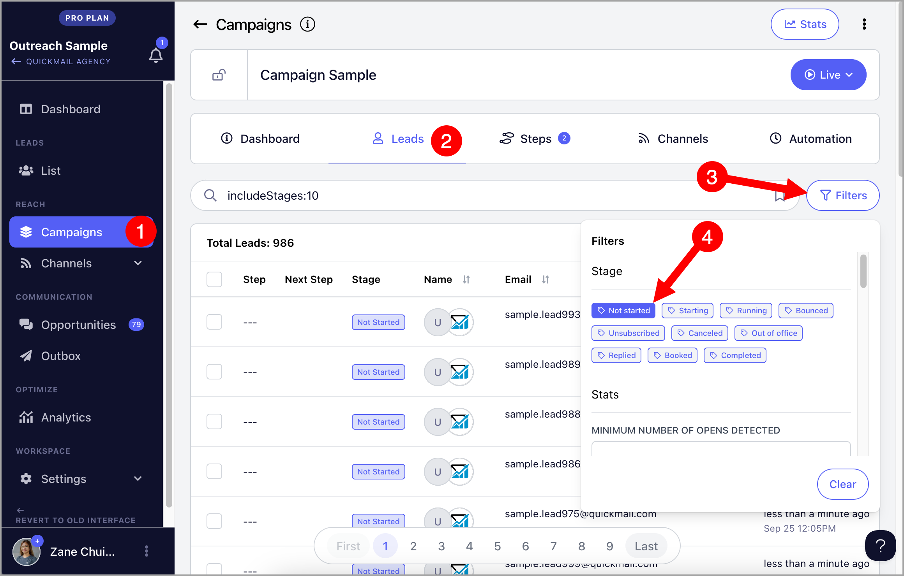
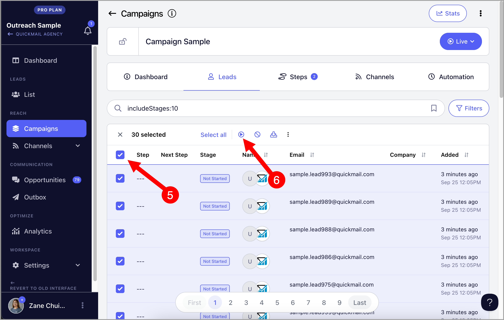

# Manually Starting Leads

Manually starting the leads allows users to start the leads without the need to wait compared to setting up Triggers. However, it is only possible to select and start up to 30 leads at a time or select all leads in the campaign.

**Important:** Starting all leads at once is not recommended. Doing so can get the inbox flagged for spamming due to sending too many emails.

To manually start leads, go to the Leads page in the campaign → Filters → Not Started

(*You can skip using filters if no leads have started the campaign yet*)

After using filters, select Leads → Click Play button to Start

The lead status will change to 'Starting' and then 'Running', and emails will be sent immediately if the send times permit.

