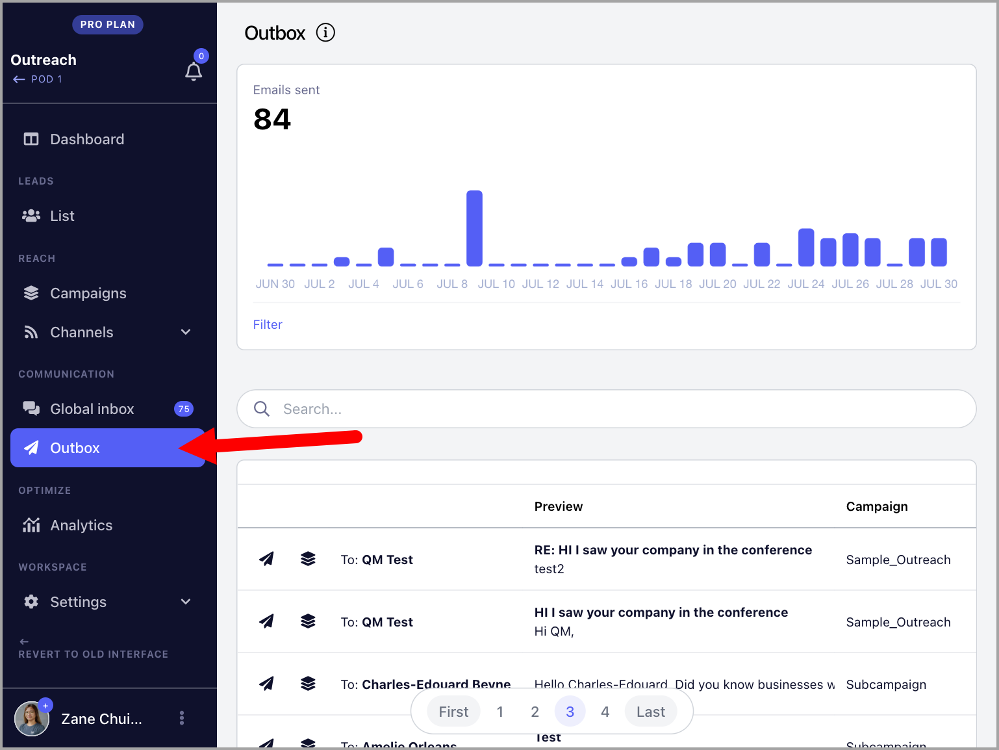
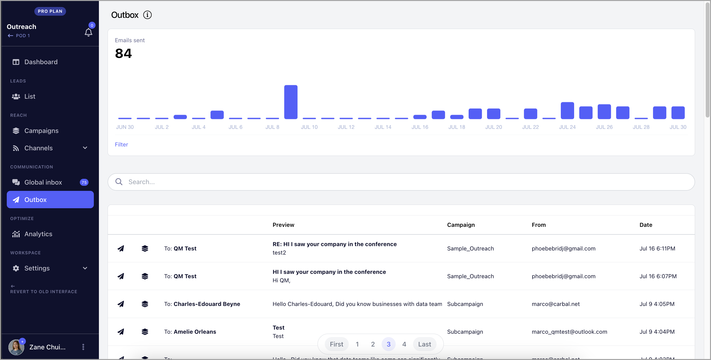
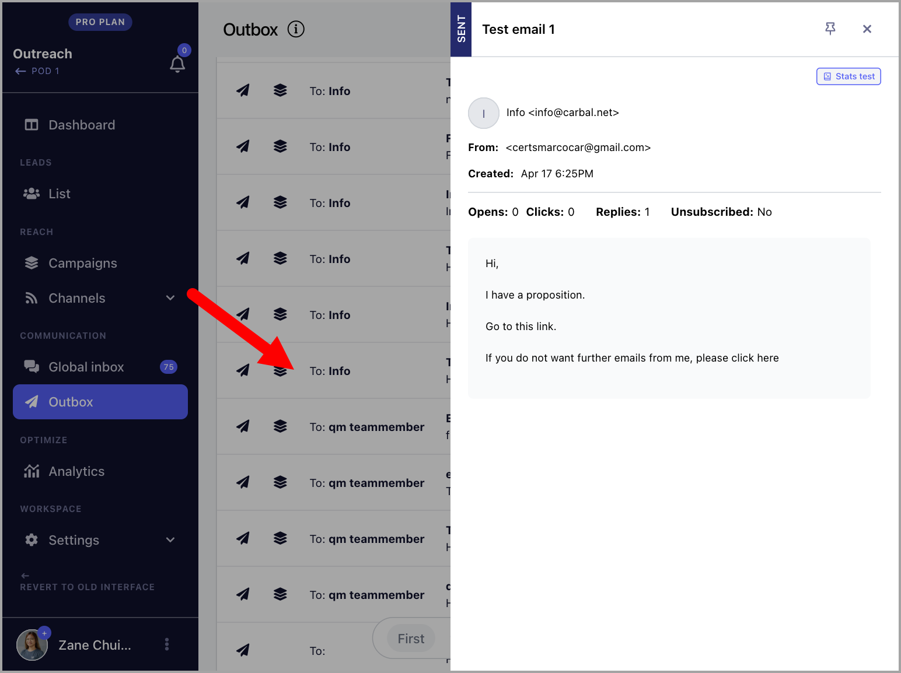

# Outbox (Sent emails)

**In this article:**

- What is the Outbox?

- Where can I see Sent Emails?

- How do Sent Emails look?

## What is the Outbox section?

Outbox is a page where you can see the number and history of emails sent from the workspace.

**Note:** Outbox only shows emails sent from the past 30 days. To see email sent more than 30 days ago, please the sent emails page directly on your email account.

## Where can I see Sent Emails?

Sent emails can be found directly in the Outbox section on the left-side menu

## How do Sent Emails look in the Outbox?

The Outbox shows the preview of the emails sent, the email account that sent the email, the date & time, and the campaign associated with the email.

**Note:** The timestamps of the sent emails depends is based on the timezone in your device

You can also see the daily number of sent emails in the past 30 days.

Sent emails can be opened by clicking on them. The email will open on the right side of the screen where it can be read in detail.

