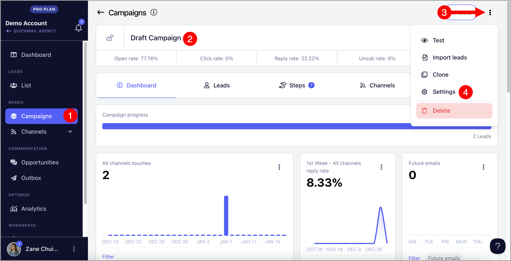
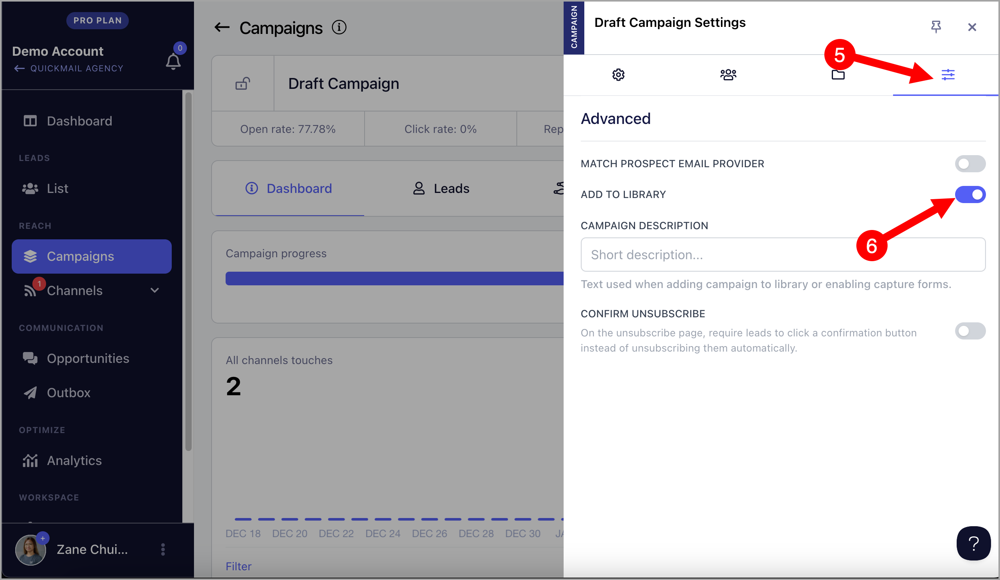
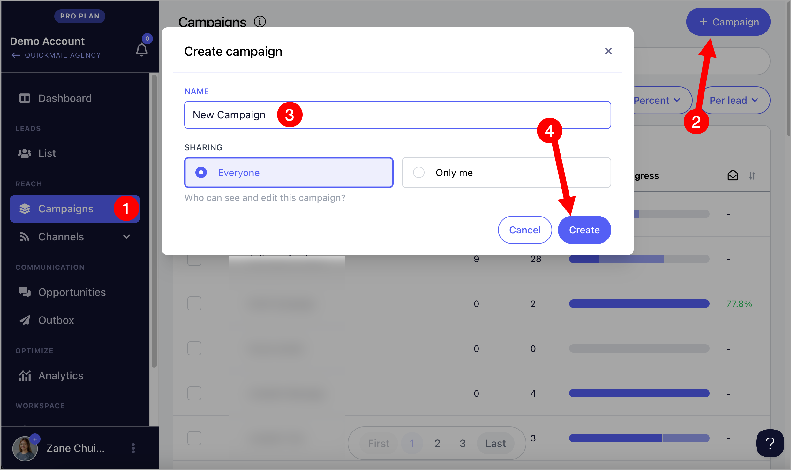
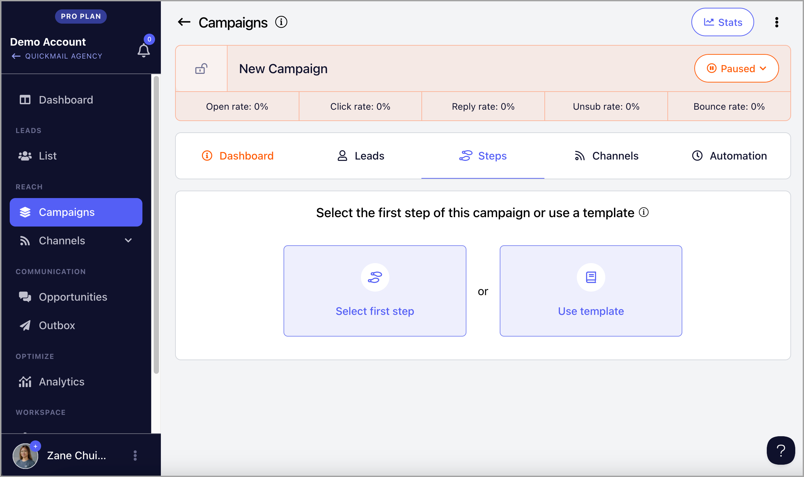
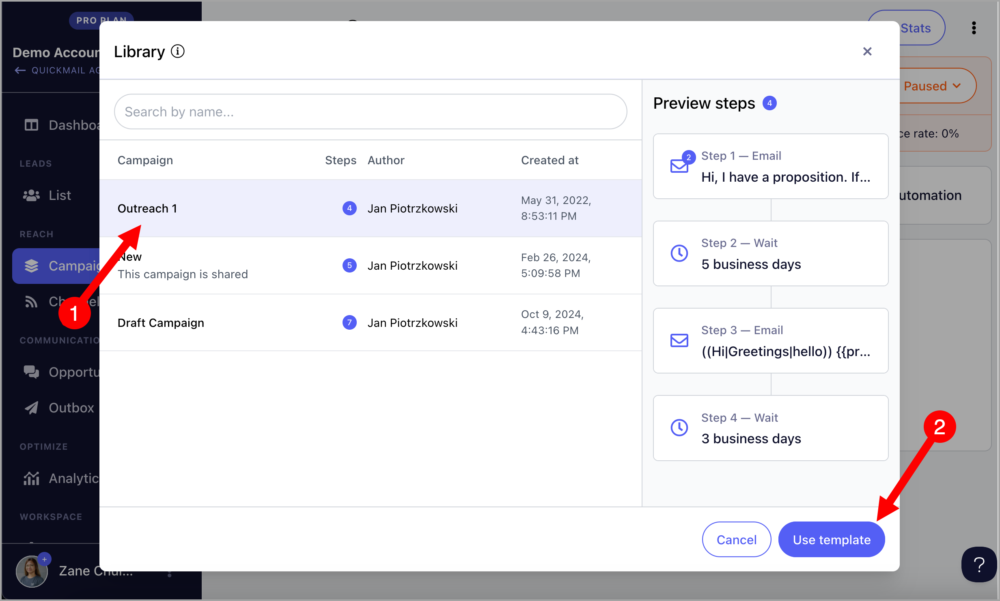
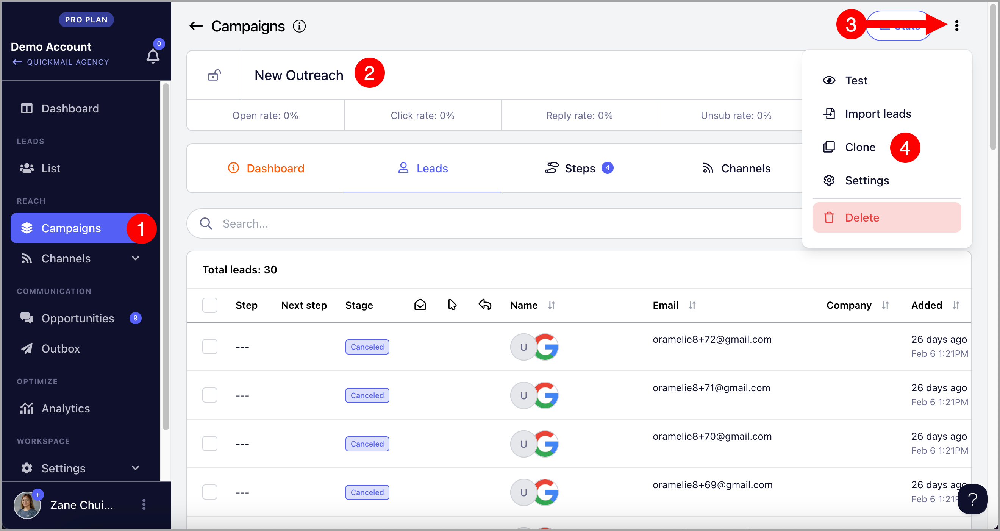

# Saving a Campaign as Template (For Agencies)

## Why use Campaign library?

Using the Campaign Library allows users to effortlessly reuse campaigns as email templates for new ones. This is particularly helpful when applying the same email copy across different campaigns within the same workspace or even for different clients. It streamlines the campaign creation process, saving you tons of time.

**Important:** Campaign library is only available for agencies

## How does it work?

Once a campaign is saved to the library via settings, it becomes available as a template. Whenever you start a new campaign, you can choose to use one of these saved templates, making the setup process much smoother and more efficient.

## How to use Campaign library?

**Step 1.** Add the campaign you'd like to use as a template to the campaign library.

Head to the campaign → Menu (vertical ellipsis at the upper right-hand corner) → Settings

Go to Advanced tab → Toggle 'Add to library' on

**Step 2.** After adding a campaign to the library, create a new campaign, either in the same client workspace or a different one.

Go to the workspace Campaigns page → + Campaign → Name the campaign → Create

**Step 3.** Once a new campaign is created, you'll be directed to the Steps page of the new campaign. From there, choose 'Use template'.

**Step 4.** A window will appear, letting you select and preview the campaign template.

## How to edit templates in the library?

The only way to edit or remove templates is by editing the campaigns themselves.

For example, if 'Test Campaign' is added to the library, you’ll have to look for 'Test Campaign' and edit the campaign itself.

If you don't want to edit the campaign if it's running, you can clone the campaign instead and add the cloned campaign to the library.

To clone the campaign, go to the campaign → Menu (three vertical dots) → Clone

