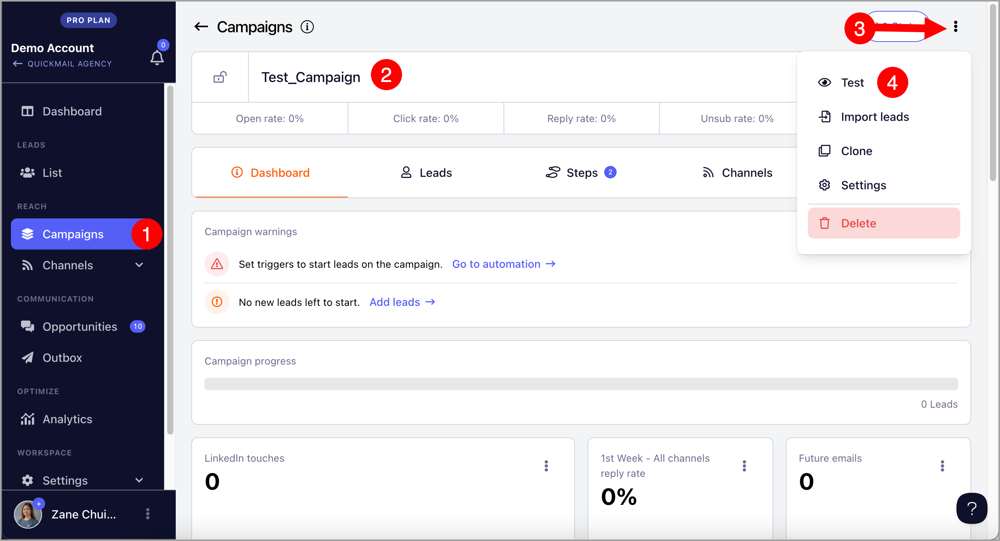
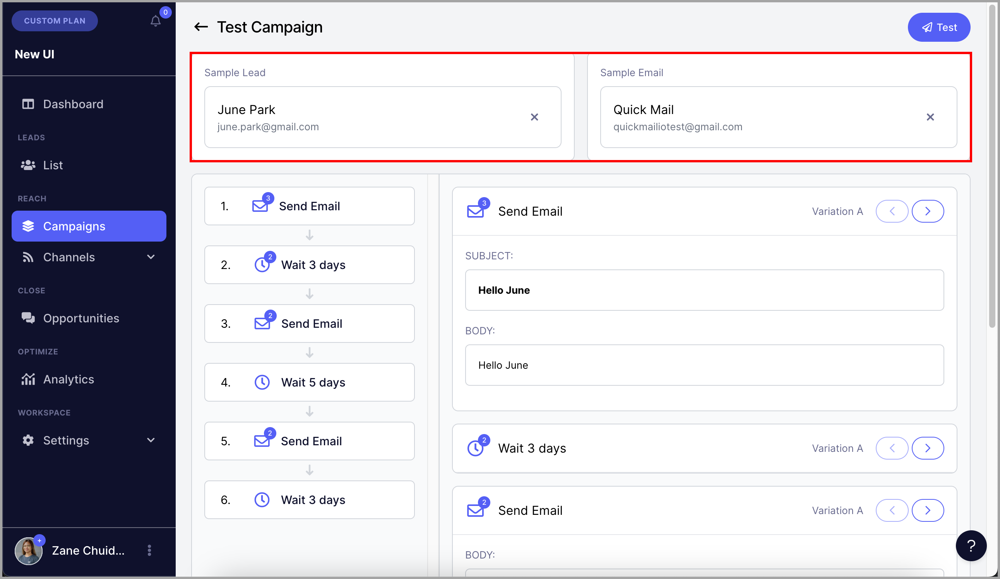
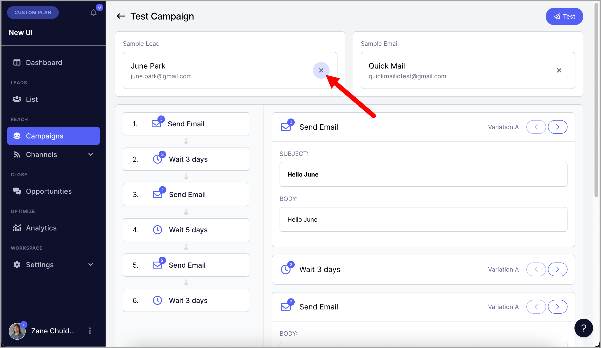
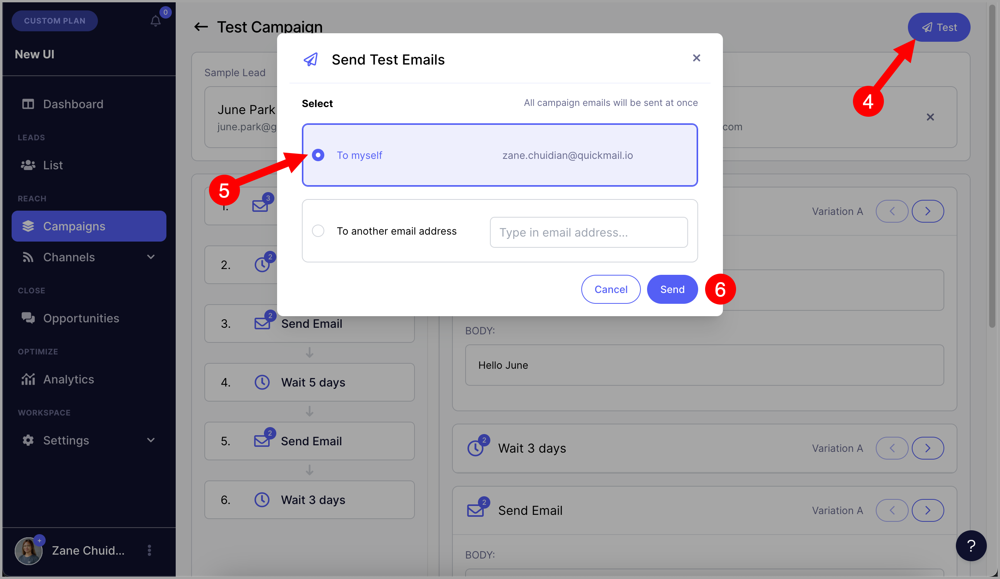

# Sending Test Emails

## Why send test emails?

Sending test emails is a good way to check what the campaign emails will look like when the emails are sent to leads.

**Note:** Sending test emails will ignore the wait steps. So all email steps will be sent in one go.

## How to send test emails?

**Step 1.** Go to Campaigns → Open a specific campaign → Click menu (three vertical dots) at the upper right-hand corner → Test campaign

**Step 2.** A test lead and an email account that will be used for sending test emails will be automatically selected.

**Note:** The test email will not be sent to the Lead selected. Selecting a Lead will allow users to see how the email will look for a specific Lead based on their info when using attributes.

If you would like to use a different test lead or email account for sending test emails, simply click on X and select a different lead or email.

**Step 3.** If you're good with the test Lead and email account selected, click on "Test" and select to which email address will the test emails be sent.

**Note:** For Microsoft email accounts, some of the test emails may go missing. This is because emails are sent very quickly, and Microsoft tends to ignore additional test emails and not send them.
