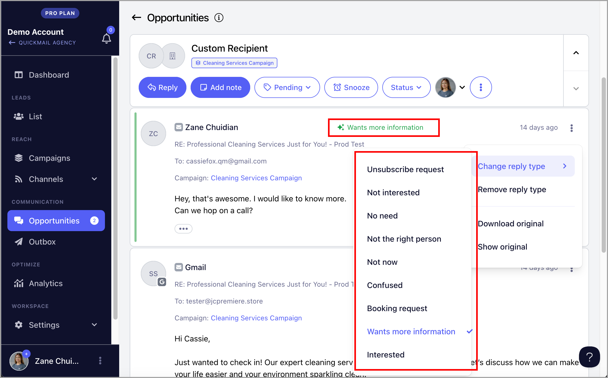
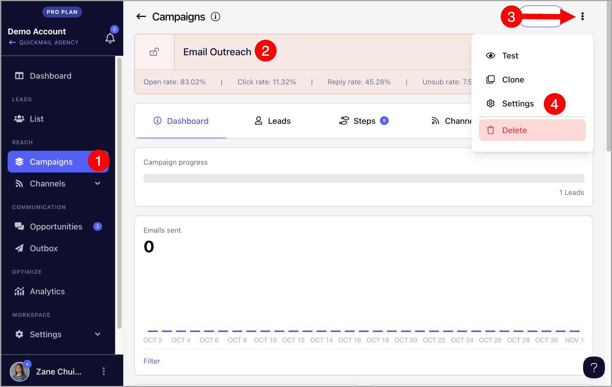
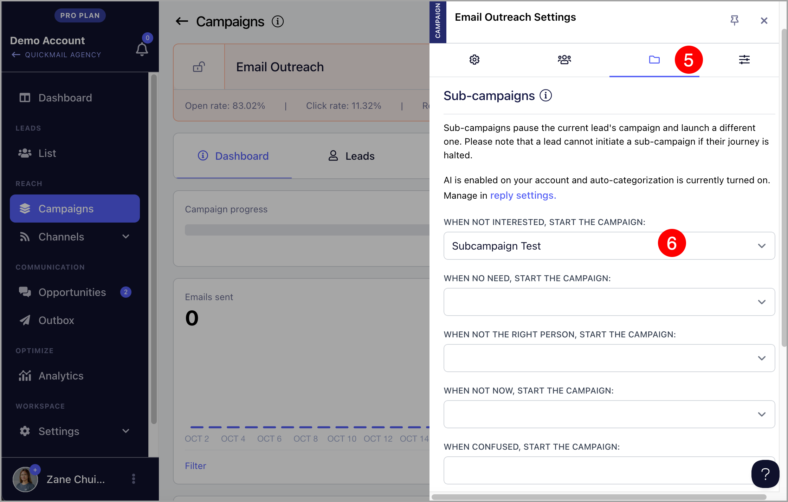
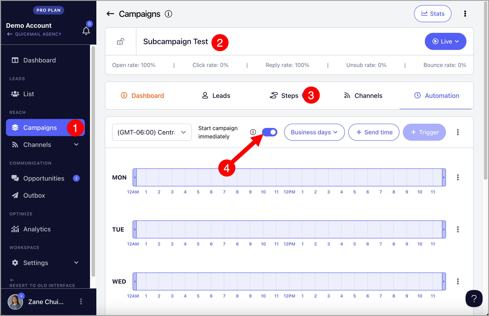
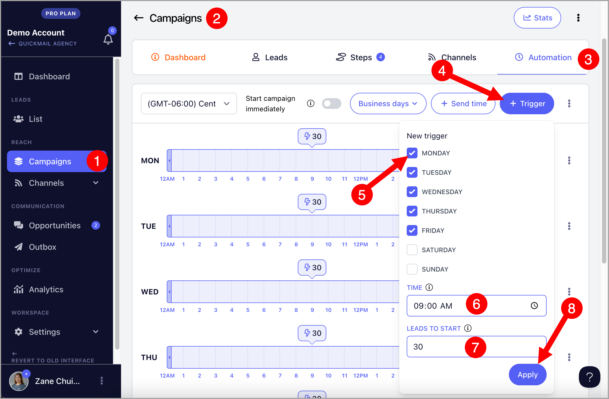
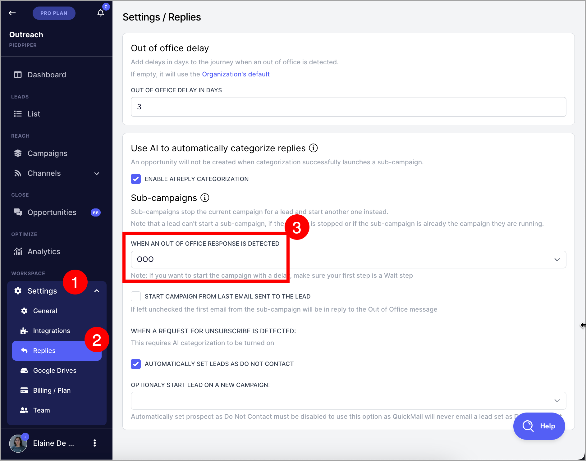
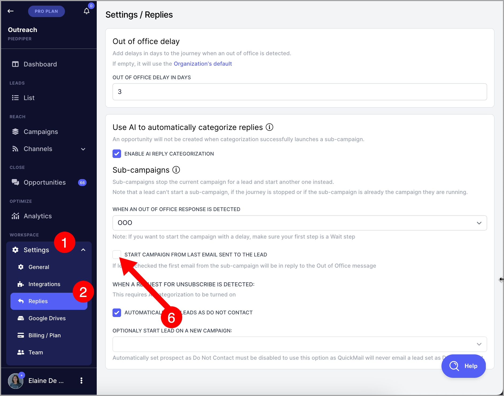
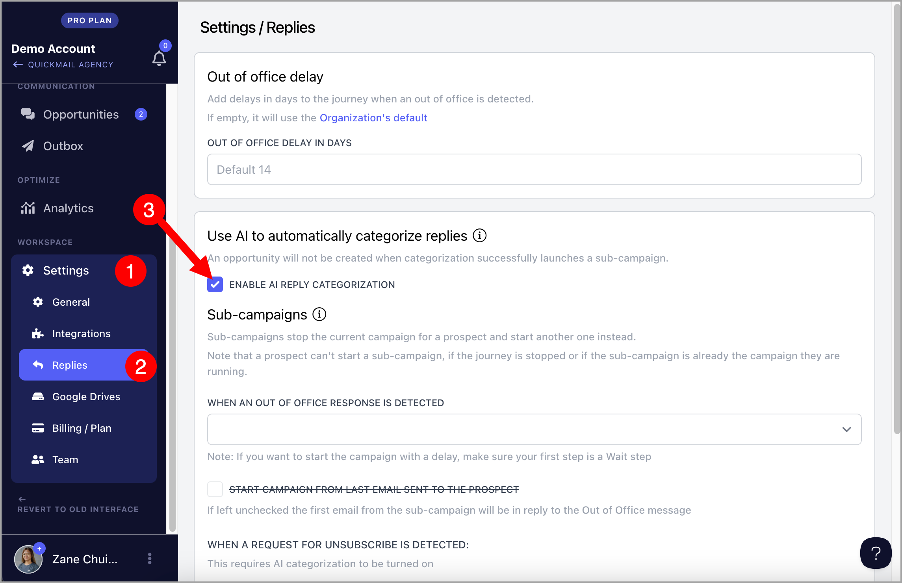
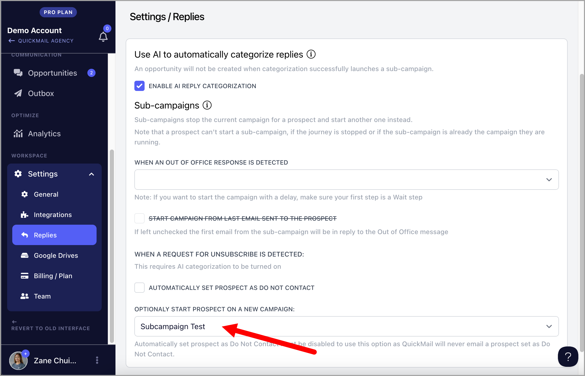
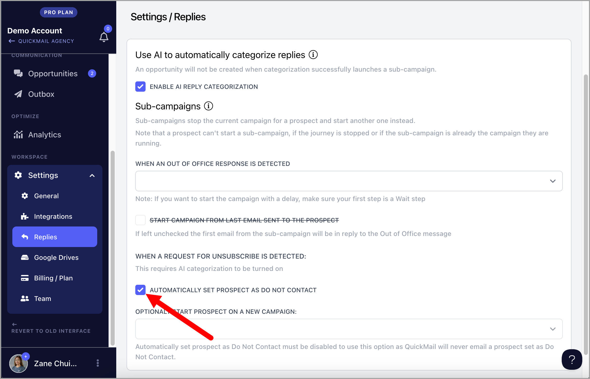

# Sub-campaigns for All Replies

**In this article:**

- Why use sub-campaigns?

- How do sub-campaigns for all reply types work?

- How to use sub-campaigns?

- How to handle out-of-office replies with sub-campaigns?

- Expert plan: How to automatically handle unsubscribe requests with sub-campaigns?

# Why use sub-campaigns?

Sub-campaigns allow users to automatically send follow-up emails based on the reply category. This saves tons of time answering commonly received emails manually.

# How do sub-campaigns for all reply types work?

When leads respond, their replies will appear in the Opportunities section, where they can be categorized manually or via AI. Once categorized, leads are automatically moved to a sub-campaign, and emails from the parent campaign will cease where their status will also be updated to 'Replied.'

Different sub-campaigns can be triggered based on the reply category. Here are the available reply categories at the moment:

**Note:** It's not possible to personalize or modify reply categories

# How to use sub-campaigns?

First, create a campaign and sub-campaign, and make sure they are both live.

After that, assign a sub-campaign to the parent campaign from Campaigns → Open the parent campaign → click the vertical ellipsis on the top-right corner of the page → Settings

In Settings, go to the Sub-campaigns tab and select the sub-campaign where you'd like to add leads based on their reply category.

**Note:** When leads are added to a campaign, they will have a 'Not Started' status by default, which also applies to sub-campaigns. So automation must be setup to start the leads.

If you want leads to automatically start the sub-campaign as soon as a reply is detected, you can enable 'Instant Start' on the sub-campaign's Automation Page.

In addition, you can add a Wait Step as the first step in the campaign if you want to delay sending the first email in the sub-campaign.

Alternatively, you can set up triggers to automatically start leads in the sub-campaign at specific times and days.

## Manually Triggering a Sub-Campaign for Opportunities

If you need to manually trigger a sub-campaign for a specific opportunity, you can do so by updating the reply type directly.

First, navigate to the Opportunities** section of QuickMail and find the specific opportunity you’d like to update.

Then click on the opportunity to view its detailed information and use the **Change Reply Type** option and select the appropriate reply type from the list. This list includes reply types such as “Positive Reply,” “Out-of-Office,” “Unsubscribe,” and any other reply types configured in the parent campaign.

When the reply type is updated, the sub-campaign associated with that reply type (as set in the parent campaign) will be triggered.

**Note**: For this to work, please make sure that the parent campaign is configured with sub-campaigns for specific reply types. Sub-campaigns will only trigger if there’s a predefined association between the reply type and a sub-campaign.

# How to automatically handle out-of-office replies with sub-campaigns?

If a lead is marked out-of-office, 14 more days will be added to the Wait Step.

For example, if a lead is marked as out-of-office, and the next Wait Step is 3 days, QuickMail will send the next email 17 days after.

With sub-campaigns, the first email they receive when they're back can be personalized

"Hope you had a great holiday! Once you're caught back up let's try to connect..."

With this enabled and an out-of-office reply is detected, the sub-campaign feature will cancel the parent campaign journey for a lead. Then, the leads automatically move to a different campaign.

**Note:** As soon as OOO is received, a Lead will start the sub-campaign immediately. Make sure to add a Wait Step at the start of your sub-campaign to avoid sending follow-ups while the Lead is on holiday.

To assign the Sub-Campaign for out-of-office replies, head to workspace Settings → Replies → Select a campaign under 'When OOO response is detected' in the Sub-campaigns section.

By default, the first message sent from the sub-campaign will be a reply to the Out of Office message that the recipient sent.

If you wish to change this, check the option to 'Start campaign from the last email sent to the lead'.

With this option checked, the first email sent from the sub-campaign will be threaded as a reply to the last email sent from the campaign.

**Note:** Out-of-office replies don't show in the Opportunities section. They can only be found directly in the email account's inbox.

# How to automatically handle unsubscribe requests with sub-campaigns?

In QuickMail, our powerful AI can analyze and detect reply sentiments to autoamtically handle unsubscribe requests. To enable "AI Reply categorization", go to workspace Settings → Replies → Enable AI Reply Categorization

**Note:** If the option to enable AI reply categorization is not available, this means that AI is not available in your current plan. AI is only available on the Expert Plan.

**Option 1**: If you'd like to send additional emails via a sub-campaign to those leads who asked to unsubscribe,

simply select a campaign under 'Optionally Start Lead on New Campaign'.

**Pro Tip:** Sending additional emails to those who asked to be unsubscribed may get your email accounts manually flagged for spamming by the recipient.

**Option 2:** To mark leads as 'Do Not Contact' and prevent them from being added to a sub-campaign when an unsubscribe request is detected in their reply, check the box for 'Automatically set Leads as Do Not Contact.'

