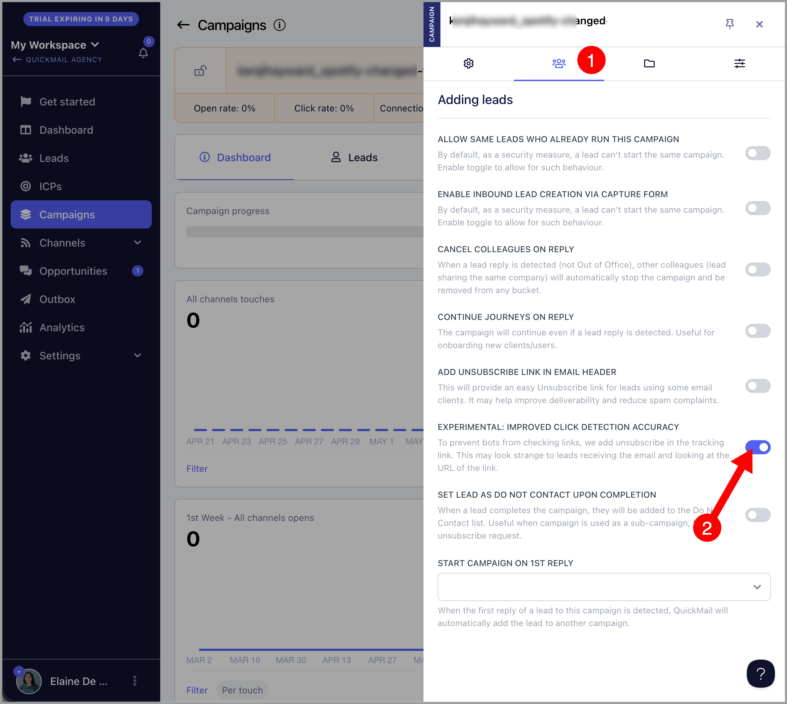
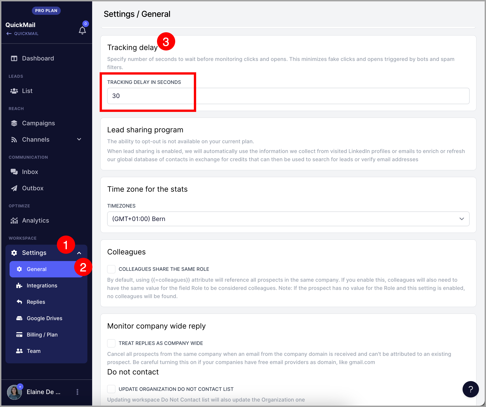

# Tracking Delay to Avoid False Opens and Clicks

### In this article:

- What causes false opens and clicks?

- How to prevent false opens and clicks?

- How to set up tracking delay?

# What causes false opens and clicks?

- Sometimes, email security systems automatically scan incoming emails immediately after delivery, which can trigger false open or click events.

- Domains ending in `.edu`   and `.org`   commonly have stricter email filtering systems, which makes automated opens and clicks more frequent.

- Large organizations such as hospitals, government agencies, and schools often use advanced email protection tools because they are common targets for phishing attacks.

- Some security tools automatically open links in emails to check whether they lead to malicious or unsafe websites.

- Some email applications automatically preload images in the background, which can trigger open tracking pixels even if the recipient did not read the email.

- Because of these automated checks, open and click tracking should be treated as estimated engagement rather than exact human activity.

- False opens and clicks can also happen when the email is opened and links are clicked by the user/sender in the Sent folder.

# How to prevent false opens and clicks?

To prevent false opens and clicks, just set up a tracking delay.

Tracking Delay adds a delay after sending an email before tracking opens and clicks for that email.  Thus making click and open tracking more accurate and reliable.

# How to set up tracking delay?

In your QuickMail account, go to Settings → General → Adjust the "Tracking Delay in seconds"

**Note:** It's set to 3 seconds by default.

The delay can be adjusted from 0 to 600 seconds and will apply to any email sent from the account. You can enter 0 if you want to disable the tracking delay.

**Warning:** Having a long delay might lead to real opens and clicks from getting missed. Usually, users leave the delay to 3 seconds but some users set it up for up to a minute.

# How to prevent false opens and clicks?

**Option 1: **To improve click tracking accuracy, you can enable the campaign setting called “Improved click detection accuracy.”

When this setting is enabled, QuickMail adds the word “unsubscribe” to tracked links because most security bots avoid clicking unsubscribe links. This helps reduce false click activity caused by automated email scanners.

This does not unsubscribe leads from the campaign, since unsubscribe handling is managed separately by the system.

To enable this setting:

Campaign → Triple-dot icon → Settings → 2nd tab → Enable “Improved click detection accuracy”

**Option 2:** Avoid opening the emails in your sent folders as this can trigger false open and clicks
