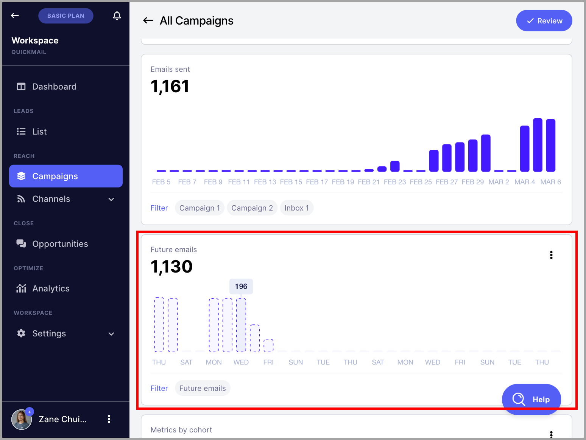

# Understanding Future Emails

**In this article:**

- Where can I see Future Emails?

- How are Future Emails calculated?

Future Emails helps you to forecast the email volume of your campaigns, streamline your planning process, and optimize resources efficiently.

## Where can I see future emails

To check Future Emails, go to Campaigns → Select a campaign → And in the Dashboard, you'll see Future Emails

## How are Future Emails calculated?

Future emails are calculated based on different factors such as:

- The number of leads in an active campaign

- The number of leads that will start the campaign based on the triggers (Campaign Automation)

- The number of follow-up emails

- Wait Steps

Certain factors are not yet taken into account by Future Emails. These include:

- Type of the first step in a campaign (e.g. if it's not an email step)

- Time delay between sending emails

- Sending times

- Out of office leads
