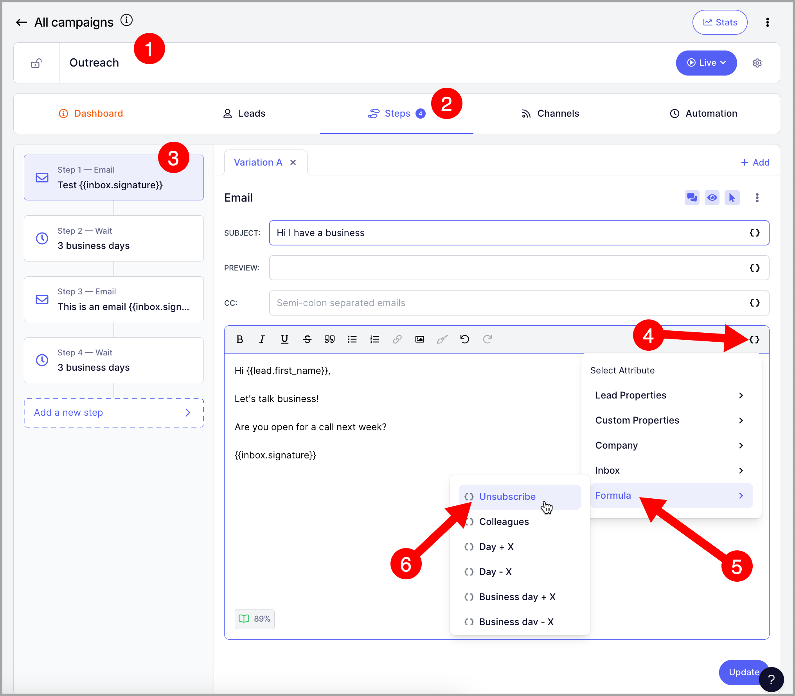

# Adding Unsubscribe Links

**In this article:**

- Why add an unsubscribe link to emails?

- How to add an unsubscribe link to my emails?

- How to personalize the unsubscribe message?

- How to include an unsubscribe link in a signature?

- How to include an unsubscribe link in the email header?

- What do leads see if they click unsubscribe?

# Why add an unsubscribe link to emails?

Including an unsubscribe link gives prospects a quick way to opt out, which can potentially reduce the risk of them marking your messages as spam.

However, the more links in a message, the greater the likelihood of reducing deliverability, so be mindful of that.

# How to add an unsubscribe link to my emails?

To add an unsubscribe link to your emails, go to the campaign → Steps → open an email step → click the **{ }** icon in the email editor to open the properties menu.

From the properties menu, click **Pre-computed** → click **Unsubscribe**.

This inserts the unsubscribe attribute wherever your cursor is in the message body.

It will read "If you don't want to hear from me again, click here," with "click here" being the unsubscribe link.

# How to personalize the unsubscribe message?

The unsubscribe attribute can also be used as a hyperlink. To do that, type your text in the email body → highlight the part you'd like to use as the unsubscribe link → click the link button on the toolbar.

Enter `{{=unsubscribe}}` as the link → click **Save**.

# How to include an unsubscribe link in a signature?

If you're including a signature in your emails, the unsubscribe link can live there too. From the signature page, you can link the `{{=unsubscribe}}` attribute to any word and it will work the same way it does in email steps.

# How to include an unsubscribe link in the email header?

You can also include an unsubscribe link in the email header to make it easier for prospects to unsubscribe from a campaign.

To do this, go to the campaign → click the gear icon → under the second tab, toggle **Add unsubscribe link in email header** on.

Here's how the unsubscribe header will appear in your emails:

**Pro tip:** The unsubscribe header won't appear if the inbox doesn't have a good sender reputation or if the unsubscribe link is not SSL. To improve the chances of it appearing, set up custom domain tracking to ensure your unsubscribe links use SSL.

# What do leads see when they click unsubscribe?

When a lead clicks the unsubscribe link, they will be redirected to a form where they can choose the reason for unsubscribing.

**Note:** Leads are automatically unsubscribed as soon as they click the link, even if they don't select a reason from the list.

Also FYI: It's not possible to edit the text in the form and change it to another language.
