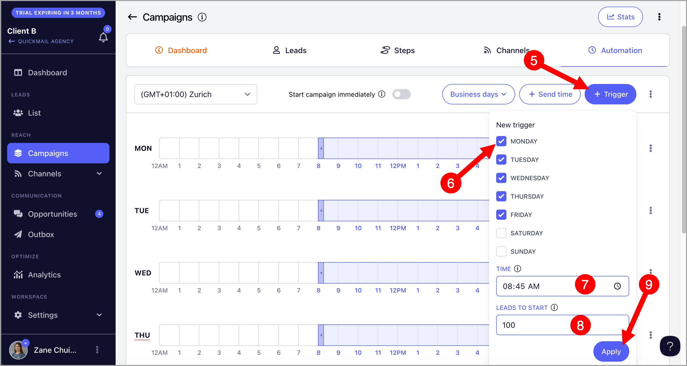
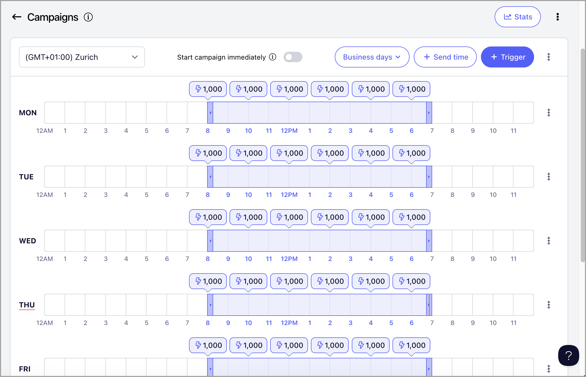

# Automate Starting Leads with Triggers

**In this article:**

- How does campaign automation work in QuickMail?

- What are triggers for?

- How do triggers work?

- How to set up triggers?

- How many leads should I add to the triggers?

## How Does Campaign Automation Work in QuickMail?

When leads are added to a campaign, they will have a "Not Started" status. The campaign will only send emails to leads once they are started.

Leads can be started either manually or by setting up triggers.

## What Are Triggers For?

Triggers allow users to control when and how many new leads start a campaign. If you want to control the number of initial emails sent, you need to set up triggers.

Note that triggers do not control the overall email volume of a campaign if it has follow-up emails.

## How Do Triggers Work?

The number of leads in the triggers is distributed evenly among the email accounts assigned to the campaign. For example, if there are 100 leads in the triggers and 5 email accounts assigned to the campaign, each email account will send to 20 new leads.

Triggers run automatically on a daily basis, so there is no need to set them up every day. For example, if you set up triggers from Monday to Friday with 100 new leads, the campaign will start 100 new leads each day until there are no more available leads.

**Tip:** Triggers cannot set time delays between sending emails. For instructions on how to set this up, refer to this guide: Throttling Emails to Avoid Getting Flagged

## How to Set Up Triggers?

Go to your preferred campaign → **Automation** tab → select your preferred timezone.

Then, click **+Triggers** → select your preferred days, time, and number of leads.

**Important:** When adding triggers, there must be at least a 15-minute gap between when the trigger is created and when it runs. For example, if you want the trigger to run at 8:00 AM, it must be created or updated by 7:45 AM at the latest. Otherwise, the trigger will run the following day.

## How Many Leads Should I Add to the Triggers?

The number of leads to add to the triggers depends on your desired email volume, the email accounts assigned to the campaign, and the number of email steps.

To find the ideal number, determine the maximum daily send limit of an email account and the number of email steps in the campaign, then divide the daily limit by the number of steps.

For example, if an email account has a daily limit of 100 emails and the campaign has 5 steps, you should add 20 leads per day. As emails from all 5 steps accumulate, the account will reach its full daily limit (5 steps × 20 leads = 100 emails).

If an email account is running 2 campaigns with 5 steps each, the 20 leads should be split between them, meaning each campaign should add 10 leads per day.

Keep in mind that email volume will initially be lower and will gradually reach the maximum limit as follow-up emails stack up. Managing volume with triggers can be tricky, so expect some experimentation until you reach your desired email volume.

**Pro Tip:** You can also use this [calculator](https://docs.google.com/spreadsheets/d/1YmM0d3M6nlBLRcNcT_hCRf8Gatfnj8XTXYL9ZyZ5vUU/edit?gid=0#gid=0) to get the suggested number of leads based on the calculation above.

## Why Can't I Add More Than 1,000 Leads in the Triggers?

Starting 1,000 leads at once can cause a spike in email volume, which may get your email accounts flagged for spam. If you need to start more than 1,000 leads, create multiple triggers throughout the day instead. For example, set triggers for 500 leads at 8:00 AM, 500 at 10:00 AM, 500 at 12:00 PM, and so on.

**Important:** If you're starting thousands of new leads, make sure you have enough email accounts and sufficient send times. Otherwise, you may end up with a backlog of emails in the send queue.

**Tip:** If you need help deciding how many leads to start in a campaign, check out: Limit the number of leads that will start a campaign using triggers

## My Campaign Has Leads — Why Does It Say "No New Leads Left to Start"?

When triggers are set up, leads show a "Not Started" status when first added to the campaign. Once the trigger conditions are met, they automatically move to "Running" status.

This message simply means that all current leads have already been started — there are no leads remaining in "Not Started" status.

**What to do:**

- **If you have more leads to contact** → Add them to the campaign and they will start based on your trigger settings.

- **If you don't have new leads right now** → You can safely ignore this message. It is not an error — it just means your campaign is running as expected with the leads already added.
