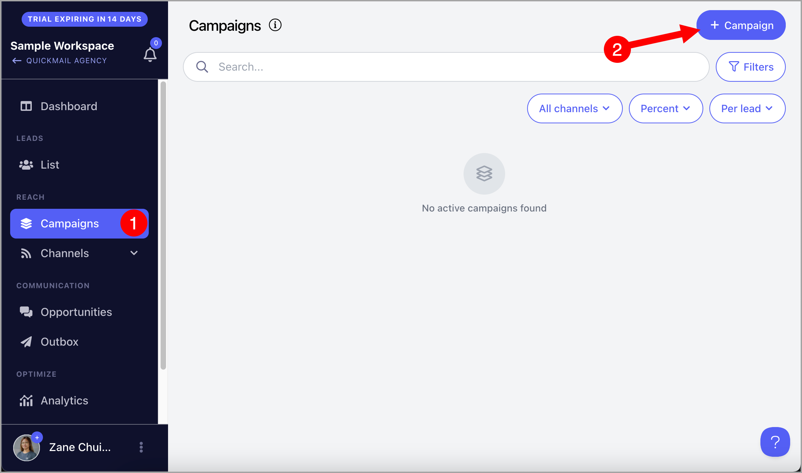
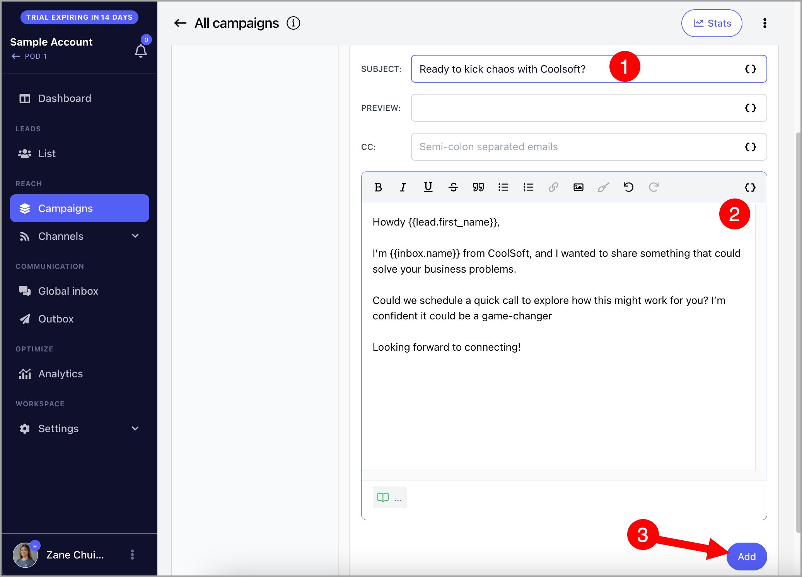
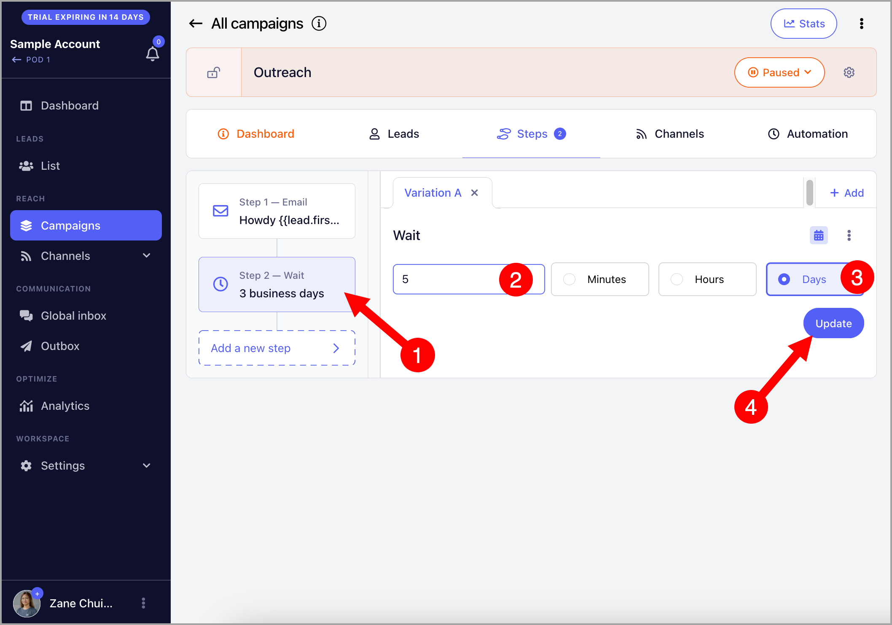
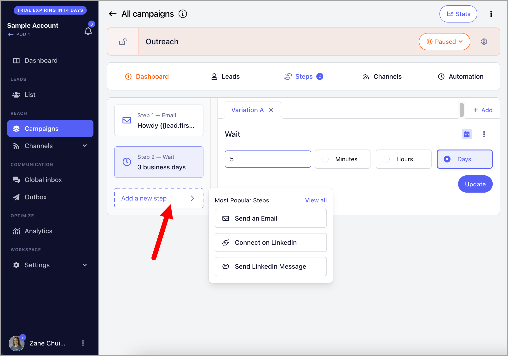
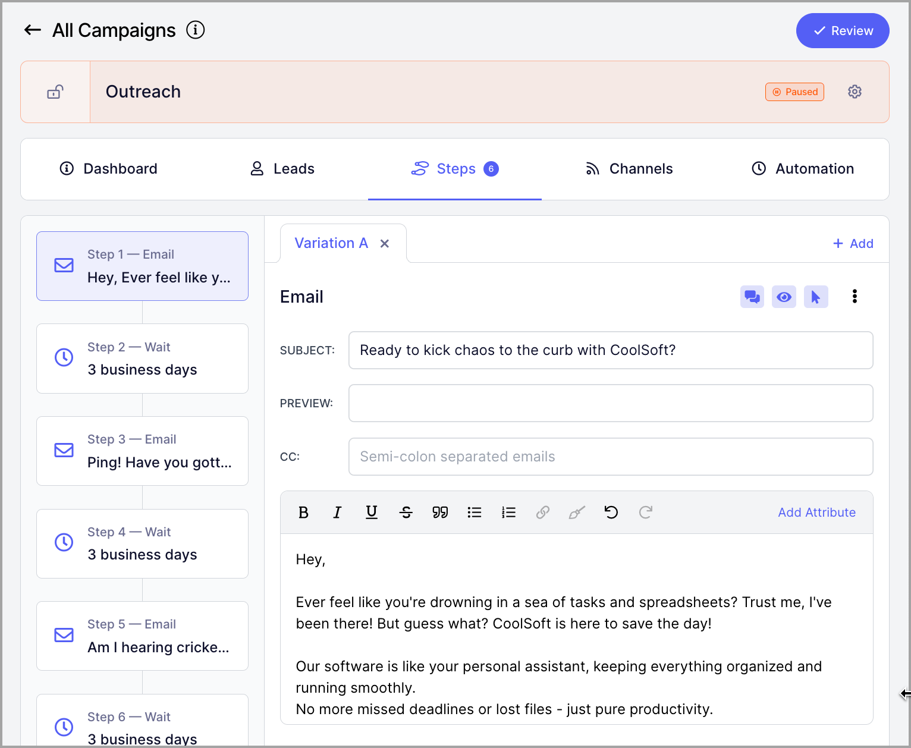
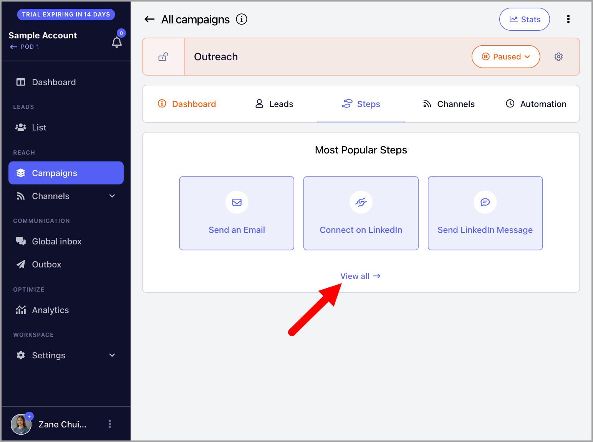
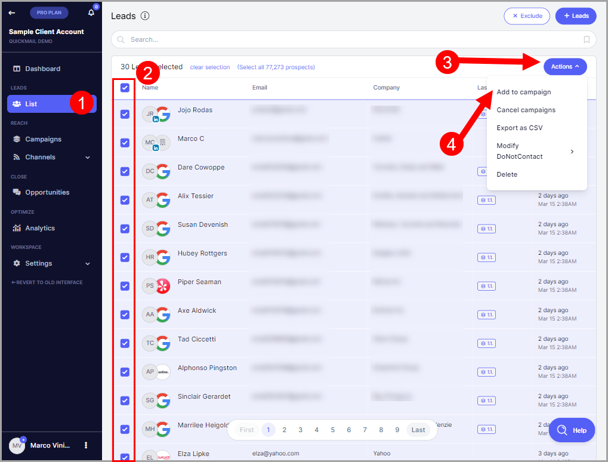

# Campaign Building: Step by Step

### In this article:

- What are campaigns?

- **Step 1:** Create a campaign

- **Step 2:** Create steps

- **Step 3:** Assign accounts for sending

- **Step 4:** Add leads to the campaign

  - Importing leads to the campaign

  - Manually adding leads to campaigns

- **Step 5:** Activate the campaign

- Editing send times

- Starting leads

  - Triggers

  - Manual start

  - Instant start

- Troubleshooting: Why is my campaign not sending?

If you prefer watching video tutorials, check this out: Campaign Building Guide 🎥

# What Are Campaigns?

Campaigns are a series of emails and tasks used to reach out to leads and get replies. In QuickMail, you can run omni-channel campaigns that include email, calls, SMS, and LinkedIn actions, among others.

## Step 1: Create a Campaign

To get started, go to **Campaigns** → click **+ Campaign**.

When creating a campaign, you will need to:

- Give the campaign a name

- Choose whether it is shared (visible to everyone) or private (only visible to you)

- Choose the days you'd like to send

- Specify the timezone for sending

- Set specific send times

- Add the number of leads you'd like to start daily

**Warning:** Enabling "Start campaign immediately" will begin sending emails as soon as leads are added. If your campaign includes a large number of leads and multiple email steps, this is not recommended. It may result in:

- A high volume of outgoing emails, which could get your email account flagged.

- A backlog of emails in the send queue, causing delays.

Consider using automation by setting the number of leads to start daily instead.

**Note:** Private campaigns are only visible to the email address that created them. They are not visible to other team members or admins.

## Step 2: Create Steps

Under the **Steps** tab, choose the type of step you want to add. Using email as an example:

Add your email subject and body → click **Add**.

**Note:** By default, a 3-day wait step is automatically created after each step. The wait duration can be changed.

You can keep adding follow-ups by clicking **Add New Step**.

Here is an example of a campaign with multiple follow-ups.

QuickMail supports many other step types beyond email and LinkedIn. To see the full list, click **View All** when adding a step.

## Step 3: Assign Emails for Sending

QuickMail does not have its own sending server, so you must add your own email account for sending. Without an email account, the campaign cannot send emails.

To add an email account, follow this guide: Adding Email Accounts for Sending

Once added, go to the campaign → **Channels** tab → under **Emails**, toggle your preferred email address on.

**Pro tip:** You can assign multiple email accounts to a campaign to safely scale your outreach. This distributes email volume across accounts and reduces the risk of being flagged by email service providers.

## Step 4: Add Leads to the Campaign

Leads must be added to the campaign before automation can run. Leads can be added during the import process or manually from the Leads list.

### Option 1: Importing Leads to the Campaign

Go to the campaign → **Menu** → **Import Leads**.

**Tip:** You can learn more about importing leads here.

**Pro tip:** If your leads are already in the workspace, you can re-import the same sheet. When doing so, make sure to check **Update lead if it exists** — otherwise, leads will be rejected as duplicates and will not be added to the campaign.

### Option 2: Manually Adding Leads to the Campaign

Select leads from the list → click **Actions** → **Add to Campaign** → select the campaign.

## Step 5: Activate the Campaign

Once your campaign is set up, the last step is to activate it.

When leads are added to a campaign, they will have a "Not Started" status. Once the campaign is live, emails will be sent based on when leads are started according to your triggers and allowed send times.

To set the campaign live, go to the campaign → click the **Paused** dropdown → select **Live**.

**Tip:** If your campaign is not sending emails, check out this guide for troubleshooting.

## Editing Send Times

Send times determine the specific hours and days when the campaign is allowed to send emails. For a newly created campaign, the initial send times are based on the settings and timezone selected during setup.

To edit send times, go to the campaign → **Automation** tab → select your preferred timezone → shade your preferred send times and days.

**Tip:** For more information about send times, check out this guide: Optimizing Send Times

**Note:** By default, there is a 60-second delay plus a 15-second random delay between sending emails. Make sure your campaign has enough send time to accommodate your preferred email volume.

## Starting Leads

When leads are added to a campaign, they are initially in a "Not Started" status. The campaign will only begin sending emails once leads are started.

Leads can be started in three ways:

- **Triggers** — start leads automatically on specific days and times

- **Manual start** — start leads at any time

- **Instant start** — start leads automatically as soon as they are added to the campaign

### Triggers

Triggers control how many leads start your campaign on specific days and times. The initial triggers are based on the number of leads to start daily set during campaign setup.

To edit triggers, go to the campaign → **Automation** tab → make sure you are using the correct timezone.

Then click **Triggers** → select the days → select the time → set the number of leads to start → click **Apply**.

If you need to clear a trigger, you can do so from the same view.

**Notes:**

⚠️ Triggers control when leads start, not how many emails are sent. If the campaign has follow-ups, total email volume will be higher. To set a daily email limit, configure it in the email account settings.

⚠️ The number of leads in the triggers is divided equally among the email accounts assigned to the campaign.

⚠️ Triggers cannot be applied retroactively. You will need to wait for the next scheduled time for new leads to start. To start leads right away, use the manual start option.

⚠️ For more information about triggers, check out this guide: Automate Starting Leads with Triggers

### Manually Starting Leads

To manually start leads, go to the **Leads** page in the campaign → select the leads → click the **Play** button.

### Instant Start

Instant start automatically starts leads as soon as they are added to the campaign. Note that this setting does not apply retroactively to leads that were already in the campaign before it was enabled.

Instant start can be enabled during campaign setup by checking the appropriate option.

If it was not enabled during setup, go to the campaign → **Automation** tab → toggle on **Start Immediately**.

**Warning:** Enabling instant start will begin sending emails as soon as leads are added. If your campaign includes a large number of leads and multiple email steps, this is not recommended. It may result in:

- A high volume of outgoing emails, which could get your email account flagged.

- A backlog of emails in the send queue, causing delays.

Consider using triggers and setting the number of leads to start daily instead.

## FAQs

**Q: If a lead's next email falls on a weekend due to a wait step, how will QuickMail handle that?**

If your campaign send times are set to Monday–Friday only, QuickMail will not send emails on Saturday or Sunday. A wait step makes the next email eligible after the set duration, but the email will only send during your allowed send times.

Example:

- Email 1 sends on **Thursday**
- Wait step = **2 days**
- Next email becomes due on **Saturday**
- Since Saturday and Sunday are not in the allowed send times, QuickMail will wait
- The email will send on the **next allowed window**, typically **Monday** during your selected sending hours

**Tip:** If you set your wait step to business days, leads will never be scheduled to send on a weekend.

**Q: I accidentally deleted a campaign. Can I recover it?**

Deleted data in QuickMail cannot be recovered. This includes campaigns, campaign steps, leads, and other data, and is done for data and security compliance reasons.

To avoid losing data, archive the campaign instead of deleting it.

**Q: Can I add an image to my campaign emails?**

Yes. Go to the step or signature → click the image icon → choose between **Upload** or **Image URL**.

Note that there is currently no option to resize images within QuickMail. Resize your image before adding it to ensure it displays correctly.

Also note that images with large file sizes may be treated as attachments by email service providers. To prevent this, keep image file sizes under 2MB.
