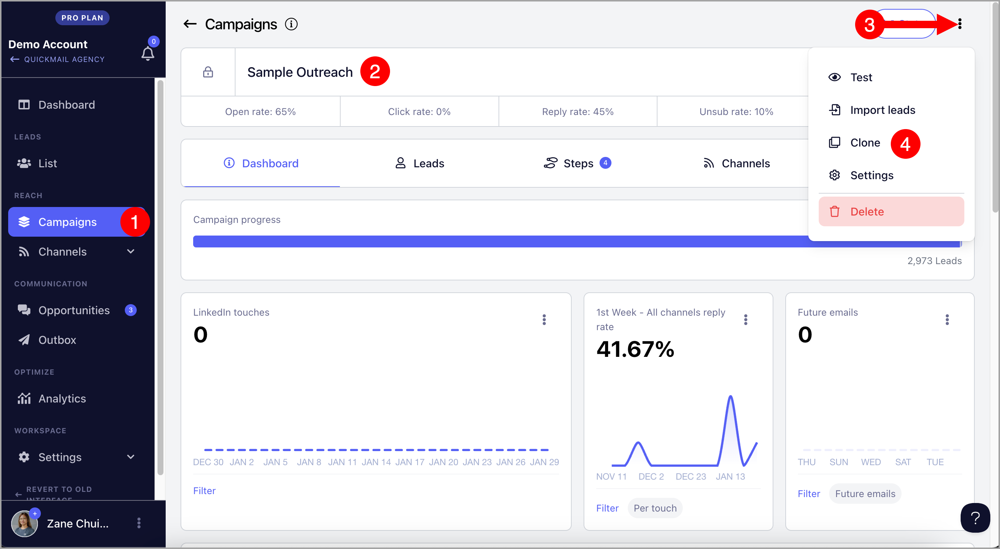

# Cloning a Campaign

Cloning a campaign allows you to replicate all the steps and settings of an existing campaign, eliminating the need to build everything from scratch. This lets you quickly launch a new campaign with the same structure and settings.

## What Elements Will Be Copied When Cloning a Campaign?

**Elements that will be copied:**

- All steps within the campaign

- Assigned email accounts

- Send times

- All campaign settings, except those listed below

**Elements that will NOT be copied:**

- Leads

- Assigned LinkedIn account

- Sub-campaigns

- "Add to Library" setting

- "Confirm Unsubscribe" setting

## How to Clone a Campaign?

Go to the campaign you'd like to clone → click the menu icon (three vertical dots) → **Clone Campaign**.

After cloning, you will be redirected to the new cloned campaign.
