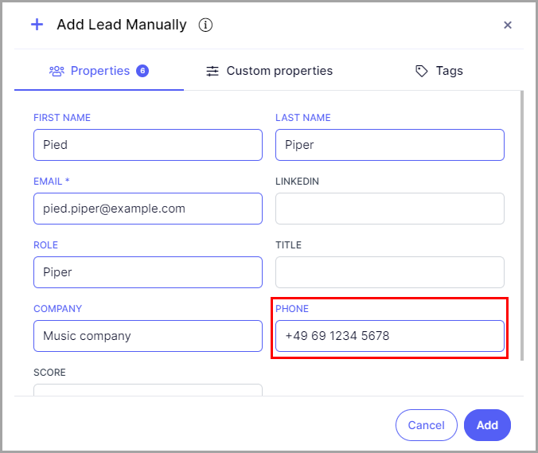
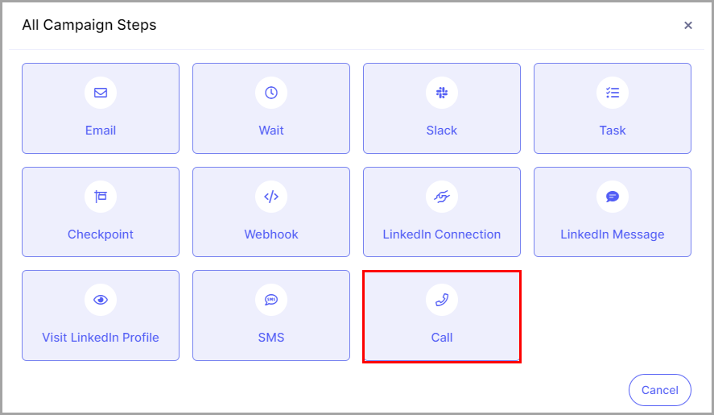
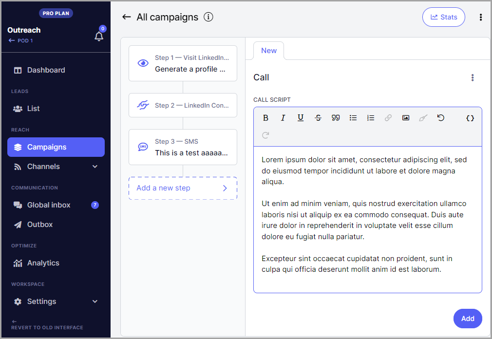
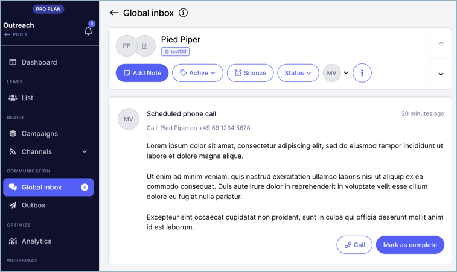

# Creating Call Steps in a Campaign

## What Are Call Steps?

Call steps are non-email campaign steps that allow users to make calls to leads. Similar to a task step, a lead's progress in the campaign will pause when they reach a call step.

**Note:** A lead must have a phone number to be called when they reach a call step.

## How to Create a Call Step?

**Step 1.** Go to **Campaigns** → create or select an existing campaign → **Steps** → click **Add a Step** → select **Call Step**.

**Step 2.** Compose a call script that will be available to read when a lead reaches the call step.

**Tip:** You can use properties to automatically populate lead details in the script.

## How to Make a Call?

When a lead reaches a call step, their campaign progress will pause and a call item will be added to the Inbox page.

**Step 1.** On the Inbox page, open a call item to view the call script for that lead. Call items are labeled "Scheduled Call."

**Step 2.** Click the **Call** button to dial the lead's phone number using the call application associated with your browser or computer.

**Note:** The Call button will not appear if the lead does not have a phone number.

Once the call is completed, you have two options:

- **Mark as complete** — resumes the lead's campaign progress and moves them to the next step.

- **Archive** — archives the call item without resuming campaign progress.
