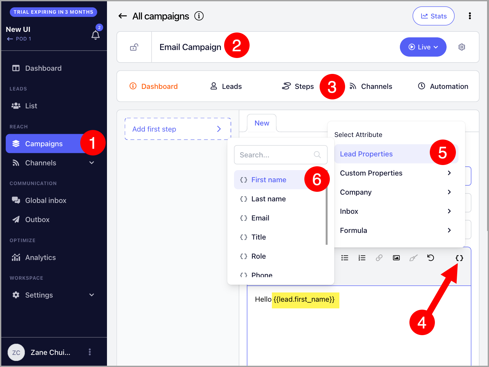
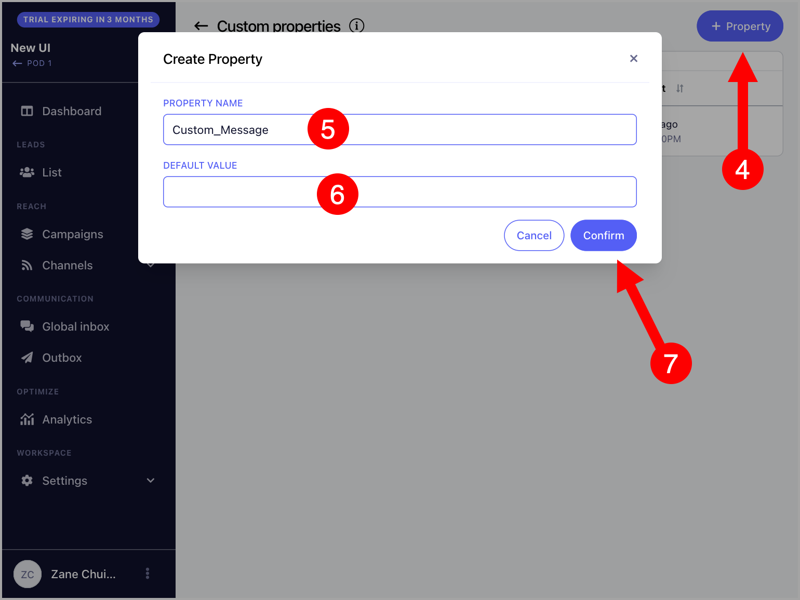
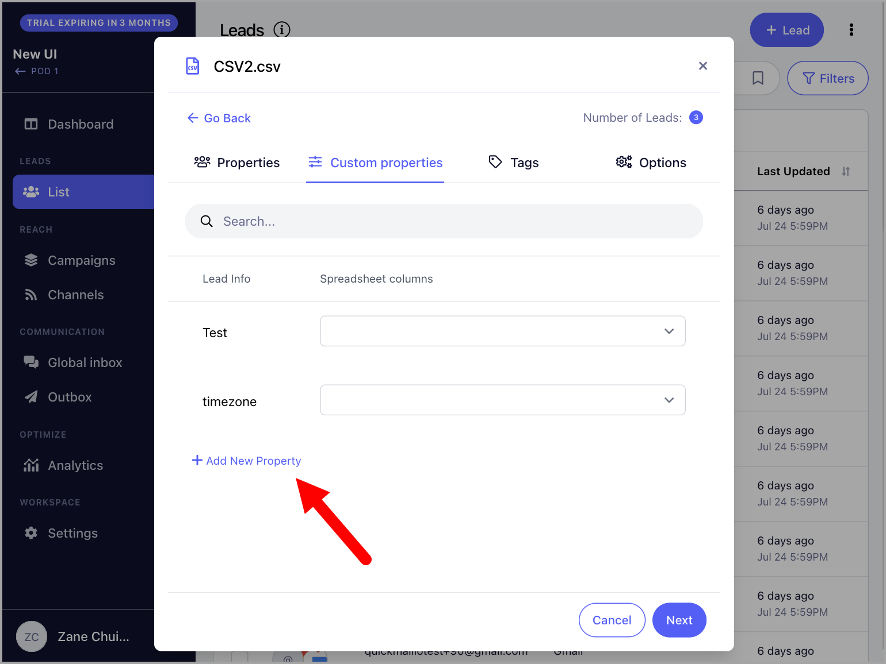
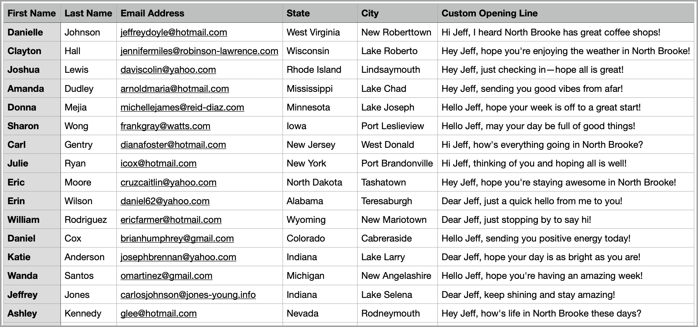
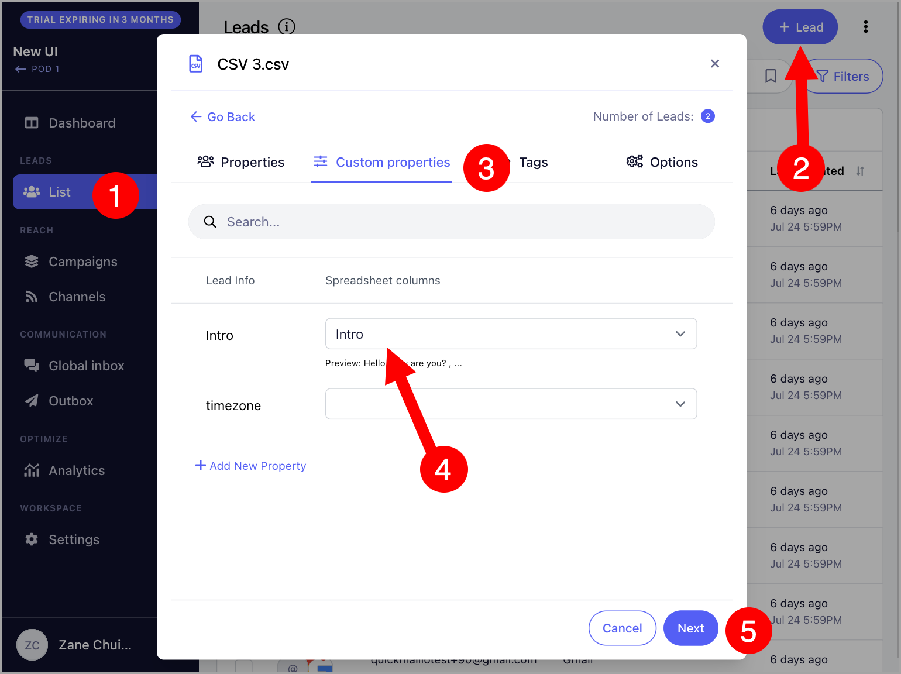
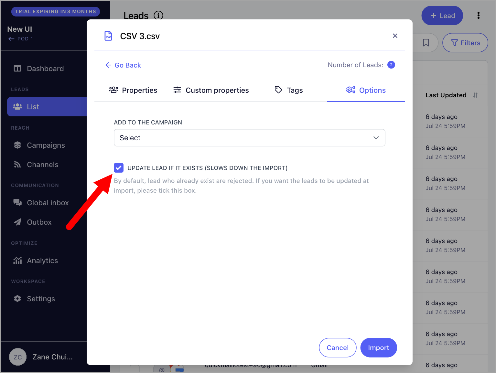
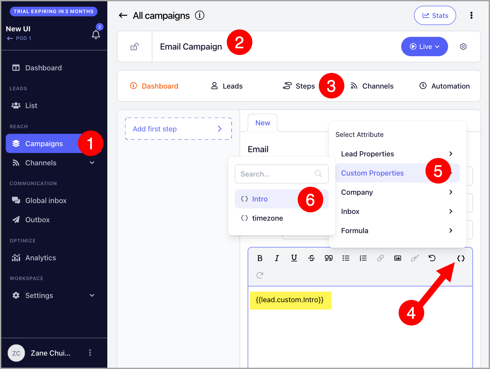
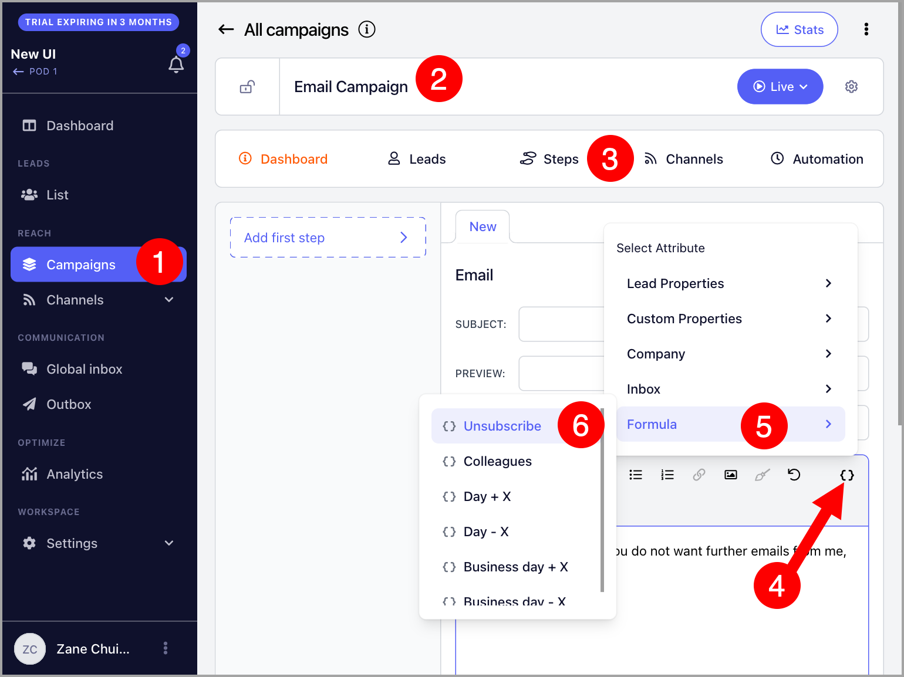
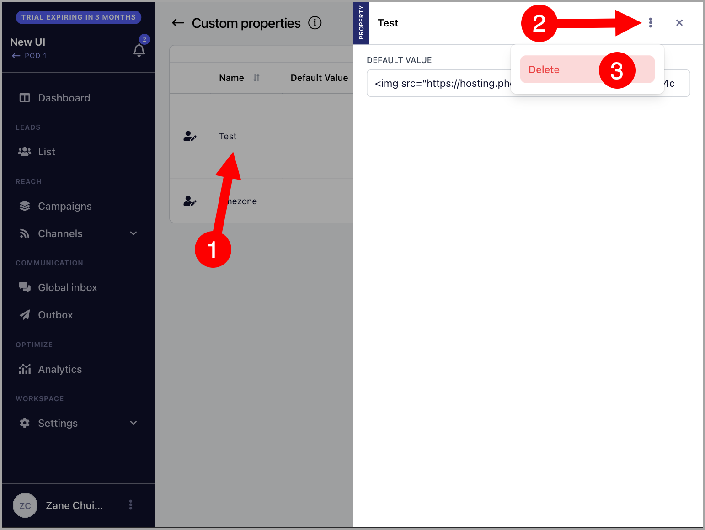
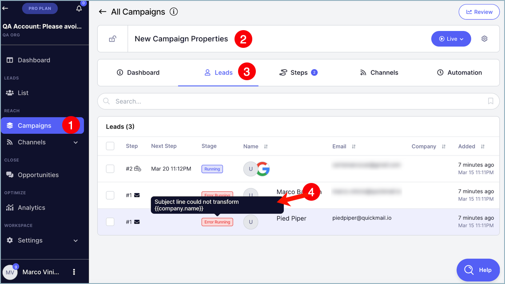

# Custom Fields for Personalizing Emails

**In this article:**

- Why use properties?

- How to add properties to email steps?

- Lead properties

- Custom properties

- Company properties

- Inbox properties

- Precomputed properties

- How to delete custom properties?

- How to edit custom properties?

- Why am I getting an error?

## Why Use Properties?

Properties are placeholders that can be added to email steps to personalize your emails. Using properties makes it easier to give your emails a personal touch and helps improve email deliverability.

## How to Add Properties to Email Steps?

To add properties, go to an email step and click **Properties** on either the email subject or body field. There are several types of properties available to customize your emails.

## Lead Properties

Lead properties are the basic way to personalize your emails. You can use them to include a lead's first name, last name, email, title, role, phone, and score.

For example:

*Hey {{lead.first_name}}, how is it being the new {{lead.role}}?*

This will translate to:

*Hey Richard, how is it being the new Regional Supervisor?*

## Custom Properties

Custom properties allow you to include personalized details in your emails for each lead, such as their city, industry, or a unique opening line tailored to each individual.

**Important:** If you need to use formatting and line breaks in custom properties, you will need to use HTML.

**Note:** It is not possible to filter leads based on custom property fields.

### Step 1: Create Custom Properties

There are two ways to create custom properties:

**Via the Custom Properties page**

Go to **List** → click the three vertical dots → **Properties**.

Click **+ Property** → add a custom property name → set a default value (optional) → **Confirm**.

The default value is used as a fallback if a lead does not have a value assigned for that property.

**Note:** Custom property names can only contain letters, numbers, hyphens (-), and underscores (_). Names with spaces cannot be created.

**Via import**

Go to **List** → **+ Leads** → **Import from CSV or Google Drive** → **Custom Properties** tab → **+ New Property**.

### Step 2: Assign Custom Property Values

After creating a custom property, values must be assigned to each lead.

**Via CSV or Google Sheet**

Below is an example of a Google Sheet with custom properties such as City and Opening_Line. Leads without a value in the sheet will use the default value set for that property.

When importing, you can map custom properties under **Lead Properties**. Here is an example:

**Note:** When updating custom properties for leads already in QuickMail, make sure to check **Update lead if it exists (slows the import process)** when re-importing. Without this, the import will be rejected to prevent duplicates.

**Via the lead's quick view**

You can also assign custom property values by opening the lead's quick view.

### Step 3: Add Custom Properties to Emails

Once assigned, custom properties will appear under the lead's properties in the email editor.

Here is an example of how a custom property can be used in an email:

*Hey,*

*{{lead.custom.Opening_Line}}*

This will translate to:

*Hey,*

*Your podcast episode on mobile kitchens helped me pursue my dreams of providing free hot meals to people who need them!*

## Company Properties

Company properties allow you to include a lead's company information in your emails.

For example:

*Is {{company.name}} still hiring? Saw the job posting at {{company.domain}}!*

This will translate to:

*Is Pied Piper still hiring? Saw the job posting at [www.piedpiper.com](http://www.piedpiper.com)!*

## Inbox Properties

Inbox properties are unique to the email address used to send an email in a campaign. They allow you to include sender-specific information, such as a signature, in your emails.

For example, if you are rotating two email addresses for a campaign, each email can include the correct inbox signature using the Signature property.

More about inbox signatures here: Email Signatures in QuickMail

## Precomputed Properties

**Unsubscribe property**

Allows you to include an unsubscribe link in your emails.

**Colleagues property**

Allows you to mention a lead's colleagues in emails. More details here: Colleagues Property.

**Day and Business Day property**

The Day property inserts the current day of the week. The Business Day property works the same way but only applies to weekdays. More details here: Day and Business Day Properties.

You can also type properties manually as long as they follow the same format used when inserting them via the properties button.

## How to Delete Custom Properties?

Go to **List** → click the three vertical dots → **Properties**.

Select the custom property you would like to delete → click the three vertical dots → **Delete**.

Confirm the deletion.

## How to Edit Custom Properties?

Go to **List** → click the three vertical dots → **Properties**.

Click the property → edit the default value.

**Note:** It is not currently possible to change the name of a custom property, but the default value can be edited.

## Why Am I Getting an Error?

Some properties will prevent an email from sending if the property cannot resolve to a value.

For example, if a lead has no company value but is in a campaign with an email step that uses `{{company.name}}`, the property will have nothing to fill in and the email will not be sent, resulting in an error.

