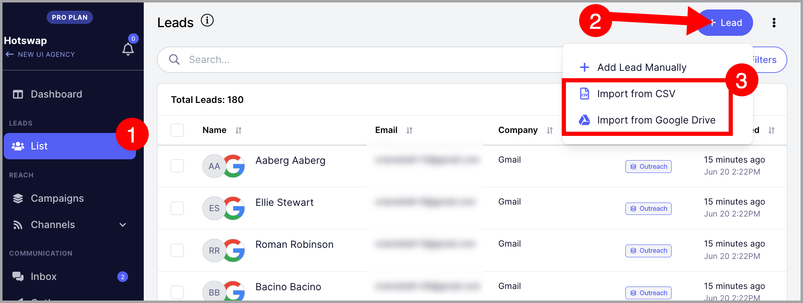

# Customizing Email Steps

**In this article:**

- How do I change font type and sizes?

- How do I resize an image in the email editor?

- Can I use HTML?

- Can I add personalized images?

## How Do I Change Font Type and Sizes?

The email editor does not support changing font types and sizes, except for different header styles. This is intentional — highly formatted emails tend to get filtered more often than plain text emails, so the editor is intentionally kept minimal.

## How Do I Resize an Image in the Email Editor?

It is not possible to resize images within QuickMail. Make sure to resize your images before adding them to an email step.

These articles may help with resizing images on [Windows](https://www.businessinsider.com/how-to-resize-an-image-on-windows) and [Mac](https://www.businessinsider.com/how-to-resize-an-image-on-mac).

## Can I Use HTML?

The email editor does not support HTML directly, but there is a workaround using custom properties.

To get started, go to the Leads page → **+ Leads** → **Import from CSV or Google Drive**.

**Note:** You do not need to complete the import to create a custom property. You can load any CSV just to access the custom properties tab.

Go to the **Custom Properties** tab → click **+ New Property**.

Name your custom property → paste the HTML code as the default value → **Confirm**.

**Warning:** Custom property names can only contain letters, numbers, hyphens (-), and underscores (_). Names with spaces cannot be created.

**Note:** Make sure your HTML code is finalized before saving it as the default value. Custom property default values cannot be edited after creation.

Once the custom property is created, insert it into your email step. The HTML will render when the recipient receives the email.

**Pro tip:** You can further personalize your emails using properties. Learn more about that here.

## Can I Add Personalized Images?

Yes. QuickMail integrates with Hyperise, which allows you to create personalized images for your emails. Learn more about setting it up [here](https://support.hyperise.com/email-marketing-integrations/quickmail-integration).
