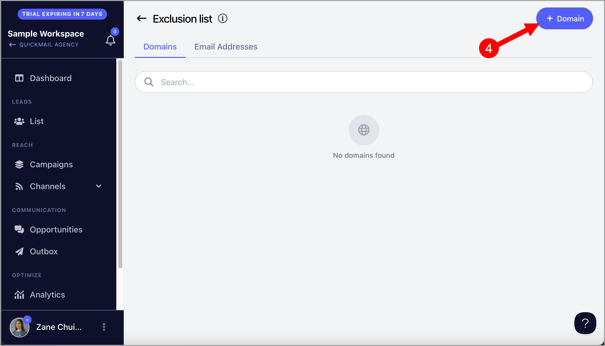
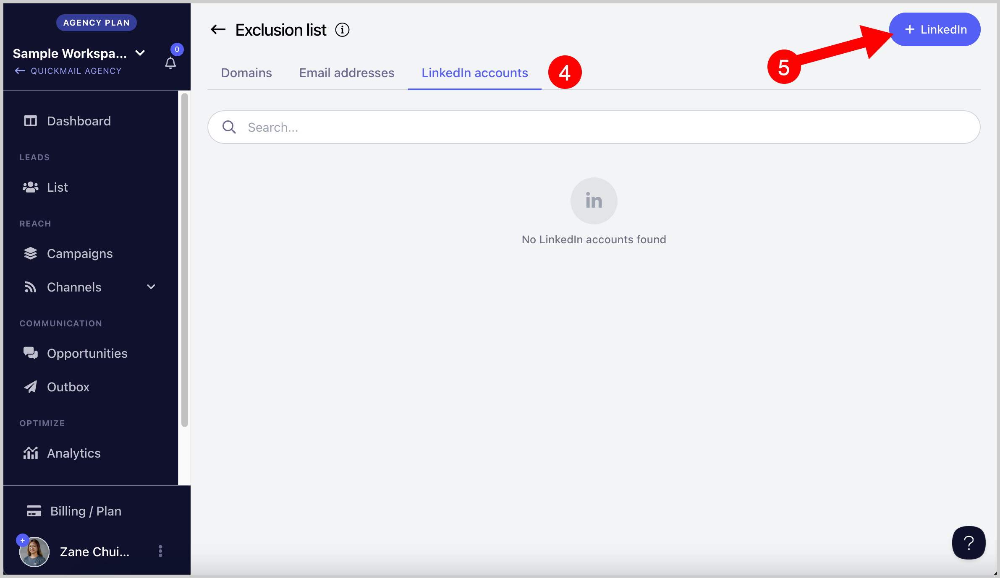

# Managing the Exclusion List

**In this article:**

- Why keep an exclusion list?

- How to exclude domains?

- How to exclude email addresses?

- How to exclude LinkedIn profiles?

- How do I automatically add leads to the exclusion list if they unsubscribe?

- How do I automatically add leads' domains to the exclusion list if they unsubscribe?

## Why Keep an Exclusion List?

The exclusion list allows you to prevent emails from being sent to specific email addresses or domains. This is useful if a company has opted out of your campaign, if certain leads are not the right fit, or if you want to prevent contacting free email addresses.

**Note:** If a lead's domain is on the exclusion list, the lead will not be able to start any campaign and any active journey will be canceled.

## How to Exclude Domains?

**Step 1.** Go to **List** → click the menu icon (three vertical dots) in the top-right corner → **Exclude**.

**Step 2.** Go to the **Domain** tab → click **+ Domain**.

**Note:** Do not include `https://`, `http://`, or `www` when adding domains.

**Step 3.** Enter one domain per line to add multiple domains at once → click **Add**.

## How to Exclude Email Addresses?

**Step 1.** Go to **List** → click **Exclude** in the top-right corner.

**Step 2.** Go to the **Email Addresses** tab → click **+ Emails**.

**Step 3.** Enter one email address per line to add multiple addresses at once → click **Add**.

## How to Exclude LinkedIn Profiles?

**Step 1.** Go to **List** → click **Exclude** in the top-right corner.

**Step 2.** Go to the **LinkedIn** tab → click **+ LinkedIn**.

**Step 3.** Enter one LinkedIn profile ID per line to add multiple profiles at once → click **Add**.

Profile IDs can be entered in either of these formats:

- `https://www.linkedin.com/in/elaine-quickmail145/`

- `elaine-quickmail145`

## How Do I Automatically Add Leads to the Exclusion List if They Unsubscribe?

Leads are automatically added to the exclusion list when they unsubscribe from your campaign. No manual action is needed.

## How Do I Automatically Add Leads' Domains to the Exclusion List if They Unsubscribe?

This is not yet supported. Domains must be added to the exclusion list manually.
